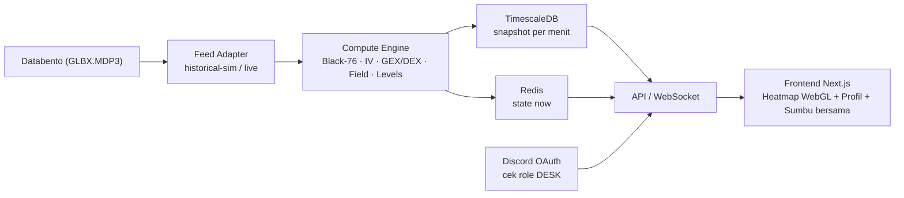
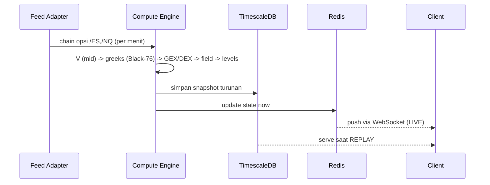
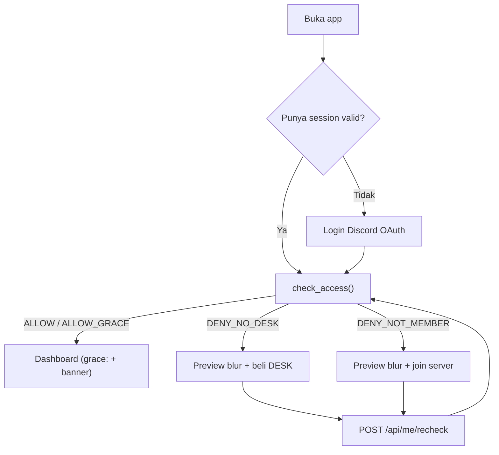
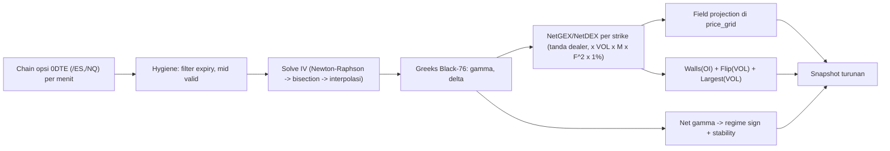
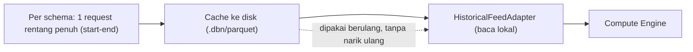
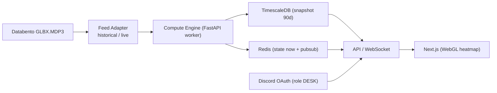
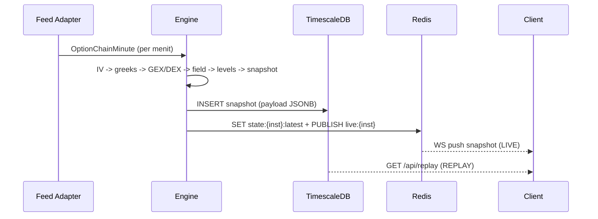

# FlowDesk — PRD Gabungan

> Dokumen ini menggabungkan **dua sumber PRD**:
> - **Bagian I — PRD Asli (multi-halaman Notion):** halaman induk + sub-halaman 0–14 (lengkap, termasuk Build Playbook).
> - **Bagian II — PRD Konsolidasi v1:** versi padat yang sudah diselaraskan dengan status build aktual (rilis 0.1–1.6).
>
> Bila ada konflik, **Bagian II (Konsolidasi)** mencerminkan kondisi build terbaru, sedangkan **Bagian I** memuat detail lengkap & acceptance criteria.

---

# BAGIAN I — PRD ASLI (MULTI-HALAMAN)

## Induk PRD — 0DTE GEX/DEX Terminal (FlowDesk)

> 📌 **Status:** Draft v0.1 · **Working title:** FlowDesk (nama final TBD) · **Owner:** pixiewhoops · **Fokus:** Terminal eksposur gamma/delta opsi **0DTE** untuk **/ES & /NQ**

### 1. Ringkasan Eksekutif
FlowDesk adalah **terminal web real-time** yang memetakan **eksposur gamma & delta dealer** untuk opsi **0DTE** pada futures **/ES (E-mini S&P 500)** dan **/NQ (E-mini Nasdaq-100)**. Produk terinspirasi **SpotGamma TRACE** (heatmap "medan" gamma) dan kedalaman metrik **GEXBOT** (GEX/DEX), namun **fokus penuh pada 0DTE** dan berbasis **volume (VOL)**.

Layar inti = satu tampilan: **panel kiri** (profil garis Net GEX/DEX) + **panel kanan** (heatmap medan), berbagi **satu sumbu harga/strike di tengah**. Tujuannya membantu trader **membaca karakter pasar** (pinning vs volatil) dan **level support/resistance & flip** secara real-time.

### 2. Masalah & Solusi
**Masalah:** Trader 0DTE retail & pembaca orderflow futures kesulitan membaca *kapan* pasar akan "nyangkut" (pinning) atau "meluncur" (volatil), serta *di level mana* dealer hedging menahan/mendorong harga. Alat yang ada mahal, tidak fokus 0DTE, atau tidak berbasis VOL.

**Solusi:** Visualisasi **field projection** ala TRACE yang menjawab *"kalau harga ke level X → direm (turquoise) atau dilempar (crimson)?"*, plus **regime meter** (pinning/volatil) dan **replay** untuk belajar dari sesi sebelumnya.

### 3. Target User & Jobs-to-be-Done
- **User:** day trader 0DTE retail + trader orderflow futures yang membaca karakter pasar.
- **JTBD 1 — Deteksi regime:** tahu apakah pasar cenderung *pinning* (stabil) atau *volatil*.
- **JTBD 2 — Level real-time:** mengenali support/resistance & titik *gamma flip* secara langsung.

### 4. Model Akses & Monetisasi
- **Login:** **Discord OAuth**.
- **Gating:** harus **member server Flowjob.id** **dan** memegang role **"DESK"**.
- **Re-check:** saat login + **harian**; jika role dicabut → **grace period sampai akhir hari**.
- **Tidak memenuhi syarat:** **preview blur** + langkah **join server & beli DESK** (link flowjob.id).
- **Setelah beli:** tombol **"Saya sudah punya DESK — cek ulang"** (re-check instan).
- **Tier:** **DESK saja** (semua fitur sama) di v1.

### 5. Master Keputusan Terkunci

| Area | Keputusan |
| --- | --- |
| Instrumen | /ES & /NQ — options-on-futures (CME, Databento GLBX.MDP3) |
| Fokus | 0DTE saja (expiry hari itu) |
| Layout | Panel kiri (profil garis) + panel kanan (heatmap), 1 sumbu harga/strike di tengah (label per 5 poin, current price garis putus + tag tunggal). Light & dark identik. |
| Garis kiri | Satu garis, color-coded: turquoise=positif, crimson=negatif. Tanpa angka, tanpa gradient. Toggle Net GEX / Net DEX. Berbasis VOL → tanpa toggle 0DTE. |
| Heatmap | Field projection ala TRACE. Light: turquoise→putih→crimson. Dark: turquoise→hitam→crimson. Basis Gamma/Delta. Mulus (interpolasi) + toggle blok. |
| Warna brand | Turquoise #40E0D0 (positif/support), Crimson #E0183C (negatif/resistance). UI monokrom netral. Dark base #000. |
| Tipografi | Space Grotesk (display/UI) + JetBrains Mono (angka). Hindari Inter. |
| Mood | Gelap minimalis futuristik + data-art. Polish landing-page di SEMUA layar. |
| Update | Per 1 menit untuk semua perhitungan. |
| Key levels | Call/Put Wall = by OI, statis seharian, Top 3 (user pilih 1/2/3). Gamma Flip & largest GEX/DEX = by VOL, dinamis intraday. |
| Regime | v1 = murni Net Gamma (positif=pinning, negatif=volatil). Arsitektur siap Stability Score komposit nanti. |
| VOL | Kumulatif sejak RTH open (rolling = v2). |
| Sesi | RTH 09:30–16:00 ET. Kalender resmi CME (auto-update libur/half-day). |
| Greeks | Dihitung in-house: Black-76, IV dari mid (Newton-Raphson, fallback bisection), rate SOFR. |
| Konvensi tanda | Dealer long calls, short puts. |
| Satuan GEX | $ notional per gerakan 1%. |
| Replay | Hari ini (aktif >1 jam setelah open) + sesi sebelumnya; pilih tanggal lampau bila ada data. Per 1 menit. Pause live + badge REPLAY. |
| Retensi | Akumulatif sejak launch hingga maks 90 hari rolling (turunan saja). |
| Stack | FE: Next.js+React+TS, heatmap WebGL. BE: Python FastAPI engine + worker. Data: TimescaleDB + Redis. |
| Infra | FE di Vercel; BE+DB+Redis di 1 VPS Hetzner (target CPX31; dev CPX21) via Docker. |
| Keandalan | Tinggi khusus jam RTH (auto-restart + heartbeat + alert Discord). Backup DB mingguan. |
| Login | Discord OAuth (sumber kebenaran = role DESK). |
| Akurasi | Wall by OI harus PERSIS; level by VOL ≤1–2 strike; regime sign wajib cocok. Validasi vs SpotGamma & GEXBOT + golden dataset. |
| Deploy | Docker Compose + CI (tes greeks+regression lulus → deploy). Staging (historical-sim) + Production. |

### 6. Arsitektur Tingkat Tinggi



### 7. Alur Data (siklus per 1 menit)



### 8. Roadmap (M0–M6)

| Milestone | Fokus |
| --- | --- |
| M0 | Setup repo + infra + Feed Adapter + ingest data historis Databento |
| M1 | Compute Engine: IV->greeks->GEX/DEX->levels, divalidasi vs referensi (akurasi) |
| M2 | Storage (Timescale) + Redis + API/WebSocket |
| M3 | Frontend: heatmap + profil garis + sumbu bersama + toggles |
| M4 | Replay + key levels + hover/crosshair |
| M5 | Login Discord + gating DESK + preview blur |
| M6 | Hardening (monitoring, backup, validasi akurasi) -> flip LIVE -> rilis v1 |

### 9. Metrik Sukses v1
- **Akurasi** level vs referensi (SpotGamma/GEXBOT) sesuai toleransi terkunci.
- **Semua update <= 1 menit**, heatmap mulus.
- Engagement: dipakai tiap hari saat RTH.

### 10. Di Luar Lingkup v1
Alert otomatis · Mobile/tablet · Instrumen selain ES/NQ · Charm/Vanna & Stability Score komposit · Rolling-window VOL.

---
## 0 · Glosarium & Kontrak Global

> 🔒 **SUMBER KEBENARAN TUNGGAL.** Semua istilah, notasi, konstanta, satuan, dan konvensi global di sini bersifat MENGIKAT untuk seluruh 13 halaman PRD. Jika ada konflik definisi antar-halaman, halaman ini yang menang.

### 0.1 Konvensi requirement (global)

| Kata kunci | Arti |
| --- | --- |
| **WAJIB / MUST** | Mutlak. Builder tidak boleh menyimpang. |
| **SEBAIKNYA / SHOULD** | Direkomendasikan; boleh menyimpang dengan alasan terdokumentasi. |
| **BOLEH / MAY** | Opsional. |

### 0.2 Glosarium istilah

| Istilah | Definisi |
| --- | --- |
| 0DTE | Zero Days To Expiration — opsi yang kedaluwarsa di hari yang sama. Fokus utama produk. |
| GEX | Gamma Exposure — eksposur gamma dealer; satuan = $ per pergerakan 1% (lihat §5). |
| DEX | Delta Exposure — eksposur delta dealer. |
| OI | Open Interest — jumlah kontrak terbuka. Basis Call/Put Wall (STATIK). |
| VOL | Volume kumulatif sejak RTH open. Basis Gamma Flip & Largest GEX/DEX (DINAMIS). |
| Net GEX / Net DEX | Agregasi eksposur dealer bertanda per strike (turquoise=positif, crimson=negatif). |
| Gamma Flip | Strike tempat net gamma berubah tanda (zero-crossing field). |
| Call/Put Wall | Strike dengan OI terbesar di atas/bawah harga; Top 3, user pilih 1/2/3. WAJIB persis vs SpotGamma. |
| Regime | Rezim pasar = tanda net gamma (positif = mean-revert/pinning; negatif = trending/volatile). |
| Stability % | Persentase stabilitas regime, ditampilkan JetBrains Mono. |
| Field projection | Heatmap eksposur sebagai medan di grid harga × waktu. |
| Dealer positioning | Asumsi: dealer long calls / short puts (lihat §6). |
| RTH | Regular Trading Hours — 09:30–16:00 ET. |
| ETH | Extended/Electronic Trading Hours — di luar RTH. |
| STALE | State saat feed gap 1–2 menit — frame terakhir ditahan + indikator. |
| Snapshot | Objek turunan per menit yang dirender FE (skema kanonik di #8). |
| DESK | Role Discord berbayar = sumber kebenaran akses. |

### 0.3 Notasi & simbol (Black-76)

| Simbol | Arti | Satuan |
| --- | --- | --- |
| F | Harga forward future (/ES atau /NQ) | index points |
| K | Strike | index points |
| T | Waktu ke ekspirasi | tahun (fraksi) |
| r | Risk-free rate, r = ln(1 + sofr) | kontinu tahunan |
| σ | Implied volatility | tahunan |
| M | Contract multiplier | $ per point |

### 0.4 Konstanta terkunci

| Konstanta | Nilai |
| --- | --- |
| Multiplier /ES | $50 / point |
| Multiplier /NQ | $20 / point |
| RTH | 09:30–16:00 America/New_York |
| Cadence snapshot | 1 menit |
| Retensi replay | 90 hari rolling |
| Toleransi IV solver | rekonstruksi harga < 1e-6 |
| Feed gap -> STALE | 1–2 menit |
| Sumber rate | SOFR (r = ln(1+sofr)) |
| Cookie sesi | HttpOnly+Secure+SameSite=Lax, 7 hari |
| Re-check role | login + harian (>24 jam) |

### 0.5 Satuan GEX (terkunci)

```
GEX_strike = gamma * VOL * M * F^2 * 0.01
# = nilai dolar eksposur gamma dealer per pergerakan harga 1%
# tanda mengikuti konvensi dealer (§6)
```

### 0.6 Konvensi tanda dealer (terkunci)
- Asumsi: **dealer long calls, short puts.**
- Net GEX positif -> dealer menstabilkan (pinning / mean-revert) -> turquoise.
- Net GEX negatif -> dealer memperkuat tren (volatile) -> crimson.
- Tanda ini WAJIB konsisten di engine (#7), regime (#4), dan profile line.

### 0.7 Token warna inti (terkunci)

| Token | Hex | Makna |
| --- | --- | --- |
| turquoise | #40E0D0 | positif / support |
| crimson | #E0183C | negatif / resistance |
| base (dark) | #000000 | background gelap |

- Heatmap dark: turquoise -> black -> crimson. Light: turquoise -> white -> crimson. Interpolasi perceptual (OKLab/LCH).
- Font: **Space Grotesk** (UI) + **JetBrains Mono** (angka). BUKAN Inter. (Detail token -> #2.)

### 0.8 Referensi Snapshot Schema
Skema kanonik penuh ada di **#8 § Snapshot Schema (schema_version 1)**. Field ringkas:

```
schema_version, instrument, session_date, ts, minute_index,
state, stale, expired, forward, rate,
axis{strike_min,strike_max,step},
regime{net_gamma,sign,stability_pct},
profile[]{strike,net_gex,net_dex,interpolated},
field{price_grid[],gamma[],delta[]},
levels{call_walls[],put_walls[],gamma_flip,largest_gex,largest_dex}
```

### 0.9 Env keys (kanonik)

```
DISCORD_CLIENT_ID, DISCORD_CLIENT_SECRET, DISCORD_GUILD_ID,
DISCORD_DESK_ROLE_ID, SESSION_SECRET, CORS_ORIGINS,
FEED_MODE (historical|live), DATABENTO_API_KEY, DATA_DIR,
TIMESCALE_DSN, REDIS_URL, SOFR_RATE
```

### 0.10 Indeks definisi (di mana hidupnya)

| Topik | Halaman kanonik |
| --- | --- |
| Rumus & metodologi hitung | #7 Model Data |
| Snapshot Schema, API, WS, infra repo | #8 Arsitektur |
| Token desain detail | #2 Design System |
| State machine sesi | #9 Sesi |
| Akses & OAuth | #6 Auth |
| Toleransi & golden dataset | #12 Testing |

---

## 1 · Spesifikasi Produk & Fitur MVP

> 🔒 **SPEC BUILD-READY — NOL AMBIGUITAS.** Daftar requirement fungsional (FR) + acceptance criteria. Setiap FR adalah perilaku WAJIB. AI builder dilarang menambah/mengurangi fitur di luar daftar ini.

### 1.0 Konvensi
- **MUST** = wajib v1. **SHOULD** = dianjurkan. **WON'T** = di luar lingkup (lihat §6).
- Tiap FR punya **ID stabil** (`FR-xxx`). Referensikan ID ini di kode/commit/test.

### 1.1 Glosarium (definisi terkunci)

| Istilah | Definisi |
| --- | --- |
| 0DTE | Opsi yang expiry pada hari perdagangan yang sama. |
| RTH | Regular Trading Hours, 09:30–16:00 ET. |
| GEX | Gamma Exposure dealer, USD per gerakan 1% (lihat #7 §8). |
| DEX | Delta Exposure dealer, USD notional (lihat #7 §8). |
| VOL | Volume traded kumulatif sejak RTH open (bobot metrik dinamis). |
| OI | Open Interest (basis Call/Put Wall, statis seharian). |
| Field projection | Total gamma dealer dihitung untuk tiap harga hipotetis pada grid (heatmap). |
| Pinning | Net gamma positif -> dealer meredam gerakan (turquoise). |
| Gamma Flip | Harga tempat field gamma berubah tanda (- -> +). |
| Wall | Strike dengan OI besar (resistance=call, support=put). |

### 1.2 Functional Requirements

| ID | Requirement | Prioritas |
| --- | --- | --- |
| FR-001 | Tampilkan **heatmap field projection** di panel kanan, sumbu X = waktu intraday, sumbu Y = harga/strike. | MUST |
| FR-002 | Heatmap mendukung basis **Gamma** atau **Delta** (toggle). | MUST |
| FR-003 | Heatmap punya mode **mulus (interpolasi)** dan **blok** (toggle). | MUST |
| FR-004 | Tampilkan **profil garis tunggal** di panel kiri (NetGEX/NetDEX), color-coded turquoise(+)/crimson(-), tanpa angka, tanpa gradient. | MUST |
| FR-005 | Panel kiri punya toggle **Net GEX / Net DEX**. | MUST |
| FR-006 | Panel kiri & kanan **berbagi satu sumbu harga/strike di tengah**, baris strike selaras. | MUST |
| FR-007 | Tampilkan **harga berjalan** sebagai garis putus + 1 tag harga. | MUST |
| FR-008 | Tampilkan **regime meter** (pinning/volatil) berbasis tanda Net Gamma + stability %. | MUST |
| FR-009 | Tampilkan **Call/Put Wall** (by OI, Top 3, statis); user pilih tampil 1/2/3. | MUST |
| FR-010 | Tampilkan **Gamma Flip** dan **Largest GEX/DEX strike** (by VOL, dinamis). | MUST |
| FR-011 | Key levels dapat di-hide per jenis. | SHOULD |
| FR-012 | **Replay** sesi: play/pause, scrubber, kecepatan 1x/2x/4x, step per-menit. | MUST |
| FR-013 | Replay hari ini aktif **>1 jam setelah RTH open**; jika sesi ETH -> replay FULL RTH sebelumnya; bisa pilih tanggal lampau bila ada data. | MUST |
| FR-014 | Semua data update **per 1 menit**. | MUST |
| FR-015 | **Hover**: tooltip (strike, waktu, nilai) + crosshair. | MUST |
| FR-016 | Ganti instrumen **ES \| NQ** via segmented toggle. | MUST |
| FR-017 | **Heatmap Zoom** slider mengatur band harga sumbu Y. | MUST |
| FR-018 | Mode **Dark/Light** dengan layout identik; default Dark. | MUST |
| FR-019 | Ingat preferensi terakhir user (theme, basis, metric, instrumen, zoom, walls). | SHOULD |

### 1.3 Detail perilaku per fitur
**Heatmap (FR-001–003, 017):** Sumber data = `snapshot.field` (#8 §3). Tiap menit = 1 kolom; heatmap = akumulasi kolom kiri->kanan. Warna: nilai>0 turquoise, <0 crimson, 0 = netral (dark=hitam, light=putih). Skala warna simetris terhadap 0. Colorbar berlabel **"Gamma ($ Notional)"** (atau "Delta"). Zoom mengubah `axis.strike_min/max`.

**Profil garis (FR-004–006):** Sumber = `snapshot.profile[]`. Sumbu Y identik dengan heatmap. Satu garis kontinu menyilang sumbu nol; segmen positif turquoise, negatif crimson. TANPA angka/grid value; TANPA gradient fill.

**Regime meter (FR-008):** Bentuk **bar/pill horizontal** turquoise<->crimson (BUKAN speedometer). Isi dari `snapshot.regime` (`sign`, `stability_pct`). Persen dalam JetBrains Mono.

**Replay (FR-012–013):** Sumber = `GET /api/replay` (#8 §6). Saat replay: pause WS live + badge **REPLAY** + tombol **"Kembali ke LIVE"**. Aturan ketersediaan lihat #10.

**Key levels (FR-009–011):** Sumber = `snapshot.levels`. Wall = garis horizontal + label; Flip & Largest = penanda. Wall (OI) statis seharian; Flip & Largest (VOL) bergerak tiap menit.

### 1.4 Non-functional requirements

| ID | NFR | Target |
| --- | --- | --- |
| NFR-1 | Latensi update live | snapshot -> layar <= 2 dtk |
| NFR-2 | Render heatmap | 60fps saat pan/zoom (WebGL) |
| NFR-3 | Platform v1 | Desktop browser modern saja |
| NFR-4 | Akurasi | sesuai toleransi #12 |
| NFR-5 | Polish | standar landing-page di semua layar (anti-AI-look) |

### 1.5 Default & persistensi
- Default tampilan: **Dark · Gamma · Net GEX · ES**.
- Preferensi disimpan per user (localStorage v1; sinkron server = v2).

### 1.6 Di luar lingkup v1 (WON'T)
Alert otomatis · Mobile/tablet · Instrumen selain ES/NQ · Charm/Vanna & Stability Score komposit · Rolling-window VOL · Preset tersimpan server.

### 1.7 Acceptance criteria

| ID | Kriteria |
| --- | --- |
| AC-P1 | Semua FR berlabel MUST terimplementasi & dapat didemokan. |
| AC-P2 | Panel kiri & kanan selaras strike (uji: garis horizontal di strike X menyentuh baris heatmap X). |
| AC-P3 | Toggle basis/metric/zoom/instrumen mengubah tampilan tanpa reload penuh. |
| AC-P4 | Replay mengikuti aturan ketersediaan (#10) & dapat kembali ke LIVE. |
| AC-P5 | Tidak ada fitur di luar daftar FR (no scope creep). |

---
## 2 · Bahasa Desain & Sistem Visual

> 🔒 **SPEC BUILD-READY — NOL AMBIGUITAS.** Token desain eksak (hex, ukuran, spasi, motion). Pakai PERSIS. Dilarang menambah warna/font/efek di luar token ini. Tujuan visual: **gelap minimalis futuristik + data-art**, polish setingkat landing page, **anti-AI-look**.

### 1. Prinsip
- Monokrom netral + 2 aksen sinyal (turquoise/crimson). Chrome minimal, data jadi bintang.
- Tidak ada gradient norak, tidak ada drop-shadow tebal, tidak ada emoji dekoratif di UI.

### 2. Token warna (hex eksak)

| Token | Dark | Light | Guna |
| --- | --- | --- | --- |
| --accent-pos (turquoise) | #40E0D0 | #40E0D0 | positif / support / pinning |
| --accent-neg (crimson) | #E0183C | #E0183C | negatif / resistance / volatil |
| --bg-base | #000000 | #FFFFFF | latar utama |
| --bg-surface | #0B0E11 | #F4F5F7 | panel/topbar |
| --bg-glass | rgba(255,255,255,0.04) | rgba(0,0,0,0.04) | toolbar floating |
| --border-subtle | rgba(255,255,255,0.08) | rgba(0,0,0,0.10) | garis tipis |
| --text-primary | #E8EAED | #0B0E11 | teks utama |
| --text-muted | #7A828C | #5B626B | label sekunder |
| --price-line | #E8EAED (dashed) | #0B0E11 (dashed) | harga berjalan |

**Skala heatmap (simetris terhadap 0):**
- Dark: `crimson(#E0183C) → hitam(#000000) → turquoise(#40E0D0)`.
- Light: `crimson(#E0183C) → putih(#FFFFFF) → turquoise(#40E0D0)`.
- Interpolasi di ruang warna perseptual (OKLab/LCH) agar mulus, BUKAN RGB linear.

### 3. Tipografi

| Peran | Font | Catatan |
| --- | --- | --- |
| UI / label / heading | **Space Grotesk** | jangan Inter; jangan font "acara nikahan" |
| Angka / data / mono | **JetBrains Mono** | semua nilai numerik, persen, harga |

**Type scale (px / weight / line-height):**
```
display   28 / 600 / 1.2     (judul section landing)
h1        20 / 600 / 1.3
h2        16 / 600 / 1.3
body      14 / 400 / 1.5
label     12 / 500 / 1.4     (uppercase, letter-spacing 0.04em)
mono-lg   16 / 500 / 1.2     (stability %, harga besar)
mono-sm   12 / 500 / 1.2     (tooltip, axis labels)
```

### 4. Spasi & radius
```
spacing scale (px): 2, 4, 8, 12, 16, 24, 32, 48
radius: sm=6  md=10  pill=999
border width: 1px (selalu --border-subtle)
```

### 5. Efek & elevasi
```
glass blur: backdrop-filter blur(16px) + --bg-glass + border 1px --border-subtle
shadow: HINDARI shadow tebal. Maks: 0 1px 0 rgba(0,0,0,0.2) untuk pemisah halus.
glow aksen: opsional, sangat halus (text-shadow 0 0 8px accent @ 30% opacity) hanya untuk nilai sinyal kunci
```

### 6. Motion
```
durasi: fast=120ms  base=200ms  slow=320ms
easing: cubic-bezier(0.4, 0, 0.2, 1)
toolbar auto-fade: idle 2.5s -> opacity 0; muncul saat mousemove (fade 200ms)
transisi tema/toggle: 200ms; data update: tween 200ms (jangan kedip)
```

### 7. Komponen — token & state

| Komponen | Spesifikasi |
| --- | --- |
| Segmented (ES\|NQ) | pill radius 999; aktif=--text-primary bg --bg-surface; inaktif=--text-muted; tinggi 28px |
| Toggle (Gamma/Delta, GEX/DEX) | segmented kecil 24px; label mono-sm |
| Slider (zoom) | track 2px --border-subtle; thumb 12px --text-primary |
| Glass toolbar | §5 glass; padding 8px; gap 8px; radius md; auto-fade §6 |
| Tooltip | bg --bg-surface; border subtle; mono-sm; radius sm; padding 8px |
| Regime pill | bar horizontal; isi gradient accent-neg↔accent-pos; indikator posisi; % mono-lg |
| Button primary (CTA) | bg --accent-pos; teks #000; radius md; tinggi 40px; hover -8% lightness |
| Badge (REPLAY/STALE) | pill; label uppercase 12px; REPLAY=accent-pos outline; STALE=amber |

### 8. Iconography
- Set garis tunggal, stroke 1.5px, sudut membulat (mis. Lucide). Ukuran 16/20px. Warna ikut --text-muted/primary.

### 9. Aturan anti-AI-look (WAJIB dipatuhi)

| JANGAN | LAKUKAN |
| --- | --- |
| Gradient ungu-biru generik | Monokrom + 2 aksen sinyal saja |
| Shadow tebal / card melayang norak | Border 1px halus + glass tipis |
| Font Inter / font dekoratif | Space Grotesk + JetBrains Mono |
| Emoji di UI inti | Ikon garis konsisten |
| Layout terlalu ramai | Chart penuh, chrome minimal, auto-fade |

### 10. Acceptance criteria

| ID | Kriteria |
| --- | --- |
| AC-D1 | Semua warna UI berasal dari token §2 (tidak ada hex liar). |
| AC-D2 | Angka memakai JetBrains Mono; UI memakai Space Grotesk. |
| AC-D3 | Skala heatmap simetris terhadap 0 & interpolasi perseptual. |
| AC-D4 | Dark & Light memakai layout identik (hanya token bertukar). |
| AC-D5 | Tidak melanggar daftar "JANGAN" §9. |

---

## 3 · Landing Page

> 🔒 **SPEC BUILD-READY — NOL AMBIGUITAS.** Struktur section, tujuan tiap section, arah copy, dan spesifikasi demo. Pakai token desain #2. Alur naratif: **storytelling → showcase → edukasi → konversi**.

### 1. Tujuan & prinsip
- Mengubah pengunjung → member Flowjob.id → pembeli DESK.
- Estetika sama dengan app (gelap minimalis futuristik). Polish landing-page penuh.

### 2. Urutan section (WAJIB, top → bottom)

| # | Section | Tujuan | Isi inti |
| --- | --- | --- | --- |
| 1 | Hero | Hook + demo mini | Headline + subhead + **mini interactive hover demo** (heatmap teaser) + CTA utama |
| 2 | Problem/Story | Storytelling | Rasa sakit trader 0DTE (pinning vs volatil) → solusi |
| 3 | Showcase fitur | Tunjukkan produk | Heatmap, profil garis, regime meter, replay (visual + caption) |
| 4 | Cara kerja | Edukasi | 3–4 langkah: data → greeks → field → baca regime/level |
| 5 | Kredibilitas | Trust | Metodologi (Black-76, validasi vs SpotGamma/GEXBOT), fokus 0DTE |
| 6 | Pricing / CTA | Konversi | Akses via DESK (Discord) → CTA join + beli + demo |
| 7 | FAQ | Hilangkan keraguan | Akses, akurasi, instrumen, 0DTE, replay |
| 8 | Footer | Navigasi + legal | Link Discord, flowjob.id, disclaimer risiko |

### 3. Hero demo (spesifikasi)
- **Mini interactive hover demo**: heatmap teaser statis yang merespons hover (crosshair + tooltip nilai), BUKAN live data.
- Tidak butuh login. Ringan (aset statis pre-render).

### 4. CTA (kontrak)

| CTA | Aksi |
| --- | --- |
| Masuk dengan Discord | → OAuth (#6) |
| Gabung Flowjob.id | → invite server Discord |
| Dapatkan DESK | → flowjob.id (paket DESK) |
| Lihat Demo | → demo replay (§5) |

### 5. Demo publik (spesifikasi)
- **Replay statis 30 menit**, jendela **11:00–11:30 WIB** yang diambil dari **sesi RTH malam sebelumnya** (data turunan, bukan live).
- Read-only (tanpa toggle penuh); menampilkan heatmap + profil + scrubber dasar.

### 6. Arah copy (guideline, bukan teks final)
- Tonal: tajam, teknikal, percaya diri; hindari hype kosong & jargon norak.
- Headline fokus manfaat: "baca kapan pasar nyangkut atau meluncur, real-time".
- Bahasa utama Indonesia (istilah teknikal boleh Inggris: GEX, DEX, 0DTE, gamma flip).

### 7. Acceptance criteria

| ID | Kriteria |
| --- | --- |
| AC-L1 | Section tampil sesuai urutan §2. |
| AC-L2 | Hero demo interaktif hover tanpa login. |
| AC-L3 | Semua CTA §4 menuju tujuan benar. |
| AC-L4 | Demo = replay statis 30 menit (bukan live). |
| AC-L5 | Estetika konsisten token #2 (anti-AI-look). |

---

## 4 · Dashboard (Layar Utama)

> 🔒 **SPEC BUILD-READY — NOL AMBIGUITAS.** Layout, dimensi, komponen, state & interaksi dashboard. Pakai token dari halaman #2. Semua ukuran & perilaku WAJIB persis.

### 1. Layout global (full-screen, 1 layar tanpa scroll)
```
+--------------------------------------------------------------+
| TOPBAR (tinggi 44px)                                         |
+--------------------------------------------------------------+
|  LEFT PANEL  |   AXIS    |        RIGHT PANEL (HEATMAP)       |
|  profil garis| (tengah,  |        field projection           |
|  (~22% lebar)|  ~72px)   |        (sisa lebar)               |
|              |  shared   |                                   |
+--------------------------------------------------------------+
| SCRUBBER BAR (tinggi 56px)                                   |
+--------------------------------------------------------------+
        [ FLOATING GLASS TOOLBAR ] (overlay, auto-fade)
```
- **Topbar 44px**, **Scrubber 56px**, sisanya area chart. Tidak ada scroll vertikal.
- **Axis di tengah** (~72px), dibagikan kiri+kanan; label strike tiap 5 poin sekali; harga berjalan = garis putus + 1 tag.

### 2. Komponen & spesifikasi

| Komponen | Lokasi | Isi / props | State |
| --- | --- | --- | --- |
| Topbar | atas | logo kecil kiri; Segmented ES\|NQ tengah-kiri; status LIVE/REPLAY + jam ET kanan; tombol Settings (gear) kanan | live/replay/stale |
| Left Panel (ProfileLine) | kiri | garis NetGEX/NetDEX; toggle metric di toolbar | gex/dex; hover |
| Shared Axis | tengah | skala strike; price line dashed + tag | zoomed |
| Heatmap (RightPanel) | kanan | field gamma/delta; colorbar "Gamma ($ Notional)" | gamma/delta; smooth/block; hover crosshair |
| Floating Glass Toolbar | overlay bawah-tengah | basis Gamma\|Delta; metric GEX\|DEX; smooth\|block; zoom slider; key-levels toggles | auto-fade (idle 2.5s) |
| Regime Meter | pojok (mis. kiri-atas chart) | pill turquoise↔crimson + stability % (mono) | pos/neg |
| Scrubber Bar | bawah | play/pause; timeline drag; 1x/2x/4x; step ±1 menit; jam berjalan | live/replay; playing/paused |
| Corner Nav | pojok | akses kecil (akun, bantuan) | — |

### 3. Interaksi (kontrak perilaku)

| Aksi | Hasil |
| --- | --- |
| Hover heatmap | crosshair + tooltip: waktu (ET), strike, nilai ($) |
| Hover profil | highlight strike sejajar + nilai |
| Geser zoom slider | ubah band sumbu Y (FR-017); kiri & kanan sinkron |
| Toggle Gamma/Delta | ganti basis heatmap + colorbar label, tween 200ms |
| Toggle GEX/DEX | ganti data profil garis |
| Segmented ES/NQ | switch instrumen; resubscribe WS |
| Mouse diam 2.5s | toolbar fade out; mousemove → fade in |
| Drag scrubber | masuk REPLAY; badge REPLAY; tombol "Kembali ke LIVE" |
| Klik "Kembali ke LIVE" | resume WS; badge hilang |

### 4. State dashboard
```
LIVE      : WS aktif, data menit terbaru, status hijau
REPLAY    : putar dari /api/replay, badge REPLAY, WS dijeda
STALE     : gap feed 1-2 menit -> tahan frame terakhir + flag STALE (amber)
PREMARKET : tampilkan replay sesi sebelumnya + countdown open
CLOSED    : snapshot terakhir + label market closed + replay tersedia
```
- Sumber state = `snapshot.state` (lihat #8 §3) + logika sesi (#9).

### 5. Data binding (ke snapshot #8 §3)

| Elemen UI | Field snapshot |
| --- | --- |
| Heatmap kolom | `field.gamma[]` / `field.delta[]` • `field.price_grid[]` |
| Profil garis | `profile[].net_gex` / `net_dex` |
| Price line | `forward` |
| Regime pill | `regime.sign`, `regime.stability_pct` |
| Walls/Flip/Largest | `levels.*` |
| Jam / badge | `ts`, `state`, `stale` |

### 6. Rendering
- Heatmap & profil = **WebGL** (target 60fps). Sumbu/label/overlay = DOM/Canvas 2D.
- Update live: append 1 kolom heatmap per menit; jangan re-render seluruh kanvas.

### 7. Acceptance criteria

| ID | Kriteria |
| --- | --- |
| AC-DB1 | Layout sesuai §1 (topbar 44, scrubber 56, axis tengah dibagikan). |
| AC-DB2 | Toolbar auto-fade idle 2.5s & muncul saat mousemove. |
| AC-DB3 | Semua interaksi §3 berfungsi tanpa reload. |
| AC-DB4 | State §4 tampil sesuai `snapshot.state`. |
| AC-DB5 | Kiri & kanan selaras strike (uji baris-per-baris). |
| AC-DB6 | Regime meter = pill (bukan speedometer), % JetBrains Mono. |

---

## 5 · Settings & Account

> 🔒 **SPEC BUILD-READY — NOL AMBIGUITAS.** Panel pengaturan: struktur, opsi, default, persistensi. Pakai token desain #2. Tidak ada preset tersimpan di v1.

### 1. Bentuk & perilaku panel
- **Slide-in dari kanan** (overlay), lebar 360px, glass surface (#2 §5), animasi 200ms (#2 §6).
- Trigger: ikon gear di topbar. Tutup: klik luar / tombol X / Esc.
- Tidak menutupi data secara permanen (overlay sementara).

### 2. Section: Tampilan (defaults)

| Setelan | Opsi | Default |
| --- | --- | --- |
| Tema | Dark / Light | Dark |
| Basis heatmap | Gamma / Delta | Gamma |
| Metric profil | Net GEX / Net DEX | Net GEX |
| Instrumen default | ES / NQ | ES |
| Zoom default | band % sumbu Y | ~±2–3% F |
| Render heatmap | Mulus / Blok | Mulus |
| Key levels tampil | Walls 1/2/3, Flip, Largest (on/off per item) | Walls Top 1 + Flip on |
| Timezone tampilan | ET / lokal | ET |

### 3. Section: Akun

| Item | Isi |
| --- | --- |
| Status DESK | Badge aktif/tidak (dari `/api/me`) |
| Discord | Tertaut sebagai @username |
| Kelola langganan | Link keluar → flowjob.id (paket DESK) |
| Cek ulang role | Tombol → `POST /api/me/recheck` (lihat #6) |
| Role terakhir dicek | Timestamp `last_check_ts` |
| Keluar | Logout (hapus session) |

### 4. Persistensi
- Preferensi tampilan disimpan **localStorage** (key `flowdesk.prefs`, JSON) di v1; sinkron server = v2.
- Perubahan langsung diterapkan (live) + disimpan.

### 5. Di luar lingkup v1
- Preset tersimpan (multi-konfigurasi) — ditunda v2.

### 6. Acceptance criteria

| ID | Kriteria |
| --- | --- |
| AC-SET1 | Panel slide-in kanan, dapat ditutup (X/Esc/klik luar). |
| AC-SET2 | Mengubah setelan langsung mengubah dashboard & tersimpan. |
| AC-SET3 | Default sesuai §2 (Dark·Gamma·Net GEX·ES·ET). |
| AC-SET4 | Akun menampilkan status DESK + tombol re-check + link flowjob.id. |
| AC-SET5 | Tidak ada fitur preset di v1. |

---
## 6 · Autentikasi & Onboarding

> 🔒 **SPEC BUILD-READY — NOL AMBIGUITAS.** Kontrak autentikasi & gating. Alur, scope, jadwal re-check, dan penanganan error WAJIB persis. Sumber kebenaran entitlement = **role DESK** di server Flowjob.id.

### 1. Mekanisme & alasan
- **Discord OAuth2** (bukan license key). Alasan: entitlement sudah hidup di role DESK → grant/cabut otomatis ikut; anti-sharing (terikat akun); revocation + UX 1-klik.

### 2. Model entitlement
- Akses diberikan **HANYA jika**: `is_member(Flowjob.id) == true` **DAN** `has_role(DESK) == true`.
- **Tier tunggal**: DESK (semua fitur sama).

### 3. OAuth flow (kontrak eksak)
```
Scopes WAJIB: identify guilds.members.read

1. GET /api/auth/discord/login
   -> redirect ke https://discord.com/oauth2/authorize
      ?client_id=DISCORD_CLIENT_ID&response_type=code
      &scope=identify%20guilds.members.read&redirect_uri=...
2. Discord redirect -> GET /api/auth/discord/callback?code=...
3. Server tukar code -> access_token (POST https://discord.com/api/oauth2/token)
4. GET https://discord.com/api/users/@me                      -> discord_id
5. GET https://discord.com/api/users/@me/guilds/{GUILD_ID}/member
      -> { roles: [...] }   (butuh scope guilds.members.read)
6. is_member = (member call sukses, bukan 404)
   has_desk  = DISCORD_DESK_ROLE_ID in member.roles
7. Buat session (cookie) + simpan entitlement cache
```

### 4. Session & cookie

| Aspek | Spesifikasi |
| --- | --- |
| Token | Session token ditandatangani `SESSION_SECRET` (HMAC), bukan JWT pihak ketiga |
| Cookie | `HttpOnly`, `Secure`, `SameSite=Lax` |
| Masa berlaku | 7 hari; diperpanjang saat aktif |
| Isi cache | `discord_id, is_member, has_desk, last_check_ts, grace_until` |
| WS auth | token dikirim via query `?token=` saat connect (lihat #8 §7) |

### 5. Gating algorithm (pseudocode WAJIB)
```
function check_access(session):
    now = utcnow()
    # re-check harian
    if now - session.last_check_ts > 24h:
        member = discord_get_member(session.discord_id)   # API call
        session.is_member = member.ok
        session.has_desk  = DESK_ROLE_ID in member.roles
        session.last_check_ts = now
        if not session.has_desk:
            # role hilang -> grace sampai akhir hari ET
            if session.grace_until is null:
                session.grace_until = end_of_day_ET(now)
        else:
            session.grace_until = null

    if session.has_desk: return ALLOW
    if session.grace_until and now < session.grace_until: return ALLOW_GRACE
    if not session.is_member: return DENY_NOT_MEMBER
    return DENY_NO_DESK
```
- **Discord API down** saat re-check: pakai cache terakhir + jangan kunci mendadak; tampilkan banner "verifikasi tertunda".

### 6. Jadwal re-check
- Saat **login** (selalu).
- **Harian** (>24 jam sejak `last_check_ts`).
- **Manual**: tombol "Saya sudah punya DESK — cek ulang" → `POST /api/me/recheck` (paksa re-check instan).

### 7. Error / edge states (kontrak UI + HTTP)

| State | HTTP/WS | UI |
| --- | --- | --- |
| Belum login | 401 | Layar login + tombol "Masuk dengan Discord" |
| Login, bukan member | 403 NOT_MEMBER | Preview blur + CTA join server Flowjob.id |
| Member, belum DESK | 403 NO_DESK | Preview blur + CTA beli DESK (flowjob.id) + tombol re-check |
| DESK dicabut (grace) | 200 + banner | Akses jalan sampai akhir hari ET + banner peringatan |
| Grace habis | 403 NO_DESK | Kunci → preview blur |
| Discord API down | 200 (cache) | Banner "verifikasi tertunda"; jangan kunci |

### 8. Onboarding (pertama kali DESK)
- **Tur singkat 3–4 langkah** (overlay): (1) Heatmap & arti warna, (2) Profil garis & regime meter, (3) Toggles (basis/metric/zoom), (4) Replay & scrubber → selesai → dashboard.
- Bisa di-skip; status "sudah onboard" disimpan per user.

### 9. Alur login & gating


### 10. Acceptance criteria

| ID | Kriteria |
| --- | --- |
| AC-AU1 | Login Discord sukses → entitlement terbaca dari role guild. |
| AC-AU2 | Tanpa role DESK → semua endpoint data 403; UI blur preview. |
| AC-AU3 | Role dicabut saat sesi aktif → tetap akses sampai akhir hari ET, lalu terkunci. |
| AC-AU4 | Tombol re-check memaksa verifikasi instan & membuka akses bila DESK aktif. |
| AC-AU5 | Discord API down → tidak mengunci user yang barusan valid (pakai cache). |
| AC-AU6 | Cookie HttpOnly+Secure+SameSite; token tervalidasi server. |

---

## 7 · Model Data & Metodologi Perhitungan

> 🔒 **SPEC BUILD-READY — NOL AMBIGUITAS.** Halaman ini adalah **kontrak perhitungan**. Implementer (manusia/AI) WAJIB mengikuti rumus, urutan, konstanta, dan toleransi PERSIS seperti tertulis. Jika ada yang tidak tercantum, **berhenti dan tanya** — dilarang berimprovisasi.

### 0. Konvensi & kata kunci
- **WAJIB/MUST** = mutlak. **SHOULD** = sangat dianjurkan. **MAY** = opsional.
- Semua waktu internal disimpan **UTC** (ISO-8601). Tampilan dikonversi (default ET).
- Identifier: Python `snake_case`, TypeScript `camelCase`.
- Semua angka floating point **double (float64)**.
- Semua perhitungan dieksekusi **per menit** untuk tiap instrumen (`ES`, `NQ`) secara terpisah.

### 1. Notasi & simbol

| Simbol | Arti | Sumber/unit |
| --- | --- | --- |
| F | Harga futures (forward) underlying | Last trade /ES atau /NQ front-month, poin |
| K | Strike opsi | poin |
| T | Waktu ke expiry | tahun (lihat §4) |
| r | Risk-free rate (kontinu) | SOFR harian → desimal |
| σ | Implied volatility per kontrak | desimal tahunan (mis. 0.18) |
| N(x) | CDF normal standar | — |
| φ(x) | PDF normal standar | — |
| M | Multiplier kontrak | /ES=50, /NQ=20 (USD/poin) |
| w_K | Bobot strike | VOL kumulatif (metrik dinamis) atau OI (walls) |

### 2. Konstanta terkunci

| Konstanta | Nilai | Catatan |
| --- | --- | --- |
| MULTIPLIER_ES | 50 | USD per poin |
| MULTIPLIER_NQ | 20 | USD per poin |
| DAY_COUNT | 365 (kalender) | untuk konversi T |
| RATE_SOURCE | SOFR (harian) | dikonversi ke kontinu: r = ln(1 + sofr) |
| RTH_OPEN | 09:30 ET | awal akumulasi VOL & minute_index=0 |
| RTH_CLOSE | 16:00 ET | minute_index terakhir |
| UPDATE_INTERVAL | 60 detik | 1 snapshot per menit |
| GRID_STEP | 1 strike (5 poin) | resolusi sumbu harga field |
| GRID_RANGE | ± band dinamis | lihat §9 (Heatmap Zoom) |
| IV_MAX_ITER | 50 | batas iterasi Newton-Raphson |
| IV_TOL | 1e-6 | toleransi konvergensi harga |
| IV_BOUNDS | [0.001, 5.0] | batas σ untuk bisection fallback |
| MOVE_PCT | 0.01 | definisi "gerakan 1%" untuk satuan GEX |

### 3. Input data (dari Databento)
Per menit, untuk tiap strike & tipe (call/put) 0DTE:

| Field | Sumber schema | Pakai untuk |
| --- | --- | --- |
| bid, ask | mbp-1 / bbo | mid → solve IV |
| volume (kumulatif sesi) | trades (agregasi) | w_K untuk GEX/DEX & level VOL |
| open_interest | statistics | Call/Put Wall (by OI) |
| strike, option_type, expiry | definition | identitas kontrak |
| F (futures price) | trades/mbp-1 underlying | semua greeks |

- **WAJIB** filter: hanya kontrak dengan `expiry == session_date` (0DTE).
- `mid = (bid + ask) / 2`. Jika `bid<=0` atau `ask<=0` → kontrak masuk jalur **interpolasi IV** (§10).

### 4. Time-to-expiry (T) — eksak
- Expiry 0DTE = settle pada **RTH_CLOSE (16:00 ET)** hari itu (gunakan waktu settle resmi instrumen).
- `minutes_left = max(0, (expiry_settle_utc - now_utc) in minutes)`
- `T = minutes_left / (365 * 24 * 60)`
- Jika `T == 0` (di/after close): pakai `T = 1/(365*24*60)` (1 menit floor) untuk hindari div-by-zero; tandai snapshot `expired=true`.

### 5. Forward price F
- `F` = harga futures front-month instrumen pada menit tsb (last trade; jika tak ada trade di menit itu, pakai mid futures).
- **WAJIB** satu nilai F per menit, dipakai konsisten untuk semua strike.

### 6. Model harga — Black-76 (options-on-futures)
```
d1 = ( ln(F/K) + 0.5 * sigma^2 * T ) / ( sigma * sqrt(T) )
d2 = d1 - sigma * sqrt(T)

Call = exp(-r*T) * ( F * N(d1) - K * N(d2) )
Put  = exp(-r*T) * ( K * N(-d2) - F * N(-d1) )

Gamma      = exp(-r*T) * phi(d1) / ( F * sigma * sqrt(T) )
Delta_call = exp(-r*T) * N(d1)
Delta_put  = exp(-r*T) * ( N(d1) - 1 )
Vega       = F * exp(-r*T) * phi(d1) * sqrt(T)   # per 1.00 vol; /100 untuk per 1%
```
- `N` = CDF normal standar; `phi` = PDF normal standar.
- **WAJIB** pakai Black-76 (futures), **bukan** Black-Scholes spot.

### 7. Solver IV (per kontrak) — pseudocode WAJIB
```
function solve_iv(market_mid, F, K, T, r, option_type):
    # initial guess (Brenner-Subrahmanyam)
    sigma = sqrt(2*pi/T) * (market_mid / F)
    sigma = clamp(sigma, IV_BOUNDS[0], IV_BOUNDS[1])

    for i in 1..IV_MAX_ITER:
        price = black76_price(option_type, F, K, T, r, sigma)
        vega  = black76_vega(F, K, T, r, sigma)        # per 1.00
        diff  = price - market_mid
        if abs(diff) < IV_TOL: return sigma
        if vega < 1e-8: break                          # vega terlalu kecil -> fallback
        sigma = sigma - diff / vega                    # Newton-Raphson
        if sigma <= IV_BOUNDS[0] or sigma >= IV_BOUNDS[1]: break

    # fallback: bisection pada IV_BOUNDS
    return bisection_iv(market_mid, F, K, T, r, option_type, IV_BOUNDS, IV_TOL, max_iter=100)
```
- Jika bisection juga gagal konvergen → tandai strike `iv_failed=true` → jalur interpolasi (§10).

### 8. GEX & DEX per strike — satuan & tanda terkunci
**Konvensi dealer (TERKUNCI): dealer LONG calls, SHORT puts.**
```
# kontribusi gamma dealer per kontrak
sign_call = +1
sign_put  = -1

# GEX = dollar gamma untuk gerakan 1% (MOVE_PCT)
GEX_call(K) = sign_call * Gamma_call * w_K_call * M * F^2 * MOVE_PCT
GEX_put(K)  = sign_put  * Gamma_put  * w_K_put  * M * F^2 * MOVE_PCT
NetGEX(K)   = GEX_call(K) + GEX_put(K)

# DEX = dollar delta (notional)
DEX_call(K) = sign_call * Delta_call * w_K_call * M * F
DEX_put(K)  = sign_put  * Delta_put  * w_K_put  * M * F
NetDEX(K)   = DEX_call(K) + DEX_put(K)
```
- `w_K` = **VOL kumulatif sejak RTH_OPEN** untuk profil garis & level dinamis.
- Satuan **GEX = USD per gerakan 1%**; **DEX = USD notional**.
- Profil garis kiri = `NetGEX(K)` (atau `NetDEX(K)` bila toggle DEX), color-coded turquoise(+)/crimson(−).

### 9. Field projection (heatmap) — algoritma WAJIB
Untuk tiap menit `t`, hitung medan gamma sepanjang grid harga:
```
build price_grid:
    center = round_to_strike(F)
    half = ceil(zoom_band / GRID_STEP)         # zoom_band dari Heatmap Zoom (default ± ~2-3% F)
    grid = [center - half*GRID_STEP ... center + half*GRID_STEP] step GRID_STEP

for p in price_grid:                            # p = harga hipotetis
    field_gamma[p] = 0
    for K in strikes:
        sigma = sigma_K (IV pasar di strike K, tetap)
        g_call = black76_gamma(F=p, K, T, r, sigma)
        g_put  = black76_gamma(F=p, K, T, r, sigma)
        field_gamma[p] += (+1)*g_call*w_K_call*M*p^2*MOVE_PCT
        field_gamma[p] += (-1)*g_put *w_K_put *M*p^2*MOVE_PCT
```
- Nilai `field_gamma[p]` > 0 → meredam (pinning, turquoise); < 0 → memperbesar (volatil, crimson).
- Hasil per menit = **1 kolom** array `field_gamma[price_grid]`. Heatmap = kumpulan kolom antar waktu.
- Basis **Delta**: ganti `black76_gamma` → dollar delta dengan formula §8 (tanpa `F^2*MOVE_PCT`, pakai `*p`).
- Rendering: interpolasi mulus antar sel (default) + toggle blok (nilai diskret per strike).

### 10. Likuiditas tipis — interpolasi IV (WAJIB)
```
for K in strikes where iv_failed or mid invalid:
    K_lo = strike valid terdekat di bawah K
    K_hi = strike valid terdekat di atas K
    sigma_K = linear_interp(K, K_lo, sigma[K_lo], K_hi, sigma[K_hi])
    mark interpolated=true
if tidak ada tetangga valid di satu sisi: pakai sigma tetangga terdekat (flat extrapolation)
```

### 11. Key levels — algoritma per level
```
# Call/Put Wall (by OI, statis seharian, Top 3)
call_walls = top3( strikes where K > F, key = call_OI )      # resistance
put_walls  = top3( strikes where K < F, key = put_OI )       # support
# diambil sekali dari snapshot OI EOD/overnight; TIDAK berubah intraday

# Gamma Flip / Zero Gamma (by VOL, dinamis)
# cari p* di price_grid dimana field_gamma berubah tanda (− -> +) saat p naik
for i in 1..len(grid)-1:
    if field_gamma[i-1] < 0 and field_gamma[i] >= 0:
        gamma_flip = linear_zero_crossing(grid[i-1], field_gamma[i-1], grid[i], field_gamma[i])
        break
# jika banyak crossing: ambil yang terdekat dengan F

# Largest GEX / DEX strike (by VOL, dinamis)
largest_gex = argmax_K | NetGEX(K) |
largest_dex = argmax_K | NetDEX(K) |
```

### 12. Regime & Stability (v1)
```
net_gamma_total = sum_K NetGEX(K)
regime_sign = "positive" if net_gamma_total >= 0 else "negative"
# stability_pct v1 = pemetaan sederhana magnitudo net_gamma ke 0..100
# (rumus final dikunci saat M1; v1 boleh: normalisasi terhadap rolling max sesi)
stability_pct = clamp( 100 * net_gamma_total / running_abs_max, 0, 100 )
```
- v1 regime **murni tanda Net Gamma**. Stability hanya indikator visual; **bukan** sinyal trading.

### 13. Data hygiene & edge cases (WAJIB ditangani)

| Kasus | Aksi |
| --- | --- |
| bid/ask <= 0 atau crossed (bid>ask) | mid invalid → interpolasi IV (§10) |
| volume = 0 di strike | w_K=0 → kontribusi 0 (tetap dihitung) |
| OI tidak tersedia | wall pakai OI snapshot terakhir; tandai stale |
| IV gagal konvergen | interpolasi; jika tetap gagal, exclude + log |
| F tidak ada di menit itu | pakai mid futures; jika kosong, carry last F + flag stale |
| Strike sangat jauh OTM/ITM | boleh di-clip ke GRID_RANGE; jangan crash |

### 14. Output (kontrak ke layer penyimpanan)
Setiap menit menghasilkan **1 snapshot turunan** (skema field eksak ada di halaman **Arsitektur §Snapshot Schema**) berisi: `forward`, `profile[]` (NetGEX/NetDEX per strike), `field` (array gamma/delta per price_grid), `levels` (walls, gamma_flip, largest_gex/dex), `regime`.

### 15. Acceptance criteria (uji wajib lulus)

| ID | Kriteria | Toleransi |
| --- | --- | --- |
| AC-1 | Black-76 price/greeks vs implementasi referensi (mis. py_vollib black) pada 20 kasus terkontrol | \|selisih\| < 1e-6 |
| AC-2 | IV solver: harga rekonstruksi dari σ hasil = mid input | < 1e-6 |
| AC-3 | Call/Put Wall (OI) vs SpotGamma hari sama | HARUS PERSIS (strike identik) |
| AC-4 | Gamma Flip & largest GEX/DEX (VOL) vs referensi | ≤ 1–2 strike |
| AC-5 | Tanda regime (net gamma) vs referensi | WAJIB cocok |
| AC-6 | Satuan GEX = USD per 1% (cek dimensi: M*F^2*0.01) | eksak |
| AC-7 | Seluruh pipeline 1 menit selesai < UPDATE_INTERVAL | < 60 dtk |

### 16. Pipeline (ringkas)


---
## 8 · Arsitektur Sistem & Alur Data

> 🔒 **SPEC BUILD-READY — NOL AMBIGUITAS.** Halaman ini adalah **kontrak data & antarmuka** lintas layer. Semua nama field, tipe, key, endpoint, dan pesan WAJIB dipakai PERSIS. Jangan menambah/mengganti field tanpa update halaman ini.

### 1. Komponen & tanggung jawab

| Komponen | Teknologi | Tanggung jawab |
| --- | --- | --- |
| Feed Adapter | Python | Sumber chain opsi per menit (historical-sim / live). Satu interface, dua implementasi. |
| Compute Engine | Python (numpy/scipy) | IV → greeks → GEX/DEX → field → levels → snapshot (lihat halaman #7). |
| API/WS service | Python FastAPI | REST + WebSocket, auth Discord, baca Redis (live) / Timescale (replay). |
| TimescaleDB | Postgres + Timescale | Simpan snapshot turunan per menit (retensi 90 hari). |
| Redis | Redis | State "now" per instrumen + pub/sub push WS. |
| Frontend | Next.js + React + TS | Heatmap WebGL + profil + sumbu + kontrol + auth UI. |

### 2. Struktur repo (monorepo)
```
/flowdesk
  /engine            # python: feed adapter + compute engine + worker
    /feed            # base.py, historical.py, live.py
    /compute         # black76.py, iv.py, greeks.py, exposure.py, field.py, levels.py, regime.py
    /io              # databento_ingest.py, timescale.py, redis_client.py
    /schemas         # snapshot.py (pydantic), config.py
    main_worker.py   # loop per menit
  /api               # python: fastapi
    /routes          # health.py, snapshot.py, replay.py, auth.py, ws.py
    /auth            # discord_oauth.py, gating.py
  /web               # next.js app
    /components      # Heatmap, ProfileLine, Axis, Toolbar, RegimeMeter, Scrubber, SettingsPanel
    /lib             # ws-client.ts, api.ts, types.ts (mirror schema)
  /infra             # docker-compose.yml, .env.example, ci/
  /tests             # golden/, unit/
```

### 3. 🔑 Snapshot Schema (kontrak inti) — JSON eksak
Satu objek per (instrumen, menit). Inilah yang disimpan & dikirim ke frontend.
```json
{
  "schema_version": 1,
  "instrument": "ES",
  "session_date": "2026-06-10",
  "ts": "2026-06-10T13:31:00Z",
  "minute_index": 1,
  "state": "LIVE",
  "stale": false,
  "expired": false,
  "forward": 5000.25,
  "rate": 0.0531,
  "axis": { "strike_min": 4950, "strike_max": 5050, "strike_step": 5 },
  "regime": { "net_gamma": -1.23e9, "sign": "negative", "stability_pct": 42.0 },
  "profile": [
    { "strike": 4950, "net_gex": -1.2e8, "net_dex": 3.4e7, "interpolated": false }
  ],
  "field": {
    "price_grid": [4950, 4955, 4960],
    "gamma": [-2.1e7, 0.0, 3.3e7],
    "delta": [1.1e7, 1.0e7, 0.9e7]
  },
  "levels": {
    "call_walls": [ { "strike": 5050, "oi": 12345, "rank": 1 } ],
    "put_walls":  [ { "strike": 4950, "oi": 9876,  "rank": 1 } ],
    "gamma_flip": 4990.0,
    "largest_gex": { "strike": 5000, "value": 5.6e8 },
    "largest_dex": { "strike": 4980, "value": 2.2e8 }
  }
}
```
**Aturan field (WAJIB):**
- `state` ∈ `LIVE | REPLAY | PREMARKET | CLOSED | STALE`.
- `minute_index` = menit sejak RTH_OPEN (0 = 09:30 ET).
- `field.gamma[i]` berkorelasi dengan `field.price_grid[i]` (panjang array sama).
- `profile` diurutkan menaik per `strike`.
- Semua nilai eksposur dalam **USD** (GEX = per 1% move, DEX = notional).
- Tambah field baru => naikkan `schema_version` + update halaman ini.

### 4. TimescaleDB — DDL
```sql
CREATE TABLE snapshot (
  instrument    TEXT        NOT NULL,
  session_date  DATE        NOT NULL,
  ts            TIMESTAMPTZ NOT NULL,
  minute_index  INT         NOT NULL,
  forward       DOUBLE PRECISION NOT NULL,
  payload       JSONB       NOT NULL,   -- snapshot JSON penuh (§3)
  PRIMARY KEY (instrument, ts)
);
SELECT create_hypertable('snapshot', 'ts');
CREATE INDEX ON snapshot (instrument, session_date, minute_index);

-- retensi 90 hari (akumulatif sejak launch)
SELECT add_retention_policy('snapshot', INTERVAL '90 days');
```
- **Hanya simpan turunan** (payload). Raw chain TIDAK disimpan di DB produksi.

### 5. Redis — keys & pub/sub

| Key / channel | Isi | TTL |
| --- | --- | --- |
| `state:{instrument}:latest` | Snapshot JSON terakhir (string) | tanpa TTL (ditimpa) |
| `state:{instrument}:session` | Meta sesi (date, open_ts, last_minute) | akhir hari |
| `heartbeat:engine` | Timestamp tick terakhir engine | 120 dtk |
| channel `live:{instrument}` | Publish snapshot tiap menit (pub/sub) | — |

### 6. REST API — kontrak endpoint

| Method & Path | Query/Body | Response |
| --- | --- | --- |
| GET /api/health | — | `{status, engine_heartbeat_age_s}` |
| GET /api/instruments | — | `["ES","NQ"]` |
| GET /api/snapshot/latest | `instrument` | Snapshot (§3) |
| GET /api/replay/sessions | `instrument` | `[{session_date, minute_count}]` (yang ada datanya) |
| GET /api/replay | `instrument,date,from_minute,to_minute` | `{snapshots: Snapshot[]}` |
| GET /api/auth/discord/login | — | redirect ke Discord OAuth |
| GET /api/auth/discord/callback | `code` | set session cookie + redirect |
| GET /api/me | cookie | `{discord_id, is_member, has_desk, last_check_ts, grace_until}` |
| POST /api/me/recheck | cookie | re-check role instan → `/api/me` |

- Semua endpoint data (`snapshot`, `replay`) **WAJIB** lolos gating DESK (halaman #6). Jika tidak → `403 {reason}`.

### 7. WebSocket — protokol
```
Connect:  wss://api.flowdesk/ws?token=<session_token>

Client -> Server:
  { "type": "subscribe",   "instrument": "ES" }
  { "type": "unsubscribe", "instrument": "ES" }
  { "type": "ping" }

Server -> Client:
  { "type": "snapshot",  "data": <Snapshot §3> }     # tiap menit saat LIVE
  { "type": "status",    "state": "LIVE|STALE|CLOSED|PREMARKET" }
  { "type": "heartbeat", "ts": "...Z" }              # tiap 30 dtk
  { "type": "error",     "code": "AUTH|RATE|INTERNAL", "message": "..." }
```
- Saat **REPLAY**, frontend TIDAK pakai WS live; ambil via `GET /api/replay` lalu putar lokal.
- Reconnect: exponential backoff (1s,2s,4s,max 30s).

### 8. Feed Adapter — interface (WAJIB sama persis)
```python
# engine/feed/base.py
from typing import Callable, Protocol
from schemas import OptionChainMinute   # dataclass: ts, forward, rows[strike,type,bid,ask,volume,oi]

class FeedAdapter(Protocol):
    def stream(self, instrument: str,
               on_minute: Callable[[OptionChainMinute], None]) -> None: ...
    def stop(self) -> None: ...

# historical.py -> baca file lokal Databento, emit per menit (speed configurable)
# live.py       -> stream realtime Databento, emit saat menit tutup
```
- **Flip mode via config tunggal** `FEED_MODE=historical|live`. Engine, DB, FE TIDAK berubah.
- `OptionChainMinute` adalah satu-satunya bentuk input ke Compute Engine.

### 9. 📥 Strategi Ingest Databento (ANTI-BLOKIR)
> ⚠️ **Aturan emas:** tarik **per schema dalam SATU rentang tanggal sekaligus**, lalu **cache ke disk**. JANGAN loop per-hari — itu pemicu rate-limit/blokir berulang.

- **1 schema = 1 request rentang penuh** (`start–end`). Butuh 3 schema → **3 request total**.
- Pakai **batch download / `get_range`** (rentang), bukan banyak panggilan kecil per hari.
- **Cache ke disk** (`.dbn`/parquet). `HistoricalFeedAdapter` baca file lokal; **tidak narik ulang**.
- Jeda antar request schema + **retry backoff**.

**Parameter ingest (kontrak):**
```
dataset   = "GLBX.MDP3"
schemas   = ["definition", "statistics", "trades", "mbp-1"]   # bbo boleh ganti mbp-1
symbols   = options-on-futures /ES, /NQ (parent symbology)
stype_in  = "parent"
start,end = rentang penuh (mis. 5 hari) SEKALI tarik
output    = /data/raw/{schema}/{instrument}_{start}_{end}.dbn
```
**Cukupkah 5 hari?** Plumbing/UI: cukup. Golden dataset: tambah **2–3 hari ekstrem** (trending, pinning/range, OPEX/high-vol, half-day).


### 10. Konfigurasi & ENV (kontrak)

| ENV | Contoh | Guna |
| --- | --- | --- |
| FEED_MODE | historical \| live | pilih adapter |
| DATABENTO_API_KEY | db-xxx | akses Databento (jangan di repo) |
| DATA_DIR | /data/raw | cache historis |
| TIMESCALE_DSN | postgres://... | koneksi DB |
| REDIS_URL | redis://... | state/pubsub |
| DISCORD_CLIENT_ID/SECRET | ... | OAuth |
| DISCORD_GUILD_ID | Flowjob.id server | cek membership |
| DISCORD_DESK_ROLE_ID | ... | cek role DESK |
| SESSION_SECRET | ... | tanda tangan cookie |
| CORS_ORIGINS | https://flowdesk... | batasi origin |
| SOFR_RATE | 0.0531 | rate harian (atau fetch) |

### 11. Deployment (docker-compose)

| Service | Port | Catatan |
| --- | --- | --- |
| worker (engine) | — | loop per menit, tulis Redis+Timescale |
| api | 8000 | FastAPI REST+WS |
| timescaledb | 5432 | volume persist |
| redis | 6379 | — |
| frontend | Vercel (terpisah) | panggil api via HTTPS/WSS |

- VPS: Hetzner **CPX31** (prod), **CPX21** (dev). Region tunggal dekat data.

### 12. Diagram komponen


### 13. Alur data per menit


### 14. Kenapa lewat DB (bukan langsung ke frontend)
1. **Replay** butuh snapshot tersimpan.
2. **Decoupling** — feed delay/putus tidak bikin frontend blank.
3. **Hemat compute** — hitung sekali/menit, semua user baca hasil sama.

### 15. Acceptance criteria

| ID | Kriteria |
| --- | --- |
| AC-A1 | Snapshot tervalidasi terhadap JSON schema (§3); semua field wajib ada |
| AC-A2 | `field.gamma.length == field.price_grid.length` |
| AC-A3 | Flip `FEED_MODE` historical↔live tanpa ubah kode engine/DB/FE |
| AC-A4 | WS push ≤ 2 dtk setelah snapshot ditulis Redis |
| AC-A5 | Endpoint data menolak non-DESK dengan 403 |
| AC-A6 | Retensi: snapshot >90 hari terhapus otomatis |
| AC-A7 | Ingest historis = jumlah request == jumlah schema (bukan per hari) |

---

## 9 · Sesi, Kalender & State Handling

> 🔒 **SPEC BUILD-READY — NOL AMBIGUITAS.** State machine sesi pasar + transisi. Semua jam dalam ET (display) namun perhitungan internal UTC. Sumber kalender = **kalender resmi CME** (auto libur & half-day).

### 1. Sumber & definisi waktu

| Item | Nilai |
| --- | --- |
| Kalender | CME official (libur + half-day otomatis) |
| RTH | 09:30–16:00 ET |
| Half-day | tutup lebih awal (mis. 13:00 ET) per kalender CME |
| Replay-ready hari ini | > 1 jam setelah RTH open (≥ 10:30 ET) |
| Feed gap toleransi | 1–2 menit → STALE |

### 2. State machine
```
states: PREMARKET | LIVE | STALE | CLOSED | HOLIDAY
```

| State | Kondisi | Tampilan |
| --- | --- | --- |
| HOLIDAY | Hari libur penuh per CME | Snapshot terakhir + label libur + replay tersedia |
| PREMARKET | Hari dagang, sebelum 09:30 ET | Replay sesi RTH sebelumnya + countdown ke open |
| LIVE | Dalam RTH, feed segar (≤ ~1 menit) | Data menit terbaru |
| STALE | Dalam RTH, gap feed 1–2 menit | Tahan frame terakhir + flag STALE (amber) |
| CLOSED | Setelah RTH close (atau half-day close) | Snapshot terakhir + label market closed + replay |

### 3. Transisi (pseudocode WAJIB)
```
function determine_state(now_et):
    if is_holiday(now_et.date):            return HOLIDAY
    open_t  = 09:30 ET
    close_t = half_day_close(now_et.date) or 16:00 ET
    if now_et < open_t:                    return PREMARKET
    if now_et >= close_t:                  return CLOSED
    # dalam RTH
    gap = now - last_snapshot_ts
    if gap > 2 min:                        return STALE
    return LIVE
```
- **Half-day**: `close_t` diambil dari kalender CME (mis. 13:00 ET).
- Transisi STALE→LIVE otomatis saat feed pulih (snapshot baru masuk).

### 4. Feed gap handling
```
if menit baru tidak datang dalam 60-120 dtk:
    pertahankan frame terakhir (jangan blank)
    set snapshot.stale = true ; state = STALE ; badge amber
if gap pulih: lanjut LIVE, badge hilang
if gap > batas panjang (mis. > 10 menit) dalam RTH:
    tampilkan notice 'feed terganggu' + heartbeat engine (lihat #11)
```

### 5. Premarket countdown
- Tampilkan replay **sesi RTH sebelumnya** (default 30 menit terakhir bisa dipilih) + **countdown** menuju 09:30 ET.
- Saat jam mencapai open & snapshot pertama masuk → PREMARKET → LIVE.

### 6. Acceptance criteria

| ID | Kriteria |
| --- | --- |
| AC-S1 | Libur/half-day terdeteksi otomatis dari kalender CME. |
| AC-S2 | `determine_state` menghasilkan state benar di tiap batas waktu (uji boundary 09:30, close, half-day). |
| AC-S3 | Gap 1–2 menit → STALE + tahan frame; pulih → LIVE. |
| AC-S4 | Premarket menampilkan replay sesi sebelumnya + countdown. |
| AC-S5 | CLOSED/HOLIDAY tetap menyediakan replay. |

---

## 10 · Replay & Retensi Data

> 🔒 **SPEC BUILD-READY — NOL AMBIGUITAS.** Aturan ketersediaan replay, kontrak data, kontrol playback. Replay = memutar snapshot tersimpan; TIDAK menghitung ulang.

### 1. Aturan ketersediaan (WAJIB)

| Konteks | Yang bisa di-replay |
| --- | --- |
| Dalam RTH, < 1 jam sejak open | Replay hari ini BELUM aktif → tawarkan replay sesi sebelumnya |
| Dalam RTH, ≥ 1 jam sejak open | Replay sesi berjalan (open → menit terkini) |
| Premarket / sesi ETH | Replay FULL RTH sesi sebelumnya |
| Tanggal lampau | Bisa dipilih bila ada data (retensi 90 hari) |

### 2. Kontrak data (lihat #8 §6)
```
GET /api/replay/sessions?instrument=ES
 -> [{ session_date, minute_count }]
GET /api/replay?instrument=ES&date=YYYY-MM-DD&from_minute=0&to_minute=389
 -> { snapshots: Snapshot[] }   # Snapshot = #8 §3
```
- Frontend memuat array snapshot lalu memutar **lokal** (tanpa WS live).

### 3. Kontrol playback

| Kontrol | Perilaku |
| --- | --- |
| Play/Pause | Mulai/berhenti pemutaran |
| Scrubber | Drag ke menit mana saja; update instan |
| Kecepatan | 1x / 2x / 4x (1x = 1 menit data per detik real, dapat dikonfigurasi) |
| Step | ± 1 menit per klik |
| Badge REPLAY | Tampil selama mode replay |
| Kembali ke LIVE | Keluar replay, resume WS, badge hilang |

### 4. Penyimpanan & retensi
- Hanya **snapshot turunan** disimpan (TimescaleDB, retensi **90 hari**, akumulatif sejak launch).
- Tidak menyimpan raw chain di produksi.

### 5. Edge cases

| Kasus | Aksi |
| --- | --- |
| Tanggal tanpa data | Sembunyikan/disable di pemilih tanggal |
| Sesi parsial (ada gap) | Putar menit yang ada; tandai gap |
| Masuk replay saat LIVE | Jeda WS; simpan posisi LIVE untuk resume |

### 6. Acceptance criteria

| ID | Kriteria |
| --- | --- |
| AC-R1 | Aturan ketersediaan §1 dipatuhi persis. |
| AC-R2 | Scrubber + kecepatan + step berfungsi pada data tersimpan. |
| AC-R3 | "Kembali ke LIVE" resume tanpa reload penuh. |
| AC-R4 | Tanggal > 90 hari tidak tersedia (sesuai retensi). |

---
## 11 · Operasional, Keandalan & Keamanan

> 🔒 **SPEC BUILD-READY — NOL AMBIGUITAS.** Topologi infra, runbook keandalan, monitoring + ambang alert, backup, dan keamanan. Prioritas keandalan = **jam RTH**.

### 1. Topologi infra

| Layer | Host | Catatan |
| --- | --- | --- |
| Frontend | Vercel | Next.js; panggil API via HTTPS/WSS |
| API + Worker + DB + Redis | 1 VPS Hetzner | Docker Compose; prod CPX31 (4vCPU/8GB/160GB), dev CPX21 |
| Data source | Databento | turunan saja; lihat #8 §9 |

### 2. Keandalan (runbook RTH)

| Aturan | Detail |
| --- | --- |
| Auto-restart | Docker `restart: unless-stopped` untuk semua service |
| Healthcheck | Compose healthcheck per service (api, worker, db, redis) |
| Worker watchdog | Jika tidak menulis snapshot > 2 menit dalam RTH → restart proses |
| Degradasi anggun | Feed putus → STALE (lihat #9), bukan crash |

### 3. Monitoring & alert (ambang)

| Sinyal | Sumber | Ambang alert → aksi |
| --- | --- | --- |
| Engine heartbeat | `heartbeat:engine` (Redis) | usia > 120 dtk saat RTH → alert Discord webhook |
| Uptime API | `GET /api/health` | gagal 2x berturut → alert |
| Error rate | Sentry-like tracker | spike error → alert + tautan trace |
| Resource VPS | CPU/RAM/disk | disk > 85% atau RAM > 90% → alert |

- **Channel alert:** Discord webhook (terpisah dari channel member).

### 4. Backup & retensi
- **Backup DB mingguan** (dump TimescaleDB) ke storage terpisah; simpan ≥ 4 minggu.
- Snapshot retensi 90 hari (auto-purge, lihat #8 §4).
- Uji restore backup minimal sekali sebelum rilis (drill).

### 5. Keamanan

| Aspek | Aturan |
| --- | --- |
| Secrets | Hanya via ENV / secret store; TIDAK di repo (lihat #8 §10) |
| Session | Cookie HttpOnly+Secure+SameSite; token HMAC (lihat #6) |
| Rate limit | Per-IP & per-session pada endpoint auth & data |
| CORS | Whitelist origin via `CORS_ORIGINS` |
| Transport | HTTPS/WSS wajib (TLS) |
| Akses data | Semua endpoint data wajib lolos gating DESK (#6) |

### 6. Skala awal
- < 50 user pada 3 bulan pertama. 1 VPS cukup; scale-up vertikal bila perlu.

### 7. Acceptance criteria

| ID | Kriteria |
| --- | --- |
| AC-O1 | Semua service auto-restart + healthcheck. |
| AC-O2 | Heartbeat basi > 120 dtk saat RTH memicu alert Discord. |
| AC-O3 | Backup mingguan berjalan & restore teruji. |
| AC-O4 | Tidak ada secret di repo; semua via ENV. |
| AC-O5 | Endpoint data menolak akses non-DESK + rate limit aktif. |

---

## 12 · Testing & Validasi Akurasi

> 🔒 **SPEC BUILD-READY — NOL AMBIGUITAS.** Strategi uji + toleransi akurasi + matriks tes. Akurasi level adalah fitur inti: salah hitung = produk mati. Wall by OI WAJIB persis.

### 1. Tingkatan uji

| Level | Cakupan |
| --- | --- |
| Unit | Black-76 (price/greeks), IV solver, agregasi GEX/DEX, field, levels |
| Regression (golden) | Snapshot turunan vs golden dataset tersimpan |
| Integration | Feed Adapter → Engine → DB/Redis → API/WS |
| Manual eyeball | Bandingkan visual vs SpotGamma & GEXBOT hari sama |

### 2. Toleransi akurasi (TERKUNCI)

| Metrik | Toleransi |
| --- | --- |
| Black-76 price/greeks | vs referensi analitik/py_vollib < 1e-6 |
| IV solver | rekonstruksi harga < 1e-6 |
| Call/Put Wall (OI) | **PERSIS** (strike identik) vs SpotGamma |
| Gamma Flip (VOL) | ≤ 1–2 strike vs referensi |
| Largest GEX/DEX (VOL) | ≤ 1–2 strike |
| Regime sign | WAJIB cocok |

### 3. Golden dataset
- Ambil dari ingest historis (lihat #8 §9): 5 hari plumbing + **2–3 hari ekstrem** (trending, pinning/range, OPEX/high-vol, half-day).
- Simpan output snapshot referensi (di-review manual sekali) sebagai baseline regression.
- Regression gagal bila output menyimpang di luar toleransi §2.

### 4. Matriks tes (contoh kasus wajib)

| ID | Kasus | Ekspektasi |
| --- | --- | --- |
| T-01 | Black-76 ATM/ITM/OTM call & put | cocok referensi < 1e-6 |
| T-02 | IV solver pada mid normal | konvergen < 50 iter |
| T-03 | IV solver likuiditas tipis | fallback bisection / interpolasi (tidak crash) |
| T-04 | NetGEX tanda dealer (long call/short put) | tanda sesuai #7 §8 |
| T-05 | Field zero-crossing | gamma_flip terinterpolasi benar |
| T-06 | Wall OI Top 3 di atas/bawah F | persis vs golden |
| T-07 | State machine boundary (#9) | state benar di 09:30, close, half-day |
| T-08 | Gap feed | STALE + tahan frame |
| T-09 | Gating non-DESK | 403 di endpoint data |
| T-10 | Pipeline 1 menit | selesai < 60 dtk |

### 5. Lingkungan uji
- **Staging = historical-sim** (FEED_MODE=historical) wajib lolos sebelum flip LIVE.
- Production flip ke FEED_MODE=live hanya setelah akurasi & regression hijau.

### 6. Acceptance criteria (gate rilis)

| ID | Kriteria |
| --- | --- |
| AC-T1 | Semua unit & regression hijau dalam CI. |
| AC-T2 | Wall OI persis vs referensi pada golden days. |
| AC-T3 | Level VOL & regime dalam toleransi §2. |
| AC-T4 | Eyeball vs SpotGamma/GEXBOT "masuk akal" (sign + bentuk). |
| AC-T5 | Staging historical-sim lolos sebelum LIVE. |

---

## 13 · CI/CD, Deployment & Telemetri

> 🔒 **SPEC BUILD-READY — NOL AMBIGUITAS.** Pipeline CI/CD, tahapan deploy, telemetri & error tracking. Tes (greeks + regression) WAJIB lulus sebelum deploy.

### 1. Strategi
- **Docker Compose** untuk seluruh service backend (lihat #8 §11).
- **CI auto-deploy** terpicu `git push` ke branch rilis.
- **Staging** (historical-sim) & **Production** terpisah (env + data berbeda).

### 2. Pipeline (tahapan WAJIB berurutan)
```
1. lint + typecheck (python + ts)
2. unit tests (black76, iv, exposure, field, levels)
3. regression tests (golden dataset, lihat #12)
4. build images (engine, api, web)
5. deploy -> STAGING (FEED_MODE=historical)
6. smoke test staging (/api/health, snapshot valid)
7. manual approval (gate)
8. deploy -> PRODUCTION
```
- **Gagal di step manapun → pipeline berhenti, tidak deploy.**
- Step 3 gagal (akurasi) = **blocker mutlak**.

### 3. Lingkungan

| Env | FEED_MODE | Tujuan |
| --- | --- | --- |
| Staging | historical | validasi akurasi & integrasi sebelum LIVE |
| Production | live | rilis ke user DESK |

### 4. Deploy mechanics
- Image ter-tag per commit (`:sha`) + `:latest` untuk env.
- Migrasi DB dijalankan terkontrol sebelum start service baru.
- Rollback: re-deploy tag commit sebelumnya.
- Zero-data-loss: snapshot di Timescale persist lintas deploy (volume).

### 5. Telemetri & error tracking

| Aspek | Aturan |
| --- | --- |
| Telemetri | Ringan, privasi-aware (no PII sensitif); event kunci: login, switch instrumen, replay, error |
| Error tracking | Sentry-like; capture exception FE & BE + stack/trace |
| Alert | Error spike / deploy fail → Discord webhook (channel ops) |
| Deploy notif | Sukses/gagal deploy → Discord webhook |

### 6. Secrets di CI
- Disuntik via CI secret store / ENV (lihat #8 §10). TIDAK di repo, TIDAK di log.

### 7. Acceptance criteria

| ID | Kriteria |
| --- | --- |
| AC-C1 | Push ke branch rilis memicu pipeline penuh §2. |
| AC-C2 | Regression/greeks gagal → deploy diblokir. |
| AC-C3 | Staging historical-sim ter-deploy & smoke test lolos sebelum prod. |
| AC-C4 | Rollback ke commit sebelumnya berfungsi. |
| AC-C5 | Error spike & status deploy terkirim ke Discord webhook. |
| AC-C6 | Tidak ada secret di repo/log CI. |

---

## 14 · Build Playbook (Prompt-by-Prompt untuk AI Agent)

> 🎯 **Cara pakai:** Kamu kasih AI agent **satu prompt = satu deliverable ZIP + README manual**. Agent jalan di browser, sandbox **tanpa internet**, tidak meng-install/menjalankan kode — dia **hanya menulis file lengkap**. Sesi agent **fresh tiap kali**, jadi tiap prompt sudah self-contained. **PRD ini sumber kebenaran mutlak.**

### Aturan emas (baca sekali)
1. **Urutkan.** Kerjakan fase 0 → 6 berurutan. Tiap prompt mengasumsikan ZIP prompt sebelumnya sudah ada (kamu yang gabung/extract).
2. **Selalu tempel MASTER PREAMBLE** (di bawah) **di ATAS setiap prompt**. Itu yang mengunci: no-internet, output file lengkap, token desain, anti-AI-look.
3. **Kalau agent butuh detail lebih**, tempel juga isi sub-halaman PRD yang relevan (nomor halaman disebut tiap prompt).
4. **Tolak hasil setengah jadi.** Prompt sudah menuntut file lengkap tanpa `...`/TODO. Kalau ada placeholder, suruh ulang.
5. **ZIP + README wajib.** Tiap deliverable = arsip berisi semua file tugas itu + `README.md` (langkah setup lokal + checklist verifikasi + bagian "Assumptions").

### 🧱 MASTER PREAMBLE (tempel di ATAS setiap prompt)
```
You are a senior full-stack engineer building "FlowDesk" — a real-time 0DTE GEX/DEX options terminal for /ES & /NQ futures (inspired by SpotGamma TRACE + GEXBOT, but VOL-based and 0DTE-focused).

OPERATING RULES (non-negotiable):
- Sandbox has NO internet, NO package install, NO code execution. You ONLY write files.
- Deliver ONE .zip containing every file for THIS task + a README.md with: exact local setup/run commands, a manual verification checklist, and an "Assumptions" section.
- Output COMPLETE file contents. No "...", no TODO, no stubs, no "rest unchanged". Pin EXACT dependency versions.
- The PRD is the single source of truth. The LOCKED CONTRACT below is absolute — never substitute colors, fonts, formulas, units, or schema.
- If something is truly unspecified, pick the SIMPLEST choice consistent with the locked contract and record it under README > Assumptions.
- Production-grade quality only. Follow ANTI-AI-LOOK rules. Do NOT ship generic boilerplate.
- You cannot run code; self-verify by careful static reasoning and keep code type-safe.

LOCKED CONTRACT (global):
- Colors: turquoise #40E0D0 = positive/support ; crimson #E0183C = negative/resistance ; dark base #000000.
- Heatmap ramp: dark = turquoise->black->crimson ; light = turquoise->white->crimson ; perceptual interpolation (OKLab/LCH).
- Fonts: Space Grotesk (UI/display) + JetBrains Mono (all numbers). NEVER Inter. NEVER wedding-style/decorative fonts.
- Instruments: /ES multiplier $50/pt, /NQ multiplier $20/pt. Strike step: /ES = 5, /NQ = 10.
- Session: RTH 09:30-16:00 America/New_York (half-days auto from CME calendar). Cadence: 1 minute. Replay retention: 90 days rolling, derived-only.
- Pricing model: Black-76. Forward F = futures price. r = ln(1+SOFR). IV from option mid (Newton-Raphson, fallback bisection, tol 1e-6).
- Dealer convention: dealer long calls, short puts. Net GEX>0 -> pinning/stabilizing (turquoise). Net GEX<0 -> trending/volatile (crimson).
- GEX unit: GEX_strike = gamma * VOL * M * F^2 * 0.01  (USD per 1% move). VOL = cumulative volume since RTH open.
- Key levels: Call/Put Wall = by OI, STATIC all day, Top 3 (user picks 1/2/3, MUST match SpotGamma EXACTLY). Gamma Flip + Largest GEX/DEX = by VOL, dynamic.
- Regime v1 = sign of net gamma + stability %.
- Access: Discord OAuth2 (scopes: identify guilds.members.read). Truth = member of guild Flowjob.id holding role "DESK". Re-check at login + daily(>24h). Cookie HttpOnly+Secure+SameSite=Lax, 7d.
- Snapshot schema (schema_version 1): { schema_version, instrument, session_date, ts, minute_index, state, stale, expired, forward, rate, axis{strike_min,strike_max,step}, regime{net_gamma,sign,stability_pct}, profile[]{strike,net_gex,net_dex,interpolated}, field{price_grid[],gamma[],delta[]}, levels{call_walls[],put_walls[],gamma_flip,largest_gex,largest_dex} }.
- Env keys: DISCORD_CLIENT_ID, DISCORD_CLIENT_SECRET, DISCORD_GUILD_ID, DISCORD_DESK_ROLE_ID, SESSION_SECRET, CORS_ORIGINS, FEED_MODE(historical|live), DATABENTO_API_KEY, DATA_DIR, TIMESCALE_DSN, REDIS_URL, SOFR_RATE.

ANTI-AI-LOOK RULES:
- No generic SaaS purple gradients, no Inter, no rounded-everything, no emoji-as-icons, no centered hero with one button cliche.
- Intentional spacing, real data-art aesthetic, monospaced numbers, restrained motion, dark futuristic minimal.
- Every UI number uses JetBrains Mono. Tabular alignment for figures.

STACK (locked):
- Frontend: Next.js (App Router) + React + TypeScript. Heatmap = WebGL (regl or raw WebGL2). Tailwind for layout, CSS vars for tokens.
- Backend: Python 3.11 + FastAPI + a worker. Data: TimescaleDB (Postgres) + Redis.
- Monorepo: pnpm workspaces (web) + python package (engine/api). Docker Compose for backend.
- Landing extras (Phase 5 only): Lenis (smooth scroll) + GSAP ScrollTrigger + Three.js (data-art hero).

When I say "PRD #N" I mean the corresponding sub-page; I will paste it if you need more detail. Acknowledge the locked contract, then produce the deliverable.
```

### Konvensi ZIP & README (berlaku semua prompt)

| Hal | Aturan |
| --- | --- |
| Nama ZIP | `flowdesk-<fase>-<slug>.zip` (mis. `flowdesk-p1-engine-black76.zip`) |
| README wajib berisi | 1) prasyarat & versi, 2) langkah setup lokal, 3) cara verifikasi manual, 4) daftar file, 5) Assumptions |
| Tidak boleh | `...`, TODO, stub, "rest unchanged", dependency tanpa versi |
| Struktur | Hormati layout repo di PRD #8; tiap ZIP menaruh file di path final yang benar |

### Peta fase → deliverable

| Fase | Isi | Jml prompt |
| --- | --- | --- |
| Fase 0 | Fondasi: monorepo, kontrak Snapshot Schema, paket design-token | 3 |
| Fase 1 | Compute Engine (akurasi-kritis): Black-76, IV, GEX/DEX, field, levels, snapshot, feed adapter | 6 |
| Fase 2 | Storage & API: Timescale, Redis, REST, WebSocket, scheduler | 5 |
| Fase 3 | Auth: Discord OAuth, sesi, gating | 2 |
| Fase 4 | Dashboard FE: shell, heatmap WebGL, profil, sumbu, topbar, toolbar, scrubber/replay, settings, auth UI | 9 |
| Fase 5 | Landing page sinematik: Lenis + GSAP + Three.js + demo | 4 |
| Fase 6 | Ops/Testing/CI-CD: Docker Compose, golden regression, monitoring, pipeline, hardening | 5 |

### Daftar halaman fase
1. Fase 0 · Fondasi & Kontrak
2. Fase 1 · Compute Engine (akurasi-kritis)
3. Fase 2 · Storage & API
4. Fase 3 · Auth (Discord OAuth + Gating)
5. Fase 4 · Dashboard Frontend (layar utama)
6. Fase 5 · Landing Page Sinematik
7. Fase 6 · Ops, Testing & CI/CD

---

# BAGIAN II — PRD KONSOLIDASI v1

> Berikut isi lengkap PRD versi konsolidasi (padat, sudah diselaraskan dengan status build aktual). Disalin apa adanya dari berkas konsolidasi.

---

# PRD — 0DTE GEX/DEX Terminal (FlowDesk) — Konsolidasi v1

<aside>
🔒

**SUMBER KEBENARAN TUNGGAL.** Dokumen ini mengonsolidasikan seluruh 14 halaman PRD ekspor menjadi satu, dan diselaraskan dengan kondisi build aktual (rilis 0.1–1.6). Semua istilah, notasi, konstanta, satuan, dan konvensi bersifat **MENGIKAT**. Bila ada konflik, bagian **Kontrak Global** (§0) yang menang.

</aside>

<aside>
🟢

**Status build (per rilis 1.6):** Backend engine + API + auth **SELESAI** (rilis 0.1–1.6). Sisa: **Fase 4 & 5 (frontend Next.js/WebGL)** dan **Fase 6 (ops, testing, CI/CD)**. Lihat §15 untuk peta status & §16 untuk daftar yang ditangguhkan.

</aside>

## Daftar isi

---

# 0 · Glosarium & Kontrak Global (TERKUNCI)

## 0.1 Konvensi requirement

- **WAJIB / MUST** — mutlak, builder tidak boleh menyimpang.
- **SEBAIKNYA / SHOULD** — direkomendasikan; boleh menyimpang dengan alasan terdokumentasi.
- **BOLEH / MAY** — opsional.

## 0.2 Glosarium istilah

| Istilah | Definisi |
| --- | --- |
| 0DTE | Opsi yang kedaluwarsa di hari yang sama. Fokus utama produk. |
| GEX | Gamma Exposure dealer; satuan = USD per gerakan 1%. |
| DEX | Delta Exposure dealer; satuan = USD notional. |
| OI | Open Interest. Basis Call/Put Wall (**STATIK** seharian). |
| VOL | Volume kumulatif sejak RTH open. Basis Gamma Flip & Largest GEX/DEX (**DINAMIS**). |
| Net GEX / Net DEX | Agregasi eksposur dealer bertanda per strike (turquoise=+, crimson=−). |
| Gamma Flip | Strike tempat net gamma berubah tanda (zero-crossing field). |
| Call/Put Wall | Strike dengan OI terbesar di atas/bawah harga; Top 3, user pilih 1/2/3. **WAJIB persis vs SpotGamma**. |
| Regime | Tanda net gamma (positif = pinning/mean-revert; negatif = trending/volatile). |
| Stability % | Persentase stabilitas regime (JetBrains Mono). |
| Field projection | Heatmap eksposur sebagai medan di grid harga × waktu. |
| RTH / ETH | Regular Trading Hours 09:30–16:00 ET / di luar RTH. |
| STALE | Feed gap 1–2 menit → tahan frame terakhir + indikator. |
| Snapshot | Objek turunan per menit yang dirender FE (skema kanonik §8). |
| DESK | Role Discord berbayar = sumber kebenaran akses. |

## 0.3 Notasi Black-76

| Simbol | Arti | Satuan |
| --- | --- | --- |
| F | Harga forward futures (/ES atau /NQ) | index points |
| K | Strike | index points |
| T | Waktu ke ekspirasi | tahun (fraksi) |
| r | Risk-free rate, r = ln(1 + sofr) | kontinu tahunan |
| σ | Implied volatility | desimal tahunan |
| M | Contract multiplier | USD per point |

## 0.4 Konstanta terkunci

| Konstanta | Nilai |
| --- | --- |
| Multiplier /ES | $50 / point (step strike 5) |
| Multiplier /NQ | $20 / point (step strike 10) |
| RTH | 09:30–16:00 America/New_York |
| Cadence snapshot | 1 menit |
| Retensi replay | 90 hari rolling |
| Toleransi IV solver | rekonstruksi harga < 1e-6 |
| Feed gap → STALE | 1–2 menit |
| Sumber rate | SOFR (r = ln(1+sofr)) |
| Cookie sesi | HttpOnly+Secure+SameSite=Lax, 7 hari |
| Re-check role | login + harian (>24 jam) |

## 0.5 Satuan & tanda GEX (terkunci)

```
GEX_strike = gamma * VOL * M * F^2 * 0.01
# nilai dolar eksposur gamma dealer per gerakan harga 1%
```

- Asumsi dealer: **LONG calls, SHORT puts** (sign_call=+1, sign_put=−1).
- Net GEX **positif** → dealer menstabilkan (pinning) → **turquoise**.
- Net GEX **negatif** → dealer memperkuat tren (volatile) → **crimson**.
- Tanda WAJIB konsisten di engine, regime, dan profile line.

## 0.6 Token warna inti (terkunci)

| Token | Hex | Makna |
| --- | --- | --- |
| turquoise | #40E0D0 | positif / support |
| crimson | #E0183C | negatif / resistance |
| base (dark) | #000000 | background gelap |
- Heatmap **dark**: turquoise → black → crimson. **Light**: turquoise → white → crimson. Interpolasi perseptual (**OKLab/LCH**), bukan RGB linear.
- Font: **Space Grotesk** (UI) + **JetBrains Mono** (angka). **BUKAN Inter**.

## 0.7 Env keys kanonik (12 — TERKUNCI, jangan tambah ke-13)

```
DISCORD_CLIENT_ID, DISCORD_CLIENT_SECRET, DISCORD_GUILD_ID,
DISCORD_DESK_ROLE_ID, SESSION_SECRET, CORS_ORIGINS,
FEED_MODE (historical|live), DATABENTO_API_KEY, DATA_DIR,
TIMESCALE_DSN, REDIS_URL, SOFR_RATE
```

<aside>
📝

Toggle dev opsional non-locked yang dipakai build aktual (BUKAN env wajib baru): `PUBLIC_BASE_URL`, `COOKIE_INSECURE`, dan `DISCORD_JOIN_URL` (rilis 1.6). Nama key Redis BUKAN bagian locked contract.

</aside>

---

# 1 · Spesifikasi Produk & Fitur MVP

<aside>
🔒

AI builder dilarang menambah/mengurangi fitur di luar daftar FR ini (no scope creep).

</aside>

## 1.1 Functional Requirements

| ID | Requirement | Prioritas |
| --- | --- | --- |
| FR-001 | Heatmap field projection di panel kanan (X=waktu, Y=harga/strike). | MUST |
| FR-002 | Heatmap basis **Gamma** atau **Delta** (toggle). | MUST |
| FR-003 | Heatmap mode **mulus (interpolasi)** & **blok** (toggle). | MUST |
| FR-004 | Profil garis tunggal panel kiri (NetGEX/NetDEX), turquoise(+)/crimson(−), tanpa angka, tanpa gradient. | MUST |
| FR-005 | Toggle **Net GEX / Net DEX** di panel kiri. | MUST |
| FR-006 | Panel kiri & kanan berbagi satu sumbu harga di tengah, baris strike selaras. | MUST |
| FR-007 | Harga berjalan = garis putus + 1 tag harga. | MUST |
| FR-008 | Regime meter (pinning/volatil) = tanda Net Gamma + stability %. | MUST |
| FR-009 | Call/Put Wall (by OI, Top 3, statis); user pilih 1/2/3. | MUST |
| FR-010 | Gamma Flip & Largest GEX/DEX strike (by VOL, dinamis). | MUST |
| FR-011 | Key levels dapat di-hide per jenis. | SHOULD |
| FR-012 | Replay: play/pause, scrubber, 1x/2x/4x, step per-menit. | MUST |
| FR-013 | Replay hari ini aktif >1 jam setelah open; ETH→replay FULL RTH sebelumnya; pilih tanggal lampau bila ada data. | MUST |
| FR-014 | Semua data update per 1 menit. | MUST |
| FR-015 | Hover: tooltip (strike, waktu, nilai) + crosshair. | MUST |
| FR-016 | Ganti instrumen ES \ | NQ via segmented toggle. |
| FR-017 | Heatmap Zoom slider mengatur band harga sumbu Y. | MUST |
| FR-018 | Mode Dark/Light layout identik; default Dark. | MUST |
| FR-019 | Ingat preferensi terakhir (theme, basis, metric, instrumen, zoom, walls). | SHOULD |

## 1.2 Non-functional

- **NFR-1** latensi snapshot→layar ≤ 2 dtk · **NFR-2** heatmap 60fps (WebGL) · **NFR-3** desktop browser modern saja (v1) · **NFR-4** akurasi sesuai §12 · **NFR-5** polish anti-AI-look.

## 1.3 Default & di luar lingkup

- Default: **Dark · Gamma · Net GEX · ES**. Preferensi di localStorage v1 (sinkron server = v2).
- **WON'T v1:** alert otomatis · mobile/tablet · instrumen selain ES/NQ · Charm/Vanna & Stability komposit · rolling-window VOL · preset tersimpan server.

---

# 2 · Bahasa Desain & Sistem Visual

Tujuan visual: **gelap minimalis futuristik + data-art**, polish setingkat landing page, anti-AI-look.

## 2.1 Token warna (hex eksak)

| Token | Dark | Light | Guna |
| --- | --- | --- | --- |
| --accent-pos | #40E0D0 | #40E0D0 | positif/support/pinning |
| --accent-neg | #E0183C | #E0183C | negatif/resistance/volatil |
| --bg-base | #000000 | #FFFFFF | latar utama |
| --bg-surface | #0B0E11 | #F4F5F7 | panel/topbar |
| --bg-glass | rgba(255,255,255,0.04) | rgba(0,0,0,0.04) | toolbar floating |
| --border-subtle | rgba(255,255,255,0.08) | rgba(0,0,0,0.10) | garis tipis |
| --text-primary | #E8EAED | #0B0E11 | teks utama |
| --text-muted | #7A828C | #5B626B | label sekunder |
| --price-line | #E8EAED dashed | #0B0E11 dashed | harga berjalan |

## 2.2 Tipografi, spasi, motion

```
Font UI/label/heading : Space Grotesk (jangan Inter)
Font angka/data/mono  : JetBrains Mono (semua nilai numerik, %, harga)
type scale (px/weight/lh): display 28/600/1.2 · h1 20/600/1.3 · h2 16/600/1.3
  body 14/400/1.5 · label 12/500/1.4 (uppercase ls .04em)
  mono-lg 16/500/1.2 · mono-sm 12/500/1.2
spacing (px): 2 4 8 12 16 24 32 48
radius: sm=6 md=10 pill=999 · border 1px --border-subtle
motion: fast 120ms · base 200ms · slow 320ms · easing cubic-bezier(0.4,0,0.2,1)
toolbar auto-fade: idle 2.5s -> opacity 0; mousemove -> fade 200ms
```

<aside>
📝

**Catatan selaras build:** token desain rilis 0.3 memakai skala spacing 4/8/12/16/24/32/48/64 & radius 2/4/8 untuk paket `@flowdesk/tokens`. Fase 4 WAJIB merujuk token §2 ini sebagai sumber kebenaran final; rekonsiliasi nilai dilakukan saat membangun `@flowdesk/tokens` produksi.

</aside>

## 2.3 Aturan anti-AI-look (WAJIB)

- JANGAN: gradient ungu-biru generik, shadow tebal/card melayang, font Inter/dekoratif, emoji di UI inti, layout terlalu ramai.
- LAKUKAN: monokrom + 2 aksen sinyal, border 1px halus + glass tipis, Space Grotesk + JetBrains Mono, ikon garis konsisten, chart penuh + chrome minimal.

---

# 3 · Landing Page

Alur naratif: **storytelling → showcase → edukasi → konversi**. Mengubah pengunjung → member [flowjob.id](http://flowjob.id) → pembeli DESK.

## 3.1 Urutan section (WAJIB top→bottom)

1. **Hero** — headline + subhead + mini interactive hover demo (heatmap teaser) + CTA utama.
2. **Problem/Story** — sakit trader 0DTE (pinning vs volatil) → solusi.
3. **Showcase fitur** — heatmap, profil garis, regime meter, replay.
4. **Cara kerja** — 3–4 langkah: data → greeks → field → baca regime/level.
5. **Kredibilitas** — Black-76, validasi vs SpotGamma/GEXBOT, fokus 0DTE.
6. **Pricing/CTA** — akses via DESK (Discord) → join + beli + demo.
7. **FAQ** — akses, akurasi, instrumen, 0DTE, replay.
8. **Footer** — Discord, [flowjob.id](http://flowjob.id), disclaimer risiko.

## 3.2 Demo publik

- Hero demo: heatmap teaser statis responsif hover (crosshair + tooltip), BUKAN live, tanpa login.
- Demo: **replay statis 30 menit**, jendela 11:00–11:30 WIB dari sesi RTH malam sebelumnya (data turunan, read-only).
- CTA: Masuk dengan Discord→OAuth · Gabung [flowjob.id](http://flowjob.id)→invite · Dapatkan DESK→[flowjob.id](http://flowjob.id) · Lihat Demo→replay.

---

# 4 · Dashboard (Layar Utama)

## 4.1 Layout global (full-screen, 1 layar tanpa scroll)

```
+--------------------------------------------------------------+
| TOPBAR (44px)                                                |
+--------------------------------------------------------------+
|  LEFT PANEL  |   AXIS    |        RIGHT PANEL (HEATMAP)       |
|  profil garis| (tengah,  |        field projection           |
|  (~22% lebar)|  ~72px)   |        (sisa lebar)               |
+--------------------------------------------------------------+
| SCRUBBER BAR (56px)                                          |
+--------------------------------------------------------------+
        [ FLOATING GLASS TOOLBAR ] (overlay, auto-fade)
```

- Topbar 44px, Scrubber 56px, sisanya chart. Axis tengah ~72px dibagikan kiri+kanan; label strike tiap 5 poin; harga berjalan = garis putus + 1 tag.

## 4.2 Komponen utama

- **Topbar**: logo kiri; Segmented ES|NQ; status LIVE/REPLAY + jam ET; gear Settings.
- **Left Panel (ProfileLine)**: garis NetGEX/NetDEX; toggle metric di toolbar.
- **Heatmap (RightPanel)**: field gamma/delta; colorbar "Gamma ($ Notional)"; smooth/block; hover crosshair.
- **Floating Glass Toolbar**: basis Gamma|Delta; metric GEX|DEX; smooth|block; zoom slider; key-levels toggles; auto-fade idle 2.5s.
- **Regime Meter**: pill turquoise↔crimson + stability % (mono). BUKAN speedometer.
- **Scrubber Bar**: play/pause; timeline drag; 1x/2x/4x; step ±1 menit; jam berjalan.

## 4.3 Data binding ke snapshot (§8.3)

| Elemen UI | Field snapshot |
| --- | --- |
| Heatmap kolom | `field.gamma[]` / `field.delta[]`  • `field.price_grid[]` |
| Profil garis | `profile[].net_gex` / `net_dex` |
| Price line | `forward` |
| Regime pill | `regime.sign`, `regime.stability_pct` |
| Walls/Flip/Largest | `levels.*` |
| Jam / badge | `ts`, `state`, `stale` |
- Rendering heatmap & profil = **WebGL** (60fps); sumbu/overlay = DOM/Canvas 2D. Live: append 1 kolom/menit, jangan re-render seluruh kanvas.

---

# 5 · Settings & Account

- Panel **slide-in dari kanan** (overlay), lebar 360px, glass, animasi 200ms. Trigger gear; tutup klik luar/X/Esc.
- **Tampilan (default):** Tema Dark · Basis Gamma · Metric Net GEX · Instrumen ES · Zoom ~±2–3% F · Render Mulus · Key levels Walls Top 1 + Flip on · Timezone ET.
- **Akun:** status DESK (dari `/api/me`), Discord tertaut, kelola langganan→[flowjob.id](http://flowjob.id), **Cek ulang role→`POST /api/me/recheck`**, role terakhir dicek (`last_check_ts`), Keluar (logout).
- Persistensi: localStorage `flowdesk.prefs` (JSON) v1; sinkron server = v2. Tanpa preset tersimpan di v1.

---

# 6 · Autentikasi & Onboarding (TERKUNCI)

Sumber kebenaran entitlement = **role DESK** di server Discord [flowjob.id](http://flowjob.id). Mekanisme: **Discord OAuth2** (bukan license key).

## 6.1 Model entitlement

- Akses diberikan **HANYA jika** `is_member(flowjob.id) == true` **DAN** `has_role(DESK) == true`. Tier tunggal DESK.

## 6.2 OAuth flow (kontrak eksak)

```
Scopes WAJIB: identify guilds.members.read

1. GET /api/auth/discord/login -> redirect ke discord.com/oauth2/authorize
   ?client_id=...&response_type=code&scope=identify%20guilds.members.read&redirect_uri=...
2. Discord -> GET /api/auth/discord/callback?code=...
3. Server tukar code -> access_token (POST discord.com/api/oauth2/token)
4. GET discord.com/api/users/@me                      -> discord_id
5. GET discord.com/api/users/@me/guilds/{GUILD_ID}/member -> { roles: [...] }
6. is_member = (member call sukses, bukan 404)
   has_desk  = DISCORD_DESK_ROLE_ID in member.roles
7. Buat session (cookie HMAC) + simpan entitlement cache
```

## 6.3 Gating algorithm (pseudocode WAJIB)

```
function check_access(session):
    now = utcnow()
    if now - session.last_check_ts > 24h:
        member = discord_get_member(session.discord_id)
        session.is_member = member.ok
        session.has_desk  = DESK_ROLE_ID in member.roles
        session.last_check_ts = now
        if not session.has_desk:
            if session.grace_until is null:
                session.grace_until = end_of_day_ET(now)
        else:
            session.grace_until = null
    if session.has_desk: return ALLOW
    if session.grace_until and now < session.grace_until: return ALLOW_GRACE
    if not session.is_member: return DENY_NOT_MEMBER
    return DENY_NO_DESK
```

- Discord API **down** saat re-check → pakai cache terakhir, jangan kunci mendadak, banner "verifikasi tertunda".
- Re-check: saat login (selalu) + harian (>24 jam) + manual (`POST /api/me/recheck`).

## 6.4 Enam error/akses-state (kontrak HTTP + UI)

| State | HTTP/WS | UI |
| --- | --- | --- |
| Belum login | 401 | Layar login + "Masuk dengan Discord" |
| Login, bukan member | 403 NOT_MEMBER | Preview blur + CTA join [flowjob.id](http://flowjob.id) |
| Member, belum DESK | 403 NO_DESK | Preview blur + CTA beli DESK + tombol re-check |
| DESK dicabut (grace) | 200 + banner | Akses jalan sampai akhir hari ET + banner |
| Grace habis | 403 NO_DESK | Kunci → preview blur |
| Discord API down | 200 (cache) | Banner "verifikasi tertunda"; jangan kunci |

<aside>
🟢

**Selaras build (rilis 1.5 + 1.6):** OAuth2 + session HMAC + gating `check_access` (ALLOW/ALLOW_GRACE/DENY_NOT_MEMBER/DENY_NO_DESK) **SELESAI** di rilis 1.5. Rilis 1.6 menambahkan kontrak FE: `GET /api/me` jadi **publik** dan mengembalikan enum `access_state` (`ANON`/`NO_DESK`/`DESK`) + blok `cta{join_url, buy_url:"https://flowjob.id", recheck_supported:true}`. Endpoint data tetap 401/403. Detail FE: lihat `FE_AUTH_CONTRACT.md` di repo + 4 mock fixture + `mock_me_server.py`. **Divergensi tercatat:** `/api/me` anonim kini 200 `ANON` (bukan 401); endpoint data memakai `403 FORBIDDEN` generik, pembeda not-member vs no-desk disuguhkan via `/api/me`.

</aside>

## 6.5 Onboarding

- Tur singkat **3–4 langkah** (overlay): (1) heatmap & arti warna, (2) profil garis & regime meter, (3) toggles, (4) replay & scrubber. Bisa di-skip; status "sudah onboard" per user. **(Ditangguhkan ke Fase 4/5.)**

---

# 7 · Model Data & Metodologi Perhitungan (KONTRAK HITUNG — TERKUNCI)

Semua waktu internal UTC (ISO-8601), tampilan ET. Python `snake_case`, TS `camelCase`. Semua float64. Hitung **per menit** per instrumen terpisah.

## 7.1 Konstanta terkunci

```
MULTIPLIER_ES=50 · MULTIPLIER_NQ=20 · DAY_COUNT=365 (kalender)
RATE_SOURCE=SOFR -> r = ln(1+sofr) · RTH_OPEN=09:30 ET (minute_index=0) · RTH_CLOSE=16:00 ET
UPDATE_INTERVAL=60s · GRID_STEP=1 strike (5 poin) · IV_MAX_ITER=50 · IV_TOL=1e-6
IV_BOUNDS=[0.001, 5.0] · MOVE_PCT=0.01
```

## 7.2 Input per menit (Databento, 0DTE)

- Per strike & tipe: `bid, ask` (mid→IV), `volume` kumulatif (w_K dinamis), `open_interest` (walls), `strike, option_type, expiry`, dan `F` futures.
- WAJIB filter `expiry == session_date`. `mid=(bid+ask)/2`; bila `bid<=0`/`ask<=0` → jalur interpolasi IV.

## 7.3 Time-to-expiry & forward

```
expiry 0DTE = settle 16:00 ET hari itu
minutes_left = max(0, (expiry_settle_utc - now_utc) menit)
T = minutes_left / (365*24*60)
T==0 -> floor T = 1/(365*24*60), tandai snapshot expired=true
F = futures front-month (last trade; jika tak ada, mid futures). Satu F per menit untuk semua strike.
```

## 7.4 Black-76 (options-on-futures)

```
d1 = ( ln(F/K) + 0.5*sigma^2*T ) / ( sigma*sqrt(T) )
d2 = d1 - sigma*sqrt(T)
Call = exp(-r*T) * ( F*N(d1) - K*N(d2) )
Put  = exp(-r*T) * ( K*N(-d2) - F*N(-d1) )
Gamma      = exp(-r*T) * phi(d1) / ( F*sigma*sqrt(T) )
Delta_call = exp(-r*T) * N(d1)
Delta_put  = exp(-r*T) * ( N(d1) - 1 )
Vega       = F*exp(-r*T)*phi(d1)*sqrt(T)   # per 1.00 vol; /100 untuk per 1%
```

WAJIB Black-76 (futures), BUKAN Black-Scholes spot.

## 7.5 Solver IV (per kontrak)

```
sigma = sqrt(2*pi/T)*(market_mid/F)            # Brenner-Subrahmanyam guess
sigma = clamp(sigma, IV_BOUNDS)
for i in 1..IV_MAX_ITER:                         # Newton-Raphson
    price = black76_price(...); vega = black76_vega(...)
    diff = price - market_mid
    if abs(diff) < IV_TOL: return sigma
    if vega < 1e-8: break
    sigma = sigma - diff/vega
    if sigma <= lo or sigma >= hi: break
return bisection_iv(... IV_BOUNDS, IV_TOL, max_iter=100)   # fallback
# gagal -> iv_failed=true -> interpolasi (7.7)
```

## 7.6 GEX & DEX per strike (tanda dealer terkunci)

```
sign_call=+1 ; sign_put=-1
GEX_call(K) = +Gamma_call * w_K_call * M * F^2 * MOVE_PCT
GEX_put(K)  = -Gamma_put  * w_K_put  * M * F^2 * MOVE_PCT
NetGEX(K)   = GEX_call + GEX_put
DEX_call(K) = +Delta_call * w_K_call * M * F
DEX_put(K)  = -Delta_put  * w_K_put  * M * F
NetDEX(K)   = DEX_call + DEX_put
# w_K = VOL kumulatif sejak RTH_OPEN. GEX=USD per 1% ; DEX=USD notional.
```

## 7.7 Field projection (heatmap)

```
center = round_to_strike(F); half = ceil(zoom_band/GRID_STEP)
grid = [center - half*STEP ... center + half*STEP] step GRID_STEP
for p in grid:
    field_gamma[p] = sum_K [ (+1)*black76_gamma(F=p,K,T,r,sigma_K)*w_K_call*M*p^2*MOVE_PCT
                           + (-1)*black76_gamma(F=p,K,T,r,sigma_K)*w_K_put *M*p^2*MOVE_PCT ]
# >0 pinning(turquoise), <0 volatil(crimson). 1 kolom/menit.
# basis Delta: ganti gamma -> dollar delta (tanpa F^2*MOVE_PCT, pakai *p).
```

## 7.8 Key levels & regime

```
call_walls = top3(K>F, key=call_OI)   # resistance, STATIS seharian
put_walls  = top3(K<F, key=put_OI)    # support,    STATIS seharian
gamma_flip = zero-crossing field_gamma (− -> +), terdekat dengan F   # DINAMIS
largest_gex = argmax_K |NetGEX(K)| ; largest_dex = argmax_K |NetDEX(K)|   # DINAMIS
net_gamma_total = sum_K NetGEX(K)
regime_sign = "positive" if net_gamma_total>=0 else "negative"
stability_pct = clamp(100*net_gamma_total/running_abs_max, 0, 100)   # v1
```

## 7.9 Toleransi (uji wajib)

| Metrik | Toleransi |
| --- | --- |
| Black-76 price/greeks vs referensi | < 1e-6 |
| IV solver rekonstruksi harga | < 1e-6 |
| Call/Put Wall (OI) vs SpotGamma | **PERSIS** (strike identik) |
| Gamma Flip & Largest GEX/DEX (VOL) | ≤ 1–2 strike |
| Regime sign | WAJIB cocok |
| Pipeline 1 menit | < 60 dtk |

<aside>
🟢

**Selaras build:** engine `flowdesk-engine` (Black-76, IV solver, exposure, field, levels, regime, snapshot builder, feed adapter) **SELESAI** di rilis 0.1–0.9. `MULTIPLIER={"ES":50,"NQ":20}`; `schema_version=1`.

</aside>

---

# 8 · Arsitektur Sistem & Alur Data (KONTRAK ANTARMUKA — TERKUNCI)

## 8.1 Komponen

| Komponen | Teknologi | Tanggung jawab |
| --- | --- | --- |
| Feed Adapter | Python | Chain opsi per menit (historical-sim / live). Satu interface, dua impl. |
| Compute Engine | Python (numpy) | IV→greeks→GEX/DEX→field→levels→snapshot (§7). |
| API/WS service | Python FastAPI | REST + WebSocket, auth Discord, baca Redis (live)/Timescale (replay). |
| TimescaleDB | Postgres+Timescale | Snapshot turunan per menit (retensi 90 hari). |
| Redis | Redis | State "now" per instrumen + pub/sub WS. |
| Frontend | Next.js + React + TS | Heatmap WebGL + profil + sumbu + kontrol + auth UI. |

## 8.2 Struktur repo (monorepo)

```
/flowdesk
  /engine   /feed /compute /io /schemas  main_worker.py
  /api      /routes /auth
  /web      /components /lib
  /infra    docker-compose.yml .env.example ci/
  /tests    golden/ unit/
```

<aside>
📝

**Selaras build:** layout aktual memakai workspaces `services/engine` (paket `flowdesk-engine`) & `services/api` (paket `flowdesk-api`), plus paket FE `@flowdesk/web`, `@flowdesk/contracts`, `@flowdesk/tokens`. Fungsional setara struktur PRD; Fase 4 menambahkan `services/web`. `services/api/src/api/` berisi `main.py, models.py, errors.py, state.py, ws.py, auth.py, auth_session.py, discord_client.py, security.py, entitlement.py`.

</aside>

## 8.3 Snapshot Schema (kontrak inti, schema_version 1)

```json
{
  "schema_version": 1,
  "instrument": "ES",
  "session_date": "2026-06-10",
  "ts": "2026-06-10T13:31:00Z",
  "minute_index": 1,
  "state": "LIVE",
  "stale": false,
  "expired": false,
  "forward": 5000.25,
  "rate": 0.0531,
  "axis": { "strike_min": 4950, "strike_max": 5050, "strike_step": 5 },
  "regime": { "net_gamma": -1.23e9, "sign": "negative", "stability_pct": 42.0 },
  "profile": [ { "strike": 4950, "net_gex": -1.2e8, "net_dex": 3.4e7, "interpolated": false } ],
  "field": { "price_grid": [4950,4955,4960], "gamma": [-2.1e7,0.0,3.3e7], "delta": [1.1e7,1.0e7,0.9e7] },
  "levels": {
    "call_walls": [ { "strike": 5050, "oi": 12345, "rank": 1 } ],
    "put_walls":  [ { "strike": 4950, "oi": 9876,  "rank": 1 } ],
    "gamma_flip": 4990.0,
    "largest_gex": { "strike": 5000, "value": 5.6e8 },
    "largest_dex": { "strike": 4980, "value": 2.2e8 }
  }
}
```

- `state` ∈ `LIVE | REPLAY | PREMARKET | CLOSED | STALE`. `minute_index` = menit sejak RTH_OPEN. `field.gamma[i]` ↔ `field.price_grid[i]` (panjang sama). `profile` urut menaik per strike. Nilai eksposur USD. Tambah field → naikkan `schema_version`.

## 8.4 TimescaleDB DDL

```sql
CREATE TABLE snapshot (
  instrument TEXT NOT NULL, session_date DATE NOT NULL,
  ts TIMESTAMPTZ NOT NULL, minute_index INT NOT NULL,
  forward DOUBLE PRECISION NOT NULL, payload JSONB NOT NULL,
  PRIMARY KEY (instrument, ts) );
SELECT create_hypertable('snapshot','ts');
CREATE INDEX ON snapshot (instrument, session_date, minute_index);
SELECT add_retention_policy('snapshot', INTERVAL '90 days');
```

## 8.5 Redis keys & pub/sub

| Key / channel | Isi | TTL |
| --- | --- | --- |
| `state:{instrument}:latest` | Snapshot JSON terakhir | tanpa TTL (ditimpa) |
| `state:{instrument}:session` | Meta sesi (date, open_ts, last_minute) | akhir hari |
| `heartbeat:engine` | Timestamp tick terakhir | 120 dtk |
| channel `live:{instrument}` | Publish snapshot tiap menit | — |

<aside>
📝

Nama key Redis BUKAN bagian locked contract (boleh berbeda di build aktual).

</aside>

## 8.6 REST API (kontrak endpoint)

| Method & Path | Query/Body | Response |
| --- | --- | --- |
| GET /api/health | — | `{status, engine_heartbeat_age_s}` |
| GET /api/instruments | — | `["ES","NQ"]` |
| GET /api/snapshot/latest | `instrument` | Snapshot (§8.3) |
| GET /api/replay/sessions | `instrument` | `[{session_date, minute_count}]` |
| GET /api/replay | `instrument,date,from_minute,to_minute` | `{snapshots: Snapshot[]}` |
| GET /api/auth/discord/login | — | redirect ke Discord OAuth |
| GET /api/auth/discord/callback | `code` | set session cookie + redirect |
| GET /api/me | cookie | entitlement (lihat §6.4 + 1.6) |
| POST /api/me/recheck | cookie | re-check role instan → bentuk `/api/me` |
- Semua endpoint data (`snapshot`, `replay`, `/ws`) WAJIB lolos gating DESK; jika tidak → 403.

<aside>
🟢

**Selaras build:** REST (`/api/health`, `/api/snapshot`+`/latest`, `/api/replay/sessions`, `/api/replay`, `/api/me`, `/api/me/recheck`) + WS `/ws` + rute auth **SELESAI** (rilis 1.2–1.6). **`/api/instruments` DITANGGUHKAN** (belum dibuat). `/ws` saat ini cookie-gated; auth via `?token=` query masih ditangguhkan.

</aside>

## 8.7 WebSocket protokol

```
Connect: wss://api.flowdesk/ws?token=<session_token>
Client->Server: {type:subscribe,instrument} | {type:unsubscribe,instrument} | {type:ping}
Server->Client: {type:snapshot,data:Snapshot} | {type:status,state} | {type:heartbeat,ts} | {type:error,code,message}
Replay: FE tidak pakai WS live; ambil /api/replay lalu putar lokal.
Reconnect: exponential backoff 1s,2s,4s,max 30s.
```

## 8.8 Feed Adapter interface (WAJIB)

```python
class FeedAdapter(Protocol):
    def stream(self, instrument: str, on_minute: Callable[[OptionChainMinute], None]) -> None: ...
    def stop(self) -> None: ...
# OptionChainMinute: ts, forward, rows[strike,type,bid,ask,volume,oi]
# FEED_MODE=historical|live (flip via config tunggal; engine/DB/FE tidak berubah)
```

## 8.9 Ingest Databento (ANTI-BLOKIR)

- **1 schema = 1 request rentang penuh** (`start–end`), lalu **cache ke disk**. JANGAN loop per-hari.

```
dataset = "GLBX.MDP3"
schemas = ["definition","statistics","trades","mbp-1"]
symbols = options-on-futures /ES,/NQ (parent) ; stype_in="parent"
output  = /data/raw/{schema}/{instrument}_{start}_{end}.dbn
```

- Golden dataset: 5 hari plumbing + 2–3 hari ekstrem (trending, pinning/range, OPEX/high-vol, half-day).

## 8.10 Deployment

- docker-compose: worker (engine), api (8000), timescaledb (5432), redis (6379); frontend di Vercel. VPS Hetzner CPX31 (prod) / CPX21 (dev). **(Fase 6.)**

---

# 9 · Sesi, Kalender & State Handling

- Kalender resmi **CME** (libur + half-day otomatis). RTH 09:30–16:00 ET; half-day mis. 13:00 ET. Replay-ready hari ini > 1 jam setelah open (≥10:30 ET). Feed gap 1–2 menit → STALE.

```
states: PREMARKET | LIVE | STALE | CLOSED | HOLIDAY
function determine_state(now_et):
    if is_holiday(date): return HOLIDAY
    open_t=09:30 ET; close_t = half_day_close(date) or 16:00 ET
    if now_et < open_t:  return PREMARKET
    if now_et >= close_t: return CLOSED
    if (now - last_snapshot_ts) > 2 min: return STALE
    return LIVE
```

- Feed gap: pertahankan frame terakhir (`stale=true`, badge amber); pulih → LIVE. Gap > ~10 menit dalam RTH → notice + heartbeat engine.
- Premarket: replay sesi RTH sebelumnya + countdown ke open.

<aside>
🟢

**Selaras build:** state machine sesi + worker loop per menit **SELESAI** di rilis 1.4.

</aside>

---

# 10 · Replay & Retensi Data

- Ketersediaan: < 1 jam sejak open → replay sesi sebelumnya; ≥ 1 jam → replay sesi berjalan; premarket/ETH → FULL RTH sebelumnya; tanggal lampau bila ada data (90 hari).
- Kontrol: play/pause, scrubber (drag instan), 1x/2x/4x, step ±1 menit, badge REPLAY, "Kembali ke LIVE".
- Hanya snapshot turunan disimpan (Timescale, retensi 90 hari); tidak menyimpan raw chain di produksi.

<aside>
🟢

**Selaras build:** `GET /api/replay` + `GET /api/replay/sessions` + repository Timescale **SELESAI** (rilis 1.0, 1.2). Kontrol playback FE = Fase 4/5.

</aside>

---

# 11 · Operasional, Keandalan & Keamanan (Fase 6)

- **Infra:** FE Vercel; API+Worker+DB+Redis di 1 VPS Hetzner (Docker Compose; prod CPX31, dev CPX21). Databento = turunan saja.
- **Keandalan RTH:** auto-restart `unless-stopped`, healthcheck per service, worker watchdog (>2 menit tanpa snapshot → restart), degradasi anggun (feed putus → STALE bukan crash).
- **Monitoring:** engine heartbeat usia >120 dtk RTH → alert Discord webhook; `/api/health` gagal 2x → alert; error spike → alert; disk>85%/RAM>90% → alert.
- **Backup:** dump Timescale mingguan ke storage terpisah ≥4 minggu; uji restore (drill) sebelum rilis.
- **Keamanan:** secrets via ENV saja; cookie HttpOnly+Secure+SameSite + HMAC; rate limit per-IP & per-session di endpoint auth & data; CORS whitelist; HTTPS/WSS wajib; semua endpoint data lolos gating DESK.
- Skala awal < 50 user pada 3 bulan pertama; 1 VPS cukup.

---

# 12 · Testing & Validasi Akurasi (Fase 6)

- **Tingkatan:** unit (Black-76, IV, exposure, field, levels) · regression golden · integration (feed→engine→DB/Redis→API/WS) · manual eyeball vs SpotGamma & GEXBOT.
- **Toleransi terkunci:** lihat §7.9. Wall by OI **PERSIS**; level VOL ≤ 1–2 strike; regime sign WAJIB cocok.
- **Golden dataset:** 5 hari plumbing + 2–3 hari ekstrem; baseline regression yang di-review manual sekali.

## Matriks tes wajib

| ID | Kasus | Ekspektasi |
| --- | --- | --- |
| T-01 | Black-76 ATM/ITM/OTM call & put | cocok referensi < 1e-6 |
| T-02 | IV solver mid normal | konvergen < 50 iter |
| T-03 | IV solver likuiditas tipis | fallback bisection/interpolasi (tidak crash) |
| T-04 | NetGEX tanda dealer | tanda sesuai §7.6 |
| T-05 | Field zero-crossing | gamma_flip terinterpolasi benar |
| T-06 | Wall OI Top 3 | persis vs golden |
| T-07 | State machine boundary | benar di 09:30, close, half-day |
| T-08 | Gap feed | STALE + tahan frame |
| T-09 | Gating non-DESK | 403 di endpoint data |
| T-10 | Pipeline 1 menit | selesai < 60 dtk |
- Staging = historical-sim WAJIB lolos sebelum flip LIVE. Production flip ke `FEED_MODE=live` hanya setelah akurasi & regression hijau.

<aside>
📝

**Selaras build:** tiap rilis backend sudah membawa unit/harness sendiri (mis. auth 31/31, kontrak FE 25/25). Golden dataset & CI penuh = Fase 6.

</aside>

---

# 13 · CI/CD, Deployment & Telemetri (Fase 6)

```
Pipeline (urut WAJIB):
1 lint+typecheck (py+ts) -> 2 unit tests -> 3 regression (golden)
-> 4 build images (engine,api,web) -> 5 deploy STAGING (historical)
-> 6 smoke test staging -> 7 manual approval -> 8 deploy PRODUCTION
Gagal step manapun -> berhenti. Step 3 gagal = blocker mutlak.
```

- Image tag `:sha` + `:latest`; migrasi DB terkontrol; rollback re-deploy tag sebelumnya; snapshot persist lintas deploy.
- Telemetri ringan privasi-aware (login, switch instrumen, replay, error); error tracking Sentry-like; alert + deploy notif via Discord webhook; secrets via CI store, tidak di repo/log.

---

# 14 · Build Playbook (label langkah, BUKAN nomor rilis)

<aside>
⚠️

**PENTING:** ID langkah di Build Playbook PRD adalah **label langkah**, BUKAN nomor rilis. Penomoran rilis aktual mengikuti urutan zip sekuensial (0.1…0.9 → 1.0 → 1.1 → … → 1.6). Lihat §15.

</aside>

---

# 15 · Peta status build aktual (rilis 0.1–1.6)

| Rilis | Cakupan | Status |
| --- | --- | --- |
| 0.1–0.7 | Scaffolding monorepo, design tokens (0.3), engine math (Black-76, IV, exposure, field, levels, regime) | ✅ |
| 0.8 | Engine snapshot builder + schema | ✅ |
| 0.9 | Feed adapter (`feed/`) + `snapshot.py` integrasi | ✅ |
| 1.0 | TimescaleDB repository + DDL | ✅ |
| 1.1 | Redis state store + pub/sub | ✅ |
| 1.2 | REST API (health, snapshot, replay) | ✅ |
| 1.3 | WebSocket `/ws` | ✅ |
| 1.4 | Worker loop + session state machine | ✅ |
| 1.5 | Discord OAuth2 + session HMAC + gating | ✅ |
| 1.6 | Kontrak FE auth (`/api/me` publik + `access_state`  • `cta`) + mock + FE_AUTH_[CONTRACT.md](http://CONTRACT.md) | ✅ (fase backend terakhir) |
| Fase 4 | Frontend Next.js: shell, auth UI, heatmap WebGL, profil, sumbu, kontrol | ⏳ |
| Fase 5 | Frontend lanjutan: replay, settings, onboarding, landing, polish | ⏳ |
| Fase 6 | Ops, testing (golden), CI/CD, deployment | ⏳ |

---

# 16 · Yang masih ditangguhkan (backlog teknis)

- `GET /api/instruments` (PRD §8.6) — belum dibuat.
- WS `status`/`error` lengkap + reconnect backoff + auth via `?token=` + multiplex (saat ini `/ws` cookie-gated).
- Onboarding tour 3–4 langkah (PRD §6.5).
- Regime stability % final (v1 = normalisasi sederhana).
- `DISCORD_JOIN_URL` real invite (kini default `https://flowjob.id`).
- Frontend penuh (Fase 4/5); ops/CI/CD + golden tests (Fase 6).

---

# 17 · TODO-FROM-OWNER (terkumpul)

- Harga & benefit paket DESK (untuk landing/pricing).
- Discord `CLIENT_ID` / `CLIENT_SECRET` / `GUILD_ID` / `DESK_ROLE_ID` produksi.
- `DISCORD_JOIN_URL` (link invite Discord asli).
- Domain produksi (untuk `CORS_ORIGINS` / `PUBLIC_BASE_URL`).
- Langganan Databento **GLBX.MDP3** + API key.
- Nilai **SOFR** final (`SOFR_RATE`, kini 0.0531).
- Konfirmasi wording final 6 error state FE (Indonesia).