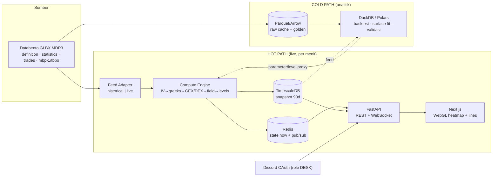

# FlowGreeks — Riset Mendalam & Cetak Biru Replikasi: TRACE + HIRO + Volatility + Exposure Lanjutan + Visualisasi 3D (/ES /NQ, Databento, Black-76)

<callout icon="🧭" color="blue_bg">
	**Apa dokumen ini.** Hasil eksekusi penuh dari mega-prompt riset FlowGreeks — bukan ringkasan, tapi riset + cetak biru replikasi end-to-end. Menggabungkan dua riset sebelumnya (**TRACE** = heatmap gamma/stok posisi, dan **HIRO** = hedging flow real-time) lalu menambah modul baru: **volatility surface, exposure greek lanjutan (GEX/DEX/vanna/charm), dinamika 0DTE, visualisasi 3D, dan modul sistem (alerting/backtesting/regime/arsitektur)** — semuanya diadaptasi ke **/ES & /NQ (CME, Databento GLBX.MDP3, Black-76)**.
	Dokumen induk sebelumnya: *SpotGamma TRACE — Riset Mendalam Replikasi Heatmap Gamma (vs OptionsDepth, GEXBOT, MenthorQ)* dan *SpotGamma HIRO — Riset Mendalam Replikasi Indikator Hedging Flow (+ adaptasi /ES /NQ Databento)*.
</callout>

<callout icon="⚖️" color="gray_bg">
	**Legenda penanda klaim**
	- **[FAKTA]** — dinyatakan eksplisit di sumber resmi/primer (link disertakan).
	- **[INFERENSI]** — kesimpulan rekayasa dari prinsip kuantitatif standar; bukan klaim resmi vendor.
	- **[PROPRIETARY]** — model/parameter internal vendor yang tidak dipublikasikan.
	- **[TIDAK TERDOKUMENTASI]** — tidak ditemukan sumber; jangan dianggap fakta.
</callout>

<callout icon="🧪" color="yellow_bg">
	**Prinsip integritas:** tidak ada angka/parameter/rumus yang dikarang seolah resmi. Yang **DIPUBLIKASIKAN vendor** dipisahkan tegas dari yang harus **DI-REVERSE-ENGINEER**. Untuk replikasi 1:1 valid, semua field hasil rekonstruksi WAJIB divalidasi numerik terhadap screenshot/sesi nyata.
</callout>

## Ringkasan eksekutif

FlowGreeks bisa dibangun sebagai **satu mesin greek + satu state engine** yang melahirkan semua produk: TRACE (stok posisi → heatmap waktu×harga), HIRO (flow real-time → garis kumulatif), surface volatilitas, dan peta exposure (GEX/DEX/VEX/charm). Yang **terdokumentasi & bisa direplikasi**: rumus GEX/DEX, konvensi tanda dealer, definisi key levels, encoding warna diverging, metodologi VIX (CBOE), parameterisasi surface (SVI/SABR), estimator realized vol (Garman-Klass/Yang-Zhang), dan greek Black-76. Yang **proprietary/harus diestimasi**: model klasifikasi trade & inventory dealer (Options Inventory Model / DDOI / Synthetic OI), Volatility Trigger™/Risk Pivot, dan parameter normalisasi visual.

**Perbedaan paling fundamental vs SpotGamma:** mereka memakai SPX/OPRA (opsi indeks cash-settled, klasifikasi dari tape OPRA). Kamu memakai **/ES /NQ di CME (opsi atas futures)** — yang justru memberi keunggulan: field **aggressor side** dari matching engine CME (via Databento `trades`/`tbbo`) memberi arah buy/sell **langsung**, tanpa perlu menebak lewat Lee-Ready. Konsekuensinya: model greek wajib **Black-76** (underlying = harga futures F), dan label "customer vs dealer" tetap harus di-proxy.

---

# BAGIAN 1 — TRACE (HEATMAP GAMMA / STOK POSISI)

## 1.1 Konsep: apa yang divisualisasikan

TRACE memvisualkan **medan tekanan hedging dealer** pada ruang **(waktu × harga)** untuk opsi, dibangun di atas *Options Inventory Model* SpotGamma, update **tiap 1 menit** dengan **proyeksi forward 5 hari**, dengan tiga lensa: **Gamma, Delta Pressure, Charm Pressure**, plus panel **Strike Plot**. [FAKTA] GEX-nya "measured in dollar notional terms based on the current price" dan tampil di TRACE Strike Plot. [FAKTA]

**Besaran yang dipetakan:** net **$-gamma dealer** per (level harga, waktu) pada lensa Gamma; net perubahan delta-positioning pada lensa Delta Pressure; perubahan delta terhadap waktu pada Charm Pressure. [FAKTA konsep; transformasi persis = PROPRIETARY]

**TRACE (stok) vs HIRO (flow):** TRACE = potret **inventory/posisi** (berbasis OI + estimasi intraday) — "di mana" tekanan terkonsentrasi. HIRO = **aliran real-time** dari tiap trade — "sedang ke mana" tekanan bergerak detik ini. [FAKTA]

## 1.2 Sumbu & struktur heatmap

- **Sumbu X = waktu intraday**, update tiap 1 menit + proyeksi forward 5 hari (calendar dropdown). [FAKTA]
- **Sumbu Y = level harga / strike.** Chart SG dirancang "to match up price action on the right with levels on the left" di sumbu harga yang sama. [FAKTA untuk chart SG; INFERENSI untuk TRACE]
- **Nilai sel/warna = net $-gamma (atau delta/charm) MM** di (harga, waktu). Biru = positif (vol rendah/pinning), merah = negatif (vol tinggi), netral = putih/hitam. [FAKTA]

**Kenapa (waktu×harga), bukan profil 1-D?** Karena gamma dealer berubah karena (a) **waktu** (charm/decay tiap menit, makin tajam mendekati close untuk 0DTE) dan (b) **harga** (gamma fungsi jarak spot→strike). [FAKTA] OptionsDepth menyebut produk ini eksplisit "a projection across time and underlying price." [FAKTA]

## 1.3 Matematika GEX per strike

Rumus resmi SpotGamma (per kontrak), **put dikalikan −1** (asumsi dealer short put pada indeks):

$$
GEX_{i} = \\Gamma_{i} \\times OI_{i} \\times \\text{ContractSize} \\times S^{2} \\times 0.01
$$

dan net agregat $`NetGEX = \\sum_{call} GEX - \\sum_{put} GEX`$ dijumlahkan ke seluruh strike & ekspirasi. [FAKTA]

<table fit-page-width="true" header-row="true">
<tr>
<td>Faktor</td>
<td>Arti</td>
<td>Catatan</td>
</tr>
<tr>
<td>`Γ`</td>
<td>∂²V/∂S² per 1 lembar (Black-Scholes)</td>
<td>Dihitung ulang saat S berubah [FAKTA]</td>
</tr>
<tr>
<td>`OI`</td>
<td>Open Interest</td>
<td>Basis posisi; resmi update overnight [FAKTA]</td>
</tr>
<tr>
<td>`ContractSize`</td>
<td>Multiplier kontrak (100 utk opsi ekuitas/indeks)</td>
<td>Untuk /ES /NQ berubah (Bagian 4) [FAKTA]</td>
</tr>
<tr>
<td>`S²·0.01`</td>
<td>Konversi ke $ per **1% move**</td>
<td>Penurunan: Γ·OI·mult·S = $/1$; ×0.01S = $/1% [INFERENSI didukung sumber]</td>
</tr>
</table>

Varian SqueezeMetrics memakai `OI × Γ × 100 × spot` (denominasi share→$) tanpa S² eksplisit; selisih karena faktor "per 1%" diterapkan terpisah. [FAKTA]

**Konvensi tanda dealer (kritis & beda per produk):**

- **Indeks (SPX, /ES, /NQ):** dealer dimodelkan **long call / short put** — karena dominasi covered call & collar di sisi customer. [FAKTA]
- **Single-stock:** dealer dimodelkan **short call & short put**. [FAKTA]
- Greek apa? Default lensa = **gamma**; TRACE juga punya lensa **delta** & **charm**. Vanna **tidak** jadi lensa TRACE resmi (tapi dipakai SpotGamma di analisis terpisah, lihat Bagian 3B). [FAKTA]

**OI vs Volume:** OI resmi hanya update overnight; SpotGamma memakai **Options Inventory Model / OI & Volume Adjustment** untuk estimasi perubahan posisi intraday dari volume live, dihitung pada 4 ekspirasi terdekat termasuk 0DTE. Cara klasifikasi volume (buy/sell, customer/dealer) = **[PROPRIETARY]** ("proprietary algorithms + multiple new data feeds").

## 1.4 Key levels (definisi & cara hitung)

<table fit-page-width="true" header-row="true">
<tr>
<td>Level</td>
<td>Definisi</td>
<td>Cara hitung</td>
<td>Status</td>
</tr>
<tr>
<td>**Call Wall**</td>
<td>Strike dgn net call gamma tertinggi → resistance utama</td>
<td>argmax net call gamma per strike</td>
<td>[FAKTA]</td>
</tr>
<tr>
<td>**Put Wall**</td>
<td>Strike dgn net put gamma terbesar → support utama</td>
<td>argmin (paling negatif) net put gamma per strike</td>
<td>[FAKTA]</td>
</tr>
<tr>
<td>**Zero Gamma / Gamma Flip**</td>
<td>Harga di mana net GEX agregat = 0 (inflection)</td>
<td>cari akar `Σ NetGEX(S)=0` dari profil GEX vs harga hipotetis</td>
<td>[FAKTA]</td>
</tr>
<tr>
<td>**Volatility Trigger™**</td>
<td>Level di bawahnya bearish feedback loop mulai; "last major support above Put Wall"; di bawahnya realized vol mengembang (68.3% confidence)</td>
<td>Metode proprietary: "dealers last major level of positive gamma support" — BUKAN sekadar crossover OI</td>
<td>[PROPRIETARY]</td>
</tr>
<tr>
<td>**Hedge Wall**</td>
<td>Analog Vol Trigger untuk single-stock; titik di mana realized vol diperkirakan mulai naik; predictive secara statistik. Di HIRO, kalkulasi serupa Vol Trigger dipakai sbg Hedge Wall</td>
<td>Proprietary (mirip Vol Trigger)</td>
<td>[PROPRIETARY]</td>
</tr>
<tr>
<td>**Absolute Gamma**</td>
<td>Strike dgn total gamma terbesar → "sticky pin", sering dekat Zero Gamma</td>
<td>argmax total gamma (call+put) per strike</td>
<td>[FAKTA]</td>
</tr>
<tr>
<td>**Risk Pivot**</td>
<td>Level kunci SpotGamma tambahan</td>
<td>tidak dipublikasi</td>
<td>[PROPRIETARY]</td>
</tr>
</table>

Catatan urutan rezim: Zero Gamma = titik infleksi, tapi bearish loop "tidak diharapkan menyala sampai menembus Volatility Trigger"; sebaliknya price harus cukup di atas Zero Gamma sebelum Call Wall menarik harga naik. [FAKTA]

## 1.5 Encoding warna

- **Diverging, berpusat nol:** biru = gamma +, merah = gamma −, netral = putih (light)/hitam (dark). [FAKTA]
- **Simetri:** titik tengah colormap = 0 ⇒ `vmin = −vmax`, `vmax = max|GEX|`. [INFERENSI — standar diverging]
- **Anti-skew outlier (krusial agar spike 0DTE tak membakar skala):** percentile clipping (98–99), signed-log/symlog `sign(x)·log(1+|x|/c)`, atau robust scaling per-frame. [INFERENSI; parameter persis TIDAK TERDOKUMENTASI]
- **Cara baca:** gamma + → dealer "buy dip/sell rip" → mean-reverting, range sempit (pinning di zona biru, paling kuat saat EOD). Gamma − → hedge searah → gerak membesar (zona merah). Topografi OptionsDepth: ridge (gamma peaks, garis hijau) = support/resistance; valley (troughs, garis kuning) = path of least resistance. [FAKTA]

## 1.6 Pembanding (TRACE vs OptionsDepth vs GEXBOT vs MenthorQ)

<table fit-page-width="true" header-row="true">
<tr>
<td>Dimensi</td>
<td>SpotGamma TRACE</td>
<td>OptionsDepth</td>
<td>GEXBOT</td>
<td>MenthorQ</td>
</tr>
<tr>
<td>Model posisi</td>
<td>Options Inventory Model / Synthetic OI [FAKTA]</td>
<td>"Actual positioning" full-portfolio [FAKTA]</td>
<td>Orderflow berbasis volatilitas, presisi ms; sisi customer [FAKTA]</td>
<td>Net GEX dari OI real-time [FAKTA]</td>
</tr>
<tr>
<td>Visual utama</td>
<td>Heatmap waktu×harga 3 lensa + Strike Plot [FAKTA]</td>
<td>Heatmap 2D + 3D surface; peaks/troughs [FAKTA]</td>
<td>Convexity ladder + profil GEX [FAKTA]</td>
<td>Gamma Levels 1–10 + TradingView [FAKTA]</td>
</tr>
<tr>
<td>Lensa greek</td>
<td>Gamma, Delta, Charm [FAKTA]</td>
<td>Gamma, Charm, Vanna [FAKTA]</td>
<td>GEX/convexity [FAKTA]</td>
<td>Net GEX, DEX [FAKTA]</td>
</tr>
<tr>
<td>Sisi konvensi</td>
<td>Dealer; index = long call/short put [FAKTA]</td>
<td>MM exposure [FAKTA]</td>
<td>**Customer** gex [FAKTA]</td>
<td>Net GEX (call−put) [FAKTA]</td>
</tr>
<tr>
<td>Update/forward</td>
<td>1 menit + forward 5 hari [FAKTA]</td>
<td>Intraday & daily [FAKTA]</td>
<td>Milidetik [FAKTA]</td>
<td>~10 menit (mitra) [FAKTA]</td>
</tr>
</table>

> Sumber pembanding: OptionsDepth projection; GEXBOT; MenthorQ guides. (detail lengkap di dokumen TRACE induk).

## 1.7 Replikasi TRACE — DATA CONTRACT + algoritma

```python
# === INPUT (per snapshot waktu t, resolusi 1 menit) ===
OptionQuote = {
    "expiry": date, "strike": float, "type": "C"|"P",
    "bid": float, "ask": float,      # mid -> solve IV
    "open_interest": int,             # OI overnight (resmi)
    "volume": int,                    # volume kumulatif hari ini
    "iv": float | None,
}
MarketState = {
    "timestamp": datetime, "future_price": float,  # F (untuk /ES /NQ)
    "risk_free_curve": Callable[[float], float],   # r(T) SOFR/OIS [INFERENSI]
}
# Posisi dealer = OUTPUT Options Inventory Model (PROPRIETARY).
# Aproksimasi reverse-engineer: signed_qty per kontrak dari net signed flow.
DealerPosition = { "contract_id": str, "signed_qty": float }  # + long / - short
GammaField = {
    "time_axis": List[datetime], "price_axis": List[float],
    "values": "ndarray[n_price, n_time]",  # net $ gamma per 1%
    "price_overlay": List[(datetime, float)],
    "key_levels": {"call_wall":float,"put_wall":float,"gamma_flip":float},
}
```

```python
import numpy as np
from scipy.stats import norm

def build_gamma_field(snapshots, price_grid, contract_mult):
    field = np.zeros((len(price_grid), len(snapshots)))
    for j, snap in enumerate(snapshots):          # X: waktu (1 min)
        for c in snap.contracts:
            T  = year_frac(snap.timestamp, c.expiry)
            iv = c.iv or solve_iv_black76(c.mid, snap.future_price, c.strike, T,
                                          snap.r(T), c.is_call)
            sgn = dealer_sign(c)                   # +long/-short (Inventory Model)
            qty = c.signed_qty
            for i, Fy in enumerate(price_grid):    # Y: harga hipotetis
                g = black76_gamma(Fy, c.strike, T, iv, snap.r(T))
                field[i, j] += sgn*qty*g*contract_mult*Fy**2*0.01
    return field
```

**Field projection = re-evaluasi gamma di tiap harga hipotetis (BUKAN smear Gaussian).** SpotGamma Phase 3: "recalculate the unit gamma for every option across a wide range of hypothetical spot levels (±10%) … Run the GEX formula across all levels." Penghalusan muncul alami karena Γ(S) berbentuk lonceng. [FAKTA] Render: `pcolormesh` diverging + `TwoSlopeNorm(0)` + clip persentil → overlay kontur (marching squares / `d3-contour`) → overlay harga → panel kiri Strike Plot (`sharey`).

---

# BAGIAN 2 — HIRO (HEDGING FLOW REAL-TIME)

## A. Konsep

**A1.** HIRO = **Hedging Impact of Real-time Options**; "measures and aggregates the delta notional value from every option trade, estimating the hedging requirement" — yaitu "what market makers will be forced to do." [FAKTA] Beda dgn GEX/TRACE: HIRO = **flow** (perubahan dari tiap trade), GEX/TRACE = **stok** (posisi terakumulasi). [FAKTA]

**A2. Kenapa leading/real-time:** dihitung dari **tape trade live** (bukan OI overnight), jadi mendahului perubahan posisi. Trader membaca: (a) **slope/akumulasi** (flow beli vs jual), (b) **divergence vs harga** (harga naik tapi HIRO turun = rapuh), (c) **spike** (impuls hedging besar). [FAKTA]

## B. Matematika & data (inti)

**B3. Rumus inti (delta-notional bertanda, diakumulasi):**

$$
HIRO_t = \\sum_{\\text{trade } k \\le t} s_k \\cdot \\delta_k \\cdot q_k \\cdot m \\cdot F_k
$$

dengan $`s_k`$ = tanda sisi customer/dealer (±1), $`\\delta_k`$ = delta opsi, $`q_k`$ = jumlah kontrak, $`m`$ = multiplier, $`F_k`$ = harga underlying. SpotGamma: agregasi delta-notional tiap trade. [FAKTA konsep; bentuk eksak Σ = INFERENSI terstruktur]

**B4. Klasifikasi sisi:** dari "Tape"; trade **above ask** = agresi beli berkonviksi, **below bid** = agresi jual. Logika persis (filter hedged-trade, deteksi retail, treatment multi-leg) = **[PROPRIETARY]**. Di OPRA, klasifikasi pakai eksekusi vs bid/ask (gaya Lee-Ready). [INFERENSI]

**B5. Arah hedging dealer (dealer = lawan customer):** customer **beli call / jual put** → dealer hedge **beli underlying** (flow +, hijau, dorongan naik); customer **jual call / beli put** → dealer **jual underlying** (flow −, merah). [FAKTA]

**B6. Delta saja?** HIRO terutama **delta-notional**; bobot gamma/charm tidak dinyatakan eksplisit → asumsi model delta-based. Model greek/IV/recompute = **[TIDAK TERDOKUMENTASI]** (kemungkinan BS untuk SPX). [INFERENSI]

**B7. Resolusi & agregasi:** per **trade** → diakumulasi **kumulatif sepanjang hari** (reset harian), plus **rolling window** (mis. 5-menit) untuk membaca momentum; candle 5 detik–30 menit. [FAKTA]

**B8. Breakdown:** per index/ticker; garis terpisah untuk **Total, Calls, Puts, Next Expiry/0DTE, Retail**. [FAKTA]

## C. Encoding visual

**C9.** Garis **kumulatif** di-overlay pada harga, **sumbu-Y ganda** (HIRO outer, price inner). Warna garis: **Putih = price, Ungu = Total HIRO, Biru = Puts, Oranye = Calls, Hijau = Next Expiry/0DTE, Merah = Retail**; overlay key levels (Call/Put/Hedge Wall, Key Gamma Strike). [FAKTA]

**C10. Divergence:** harga naik + HIRO turun → rally rapuh (setup short); contoh terdokumentasi AMD 3/17/22 (price up, HIRO down) dan SPX 2/24/25 (HIRO reversal → rally stall). [FAKTA]

## D. Replikasi HIRO

```python
Trade = { "ts": datetime, "strike": float, "expiry": date, "type":"C"|"P",
          "price": float, "size": int, "side": "A"|"B"|"N",   # CME aggressor
          "bid": float, "ask": float }

def hiro_stream(trades, F_now, mult, r_curve):
    cum, cum_call, cum_put, cum_0dte = 0,0,0,0
    for tr in trades:
        T  = year_frac(tr.ts, tr.expiry)
        iv = solve_iv_black76(mid(tr), F_now, tr.strike, T, r_curve(T), tr.is_call)
        d  = black76_delta(F_now, tr.strike, T, iv, r_curve(T), tr.is_call)
        s  = customer_sign(tr)        # dari aggressor side + proxy (lihat 4.2)
        dn = s * d * tr.size * mult * F_now
        cum += dn
        cum_call += dn if tr.is_call else 0
        cum_put  += dn if not tr.is_call else 0
        cum_0dte += dn if T < 1/365 else 0
        emit({"ts":tr.ts,"total":cum,"calls":cum_call,"puts":cum_put,"zdte":cum_0dte})
```

**D12. Teknologi:** ingest streaming (Databento live / WebSocket) → greek engine vektorisasi (numpy/Numba, cache IV per kontrak) → state akumulasi (in-memory ring buffer) → render time-series cepat (TradingView Lightweight Charts / uPlot). [INFERENSI]

**D13. HIRO vs pembanding flow:**

<table fit-page-width="true" header-row="true">
<tr>
<td>Tool</td>
<td>Inti</td>
<td>Sisi</td>
</tr>
<tr>
<td>**HIRO**</td>
<td>Delta-notional hedging flow kumulatif; greek-weighted [FAKTA]</td>
<td>Customer→dealer (delta hedge)</td>
</tr>
<tr>
<td>**Unusual Whales**</td>
<td>Net Premium / Market Tide; sisi via bid-ask, premium [FAKTA]</td>
<td>Premium-weighted, bukan delta</td>
</tr>
<tr>
<td>**Cheddar Flow**</td>
<td>Sweeps, block, dark pool [FAKTA]</td>
<td>Deteksi flow agresif</td>
</tr>
<tr>
<td>**GEXBOT**</td>
<td>Klasifikasi berbasis volatilitas, ms; delta/gamma/vanna/charm second-by-second [FAKTA]</td>
<td>Customer gex</td>
</tr>
</table>

---

# BAGIAN 3 — MODUL EKSPANSI 0DTE (BARU)

## 3A. Volatility

### IV surface (strike × expiry × IV)

**Langkah:** (1) solve IV per kontrak dari **mid** via **Newton-Raphson** (fallback bisection saat vega kecil/near-expiry); (2) ubah ke koordinat **log-moneyness** $`k=\\log(K/F)`$ dan **total implied variance** $`w(k,T)=\\sigma_{BS}^2(k,T)\\,T`$; (3) fit per-slice. [FAKTA notasi: Gatheral-Jacquier]

**Parameterisasi (standar industri):**

- **SVI** (raw): $`w(k)=a+b\\{\\rho(k-m)+\\sqrt{(k-m)^2+\\sigma^2}\\}`$ — 5 parameter per slice; bisa dibuat **arbitrage-free** (Gatheral-Jacquier SSVI menjamin bebas calendar & butterfly arbitrage). [FAKTA]
- **SABR** (stochastic α, β, ρ) — populer di rates, juga equity smile. [FAKTA]
- **Cubic spline** — pilihan desain cepat, TIDAK menjamin bebas-arbitrage. [INFERENSI]

> **Standar industri vs pilihan desain:** SVI/SSVI & SABR = standar (arbitrage-free, sumber primer). Spline/interpolasi mentah = pilihan praktis tapi rawan arbitrage. [FAKTA/INFERENSI]

### Skew, smile, term structure

- **Skew 25-delta:** $`\\sigma_{25\\Delta P}-\\sigma_{25\\Delta C}`$ (atau vs ATM) — ukuran kemiringan smile. [INFERENSI — definisi industri standar]
- **Term structure:** ATM IV vs T (contango/backwardation). [INFERENSI]

### Realized vol vs implied

- **Close-to-close:** $`\\sigma=\\sqrt{\\tfrac{N}{n}\\sum (\\ln\\tfrac{C_i}{C_{i-1}})^2}`$.
- **Garman-Klass (OHLC):** $`\\sigma_{GK}^2=\\tfrac1n\\sum[\\tfrac12(\\ln\\tfrac{H_i}{L_i})^2-(2\\ln2-1)(\\ln\\tfrac{C_i}{O_i})^2]`$ — ~7–8× lebih efisien dari close-to-close. [FAKTA]
- **Yang-Zhang:** $`\\sigma_{YZ}^2=\\sigma_O^2+k\\sigma_C^2+(1-k)\\sigma_{RS}^2`$ (gabungan overnight + close-open + Rogers-Satchell); paling efisien, handle drift & gap. [FAKTA]
- **Volatility risk premium (VRP):** implied² − realized²; **vol cone:** distribusi realized vol per horizon (persentil). [INFERENSI — konsep standar]

### Indeks vol gaya VIX untuk /ES /NQ

Metodologi VIX CBOE = **model-free implied variance**: agregasi tertimbang harga put & call SPX lintas strike (mid bid/ask), mereplikasi variance swap, lalu interpolasi ke konstanta 30-hari. [FAKTA]

$$
\\sigma^2=\\frac{2}{T}\\sum_i \\frac{\\Delta K_i}{K_i^2}e^{rT}Q(K_i)-\\frac{1}{T}\\left(\\frac{F}{K_0}-1\\right)^2
$$

**Opsi untuk /ES /NQ:** (a) pakai futures **VX/VXN** sebagai proxy; atau (b) **hitung sendiri** model-free IV pada chain /ES /NQ memakai formula di atas (F = harga futures, langsung cocok). VVIX = vol-of-vol (volatilitas dari VIX options) — analog bisa dibangun bila ada opsi pada VX. [FAKTA metodologi; penerapan ke /ES = INFERENSI]

### Dinamika IV intraday 0DTE & expected move

- **Vol crush & smile 0DTE ekstrem:** theta sangat besar, smile menukik tajam mendekati expiry. [INFERENSI didukung literatur 0DTE]
- **Expected move harian:** $`EM \\approx S\\cdot\\sigma_{ATM}\\sqrt{T}`$ atau ≈ harga **ATM straddle** (× ~0.85 untuk 1σ). [INFERENSI — standar]

## 3B. Exposure greek lanjutan

Kerangka kuantitatif dealer-positioning (gamma, vanna, charm sebagai second-order flows) dirangkum FlashAlpha & MenthorQ. [FAKTA kerangka]

<table fit-page-width="true" header-row="true">
<tr>
<td>Exposure</td>
<td>Greek</td>
<td>Rumus exposure (per strike, ber-tanda dealer)</td>
<td>Makna</td>
</tr>
<tr>
<td>**GEX**</td>
<td>Γ</td>
<td>`Σ Γ·OI·m·F²·0.01`</td>
<td>Stabilitas vs volatilitas [FAKTA]</td>
</tr>
<tr>
<td>**DEX**</td>
<td>δ</td>
<td>`Σ δ·OI·m·F`</td>
<td>Bias direksional hedging [FAKTA]</td>
</tr>
<tr>
<td>**VEX/Vanna**</td>
<td>∂δ/∂σ</td>
<td>`Σ vanna·OI·m·F·(1vol)`</td>
<td>Sensitivitas delta dealer thd IV [FAKTA]</td>
</tr>
<tr>
<td>**CHEX/Charm**</td>
<td>∂δ/∂t</td>
<td>`Σ charm·OI·m·F·(1hari)`</td>
<td>Drift delta karena waktu [FAKTA]</td>
</tr>
</table>

**SqueezeMetrics:** GEX = sensitivitas delta dealer thd harga; **VEX = sensitivitas delta dealer thd IV**; keduanya butuh **DDOI** (Dealer Directional Open Interest) — apakah dealer long/short tiap (expiry, strike, type), diturunkan dari **data transaksi** (klasifikasi buy/sell tiap trade) lalu **diverifikasi** dgn perubahan OI aktual. [FAKTA]

**Charm 0DTE (afternoon drift):** menjelang close, delta opsi yang akan expiry meluruh cepat → dealer melepas hedge → flow direksional besar di sesi sore. Skenario pre-OPEX Friday: pagi pinned (GEX dominan), sore vol naik saat charm "unwinds" delta. [FAKTA] SpotGamma: vanna & charm = "hidden greeks" pendorong grinding rallies & EOD pins; **vanna rally** = dealer beli futures saat IV turun. [FAKTA]

**Vanna (vol feedback loop):** hedging dealer → gerak harga → ubah IV → reshape hedge — loop swa-perkuat; di lingkungan volume tinggi bisa jadi runaway move. [FAKTA]

**Greek orde tinggi (speed=∂Γ/∂S, color=∂Γ/∂t):** berguna untuk akurasi re-hedge di near-expiry tapi umumnya **berlebihan** untuk dashboard; prioritaskan gamma/vanna/charm. [INFERENSI]

**Dealer-positioning (long/short gamma):** asumsi struktural (index: long call/short put) = prior publik; refinement dari klasifikasi flow = **[PROPRIETARY di SpotGamma]**, tapi **bisa di-reverse-engineer** dari OI + signed flow (lihat 4.2 — di CME kamu punya aggressor side langsung). Quant SE: asumsikan calls dimiliki dealer (GEX +), puts short dealer (GEX −), iterasi spot dgn smile konstan. [FAKTA pendekatan]

## 3C. Dinamika khusus 0DTE

- **Gamma pinning / pin risk:** dekat strike gamma besar (Absolute Gamma), dealer long gamma menahan harga → "sticky pin", terkuat saat EOD. [FAKTA]
- **Charm/theta flow ke close:** afternoon drift (lihat 3B). [FAKTA]
- **Pangsa volume 0DTE:** ~1,5 juta kontrak/hari, ≈ separuh seluruh trade terkait SPX (Cboe 2025). [FAKTA] Efek: hedging dealer terkonsentrasi di intraday & sangat sensitif waktu vs tenor panjang.
- **/ES vs /NQ:** korelasi tinggi tapi /NQ lebih bervol (beta tech); divergence flow (mis. HIRO /ES naik, /NQ turun) = sinyal rotasi/risiko. [INFERENSI]

## 3D. Visualisasi (termasuk 3D & lanjutan)

- **Heatmap gamma evolusi-waktu** (ala TRACE) + overlay key levels — Bagian 1.
- **Garis HIRO dual-axis** (total/call/put/0DTE/retail) — Bagian 2.
- **3D gamma/exposure surface:** x=strike, y=time-of-day atau time-to-expiry, z=GEX, warna=tanda. **Kapan 3D lebih baik:** saat ingin melihat **bentuk punggungan/lembah** dan evolusi konveksitas (0DTE menonjol mendekati expiry). **Risiko misleading 3D:** oklusi (data tertutup puncak), distorsi perspektif, sudut pandang menipu magnitudo → sediakan rotasi + proyeksi 2D pendamping. [FAKTA: OptionsDepth punya 3D; INFERENSI: pitfalls]
- **3D IV surface** (strike×expiry×IV) animasi real-time — `plotly go.Surface`. [FAKTA]
- **Terrain/contour, ridgeline, time-scrubbing/replay sesi** untuk audit intraday.

**Teknologi render:**

<table fit-page-width="true" header-row="true">
<tr>
<td>Kebutuhan</td>
<td>Rekomendasi</td>
<td>Catatan</td>
</tr>
<tr>
<td>3D surface interaktif (web)</td>
<td>**three.js / WebGL**, deck.gl, ECharts-GL</td>
<td>GPU; skala besar [INFERENSI]</td>
</tr>
<tr>
<td>3D riset/prototipe</td>
<td>**plotly** `Surface` (Python/JS)</td>
<td>WebGL, jutaan titik [FAKTA]</td>
</tr>
<tr>
<td>Heatmap besar</td>
<td>**datashader** / regl / PixiJS</td>
<td>Hindari SVG per-cell</td>
</tr>
<tr>
<td>Time-series cepat</td>
<td>**TradingView Lightweight Charts / uPlot**</td>
<td>HIRO/price overlay</td>
</tr>
<tr>
<td>Kontur</td>
<td>**d3-contour** (marching squares)</td>
<td>Ridge/valley</td>
</tr>
</table>

**Color theory:** diverging colormap (RdBu) untuk tanda +/− berpusat 0; perceptual-uniform (viridis/magma) untuk magnitudo searah; hindari jet. [INFERENSI — praktik viz standar]

## 3E. Modul sistem lain

- **Alerting:** flow-impact threshold (|HIRO slope| > X), level-break (price cross Call/Put Wall/Vol Trigger), **gamma-flip cross**. [INFERENSI]
- **Backtesting/validasi sinyal:** uji prediktivitas HIRO/GEX terhadap return intraday — event study (sign HIRO → return t+Δ), IC/Sharpe per bucket regime, walk-forward. [INFERENSI]
- **Regime detection:** klasifikasi long-gamma vs short-gamma (price vs Zero Gamma/Vol Trigger), regime vol (HMM/threshold pada realized vol). Implikasi: long-gamma → mean-reversion; short-gamma → momentum. [FAKTA arah; implementasi INFERENSI]
- **Arsitektur pipeline:** ingest streaming (Databento live) → greek engine (Numba/Rust) → state/akumulasi (Redis/in-memory) → store kolumnar (**Parquet/Arrow**, time-series DB spt ClickHouse/Arctic) → render. Pertimbangan: latency (hot path greek), throughput (burst 0DTE), storage tick-level. [INFERENSI]

---

# BAGIAN 4 — ADAPTASI /ES & /NQ (CME, DATABENTO, BLACK-76)

## 4.1 Schema Databento — mana yang dibutuhkan

<table fit-page-width="true" header-row="true">
<tr>
<td>Schema</td>
<td>Isi</td>
<td>Cukup utk klasifikasi buy/sell?</td>
</tr>
<tr>
<td>`bbo-1m`</td>
<td>Snapshot BBO tiap interval 1 menit</td>
<td>**TIDAK** — snapshot, tak ada per-trade side [FAKTA]</td>
</tr>
<tr>
<td>`trades`</td>
<td>Tiap trade + field **`side`** (A/B/N) dari matching engine</td>
<td>**YA** — aggressor langsung [FAKTA]</td>
</tr>
<tr>
<td>`tbbo`</td>
<td>Trade + BBO tepat sebelum trade</td>
<td>**TERBAIK** — trade + konteks quote [FAKTA]</td>
</tr>
<tr>
<td>`mbp-1`</td>
<td>Top-of-book (L1) tiap update</td>
<td>Pendukung (rekonstruksi quote) [FAKTA]</td>
</tr>
</table>

`side`: **A** = sell-aggressor, **B** = buy-aggressor, **N** = none/unknown. **Rekomendasi FlowGreeks:** `tbbo` (atau `trades` + `mbp-1`) untuk HIRO/flow; `definition` untuk master kontrak; opsional `statistics` untuk settlement/OI. [FAKTA]

> Catatan migrasi (OPRA, Mei 2025): TBBO→TCBBO, MBP-1→CMBP-1. Untuk GLBX.MDP3 (CME) skema utama tetap `trades`/`tbbo`/`mbp-1`. [FAKTA]

## 4.2 Klasifikasi sisi di CME

CME matching engine memberi **aggressor side langsung** (field `side`) — keunggulan besar vs OPRA yang perlu **Lee-Ready** (bandingkan eksekusi vs mid/bid/ask + tick rule). **TAPI: aggressor ≠ otomatis "customer".** Yang agresif bisa dealer/HFT. Strategi proxy: (a) gunakan aggressor sebagai arah inisiasi; (b) proxy customer/dealer via ukuran, pola, dan filter (mis. block, multi-leg), seperti SpotGamma — tetap **[PROPRIETARY/heuristik]**. [FAKTA aggressor; INFERENSI proxy]

## 4.3 Black-76 (opsi atas futures)

Underlying = harga futures $F$; diskon $e^{-rT}$; $`d_1=\\dfrac{\\ln(F/K)+\\tfrac12\\sigma^2T}{\\sigma\\sqrt T}`$, $`d_2=d_1-\\sigma\\sqrt T`$.

<table fit-page-width="true" header-row="true">
<tr>
<td>Greek</td>
<td>Rumus Black-76</td>
</tr>
<tr>
<td>Delta (call/put)</td>
<td>$`e^{-rT}N(d_1)`$ / $`-e^{-rT}N(-d_1)`$</td>
</tr>
<tr>
<td>Gamma</td>
<td>$`e^{-rT}\\dfrac{N'(d_1)}{F\\sigma\\sqrt T}`$</td>
</tr>
<tr>
<td>Vanna</td>
<td>$`-e^{-rT}N'(d_1)\\dfrac{d_2}{\\sigma}`$</td>
</tr>
<tr>
<td>Charm (call)</td>
<td>$`\\approx e^{-rT}\\!\\left[rN(d_1)-N'(d_1)\\dfrac{2rT\\sqrt T-d_2}{2T\\sigma\\sqrt T}\\right]`$ (turunan ∂δ/∂t, hati-hati tanda) [INFERENSI — turunan standar]</td>
</tr>
<tr>
<td>Vega</td>
<td>$`e^{-rT}F\\,N'(d_1)\\sqrt T`$</td>
</tr>
</table>

IV solver: Newton-Raphson dari quote CME (mid). [FAKTA: Black-76 utk CME options-on-futures]

```python
def black76_gamma(F,K,T,sigma,r):
    if T<=0 or sigma<=0: return 0.0
    d1=(np.log(F/K)+0.5*sigma**2*T)/(sigma*np.sqrt(T))
    return np.exp(-r*T)*norm.pdf(d1)/(F*sigma*np.sqrt(T))
def black76_delta(F,K,T,sigma,r,is_call):
    d1=(np.log(F/K)+0.5*sigma**2*T)/(sigma*np.sqrt(T))
    return np.exp(-r*T)*(norm.cdf(d1) if is_call else norm.cdf(d1)-1)
```

## 4.4 Multiplier & notional

/ES = **$50** per poin indeks, /NQ = **$20**. Delta-notional = $`\\delta\\cdot q\\cdot m\\cdot F`$; GEX = $`\\Gamma\\cdot OI\\cdot m\\cdot F^2\\cdot 0.01`$. [FAKTA]

## 4.5 Apa yang berubah vs SPX/OPRA SpotGamma

<table fit-page-width="true" header-row="true">
<tr>
<td>Aspek</td>
<td>SpotGamma (SPX/OPRA)</td>
<td>FlowGreeks (/ES /NQ/CME)</td>
</tr>
<tr>
<td>Feed</td>
<td>OPRA tape</td>
<td>Databento GLBX.MDP3 (`trades`/`tbbo`) [FAKTA]</td>
</tr>
<tr>
<td>Klasifikasi sisi</td>
<td>Lee-Ready (infer dari quote) [INFERENSI]</td>
<td>Aggressor side langsung dari matching engine [FAKTA]</td>
</tr>
<tr>
<td>Underlying</td>
<td>Spot SPX (cash)</td>
<td>Harga futures F (/ES /NQ) [FAKTA]</td>
</tr>
<tr>
<td>Model greek</td>
<td>Black-Scholes(-Merton), dividend q</td>
<td>**Black-76** (tanpa q; diskon futures) [FAKTA]</td>
</tr>
<tr>
<td>Multiplier</td>
<td>100 (SPX options)</td>
<td>$50 (/ES), $20 (/NQ) [FAKTA]</td>
</tr>
<tr>
<td>Universe</td>
<td>400+ ticker, fokus SPX</td>
<td>/ES, /NQ (extensible) [FAKTA]</td>
</tr>
<tr>
<td>Dealer/customer label</td>
<td>Proprietary inventory model</td>
<td>Proxy dari aggressor + heuristik [INFERENSI]</td>
</tr>
</table>

## 4.6 Keterbatasan & workaround

- **Customer vs dealer tak pasti** (aggressor ≠ customer) → workaround: heuristik ukuran/pola + kalibrasi vs perubahan OI harian (a la DDOI). [INFERENSI]
- **OI CME** update harian (settlement) → intraday pakai net signed volume sebagai ΔOI estimat. [INFERENSI]
- **Likuiditas chain /NQ** lebih tipis di strike jauh → smoothing surface (SVI) lebih penting. [INFERENSI]
- **Level proprietary (Vol Trigger/Risk Pivot)** tak bisa direplikasi 1:1 → bangun proxy (gamma centroid / last positive-gamma support) lalu validasi. [INFERENSI]

---

# BAGIAN 5 — SPESIFIKASI TEKNIS PEMBANGUNAN (Backend · Frontend · Database · Infra)

<callout icon="🏗️" color="blue_bg">
	Bagian ini menjawab: **"sumber data cukup GLBX.MDP3 saja?"** (ya) dan **"tentukan spek teknis ideal end-to-end"**. Disusun dari hasil mega-riset di atas + dibandingkan dengan **PRD FlowDesk** milikmu. Tempat di mana rekomendasi ini **berbeda dari PRD** ditandai eksplisit (lihat 5.10). Sebagian besar pilihan teknologi adalah **[INFERENSI / keputusan desain]**, bukan klaim vendor.
</callout>

## 5.0 Keputusan sumber data: cukup GLBX.MDP3, OPRA tidak diperlukan

**Ya, betul — cukup Databento GLBX.MDP3, tanpa OPRA.Pillar.** Alasannya struktural, bukan sekadar preferensi:

- Opsi atas futures **/ES & /NQ** diperdagangkan **100% di CME Globex**, dan seluruh datanya ada di dataset **GLBX.MDP3**. [FAKTA]
- **OPRA** adlh consolidated feed untuk **opsi ekuitas & indeks AS (SPX, SPY, saham)** — semesta SpotGamma, bukan semestamu. Untuk trader futures, OPRA **tidak relevan** dan hanya menambah biaya + kompleksitas. [FAKTA]
- Justru GLBX memberi **keunggulan**: field **aggressor `side` (A/B/N)** langsung dari matching engine CME → arah buy/sell tanpa Lee-Ready; satu venue (tanpa fragmentasi SIP) → tak perlu konsolidasi; underlying = harga futures F → **Black-76** native. [FAKTA]

<table fit-page-width="true" header-row="true">
<tr>
<td>Pertanyaan</td>
<td>GLBX.MDP3 (/ES /NQ)</td>
<td>OPRA (tidak dipakai)</td>
</tr>
<tr>
<td>Semesta instrumen</td>
<td>Opsi atas futures CME ✓</td>
<td>Opsi ekuitas/indeks AS ✗ (di luar fokus)</td>
</tr>
<tr>
<td>Arah trade</td>
<td>Aggressor side native (A/B/N) ✓</td>
<td>Harus infer Lee-Ready</td>
</tr>
<tr>
<td>Model greek</td>
<td>Black-76 (underlying F) ✓</td>
<td>Black-Scholes + dividen</td>
</tr>
<tr>
<td>Konsolidasi feed</td>
<td>Single venue, tak perlu ✓</td>
<td>Perlu (banyak exchange)</td>
</tr>
</table>

> **Kesimpulan:** semua tujuan FlowGreeks (key levels, karakteristik market, "kompas"/arus angin flow 0DTE) tercapai penuh dengan GLBX.MDP3 saja. [INFERENSI kuat]

## 5.1 Arsitektur makro (dua bidang: hot-path live + cold-path analitik)

Prinsip inti (selaras PRD #8 §14): **hitung sekali per menit di server → simpan turunan → semua klien baca hasil sama**. Saya pertahankan itu dan menambah **bidang analitik dingin** (golden dataset, backtest, surface) yang terpisah dari hot-path live agar tak mengganggu latensi RTH.



## 5.2 Lapisan data & pilihan schema Databento (final)

Untuk merekonstruksi chain 0DTE per menit (TRACE/GEX/DEX) **dan** mengklasifikasi flow per-trade (HIRO), dua kebutuhan berbeda → dua kelompok schema:

<table fit-page-width="true" header-row="true">
<tr>
<td>Schema</td>
<td>Dipakai untuk</td>
<td>Kenapa</td>
</tr>
<tr>
<td>`definition`</td>
<td>Master kontrak (strike, tipe, expiry)</td>
<td>Identitas + filter 0DTE (`expiry==session_date`) [FAKTA]</td>
</tr>
<tr>
<td>`statistics`</td>
<td>Open Interest + settlement</td>
<td>Basis Call/Put Wall (OI) [FAKTA]</td>
</tr>
<tr>
<td>`mbp-1` (atau `bbo-1m`)</td>
<td>**Quote per menit semua strike** → mid → solve IV</td>
<td>Snapshot top-of-book kontinu; perlu untuk IV seluruh chain tiap menit [FAKTA]</td>
</tr>
<tr>
<td>`trades` **atau** `tbbo`</td>
<td>**HIRO flow per-trade** (size + aggressor side)</td>
<td>`trades` punya `side`; `tbbo` = trade + BBO sebelum trade (konteks quote terbaik) [FAKTA]</td>
</tr>
</table>

<callout icon="🔎" color="gray_bg">
	**Catatan vs PRD-mu (#8 §9):** PRD memakai `["definition","statistics","trades","mbp-1"]` — itu **sudah benar**. Refinemen: untuk HIRO, pertimbangkan **`tbbo`** menggantikan `trades`+lookup quote terpisah karena `tbbo` sudah membawa BBO pas sebelum tiap trade (klasifikasi above-ask/below-bid jadi lebih akurat tanpa join manual). Untuk TRACE per-menit, `mbp-1`/`bbo-1m` tetap wajib (quote kontinu semua strike). [INFERENSI]
</callout>

**Strategi ingest (pertahankan "aturan emas" PRD):** 1 schema = 1 request rentang penuh → cache ke disk (`.dbn`/Parquet) → `HistoricalFeedAdapter` baca lokal, tidak narik ulang. Hindari loop per-hari (pemicu rate-limit). [FAKTA praktik]

## 5.3 Backend — Compute Engine (jantung sistem)

<table fit-page-width="true" header-row="true">
<tr>
<td>Aspek</td>
<td>Rekomendasi ideal</td>
<td>Alasan</td>
</tr>
<tr>
<td>Bahasa</td>
<td>**Python 3.13** (numpy + scipy)</td>
<td>Ekosistem quant matang; cocok PRD [INFERENSI]</td>
</tr>
<tr>
<td>Hot-path greek</td>
<td>Vektorisasi numpy + **Numba** (`@njit`) untuk solver IV & field projection</td>
<td>Field projection = re-eval Black-76 di grid harga × semua strike tiap menit → CPU-berat; Numba beri ~10–50× tanpa pindah bahasa [INFERENSI]</td>
</tr>
<tr>
<td>Wrangling chain</td>
<td>**Polars** (atau pandas) untuk olah chain per menit</td>
<td>Lebih cepat & hemat memori dari pandas untuk join/agg per menit [INFERENSI]</td>
</tr>
<tr>
<td>Skala lanjut</td>
<td>Opsi port hot-loop ke **Rust** (pyo3) bila >ratusan user / multi-instrumen</td>
<td>Hanya bila profiling menuntut; jangan prematur [INFERENSI]</td>
</tr>
<tr>
<td>Struktur modul</td>
<td>`black76.py · iv.py · greeks.py · exposure.py · field.py · levels.py · regime.py` (+ v2: `surface.py` SVI, v3: `vanna_charm.py`)</td>
<td>Persis PRD #8 §2 + slot ekspansi mega-riset [selaras]</td>
</tr>
</table>

Urutan pipeline per menit (selaras PRD #7 §16, diperluas): `chain → hygiene/filter 0DTE → solve IV (NR→bisection→interpolasi) → greeks Black-76 → NetGEX/NetDEX per strike (tanda dealer × VOL × M × F² × 1%) → field projection di price_grid → key levels (walls OI, flip/largest VOL) → regime → snapshot`. [FAKTA dari PRD; algoritma di ALGORITMA FINAL atas]

## 5.4 Backend — API / WebSocket service

<table fit-page-width="true" header-row="true">
<tr>
<td>Aspek</td>
<td>Rekomendasi</td>
<td>Catatan</td>
</tr>
<tr>
<td>Framework</td>
<td>**FastAPI** (Python) + Uvicorn</td>
<td>REST + WS satu proses; reuse model Pydantic = validasi snapshot [selaras PRD]</td>
</tr>
<tr>
<td>Kontrak snapshot</td>
<td>Pydantic v2 `Snapshot` (mirror ke TS `types.ts`)</td>
<td>Satu sumber kebenaran skema (PRD #8 §3)</td>
</tr>
<tr>
<td>Transport WS</td>
<td>JSON untuk metadata; **MessagePack/biner + gzip** untuk array `field`/`profile` besar</td>
<td>Array price_grid bisa ratusan titik/menit; biner memangkas payload & jitter [INFERENSI — beda dari PRD yang full-JSON]</td>
</tr>
<tr>
<td>Auth</td>
<td>Discord OAuth2 + gating role **DESK** (cookie HMAC, re-check harian + grace)</td>
<td>Pertahankan PRD #6 apa adanya [selaras]</td>
</tr>
<tr>
<td>Reliability</td>
<td>Reconnect backoff (1/2/4…max30s), heartbeat 30s, STALE bukan crash</td>
<td>Selaras PRD #9/#11</td>
</tr>
</table>

## 5.5 Database & state

<table fit-page-width="true" header-row="true">
<tr>
<td>Lapisan</td>
<td>Teknologi</td>
<td>Isi & alasan</td>
</tr>
<tr>
<td>State "now"</td>
<td>**Redis**</td>
<td>`state:{inst}:latest` · pub/sub `live:{inst}`; heartbeat engine [selaras PRD]</td>
</tr>
<tr>
<td>Snapshot turunan</td>
<td>**TimescaleDB** (hypertable, retensi 90d, JSONB payload)</td>
<td>Replay + decoupling + hemat compute [selaras PRD #8 §4]</td>
</tr>
<tr>
<td>Raw cache</td>
<td>**Parquet/Arrow** di `DATA_DIR`</td>
<td>Cache `.dbn`→Parquet untuk historical-sim & golden; tak masuk DB produksi [selaras + dipertegas]</td>
</tr>
<tr>
<td>Analitik/backtest</td>
<td>**DuckDB** (query Parquet + Timescale)</td>
<td>Backtest prediktivitas HIRO/GEX, fit surface offline, validasi golden — tanpa bebani hot-path [INFERENSI — tambahan vs PRD]</td>
</tr>
<tr>
<td>Backup</td>
<td>Dump Timescale mingguan → object storage, simpan ≥4 minggu</td>
<td>Selaras PRD #11 §4</td>
</tr>
</table>

**Sizing kasar:** snapshot turunan ~beberapa KB–puluhan KB/menit/instrumen × ~390 menit RTH × 2 instrumen × 90 hari ≈ orde **ratusan MB–beberapa GB** → 1 VPS cukup. [INFERENSI]

## 5.6 Frontend

<table fit-page-width="true" header-row="true">
<tr>
<td>Kebutuhan</td>
<td>Teknologi ideal</td>
<td>Alasan</td>
</tr>
<tr>
<td>App shell</td>
<td>**Next.js + React + TypeScript**</td>
<td>Selaras PRD; SSR landing + SPA dashboard</td>
</tr>
<tr>
<td>Heatmap field (2D)</td>
<td>**WebGL** via `regl`/PixiJS (shader custom, colormap di GPU)</td>
<td>60fps pan/zoom (NFR-2); colormap diverging perceptual (OKLab) di fragment shader [INFERENSI]</td>
</tr>
<tr>
<td>Profil garis + harga + HIRO lines</td>
<td>**uPlot** atau **TradingView Lightweight Charts**</td>
<td>Time-series ringan, dual-axis, hemat CPU [INFERENSI]</td>
</tr>
<tr>
<td>Kontur key-level (opsional)</td>
<td>**d3-contour** (marching squares)</td>
<td>Ridge/valley overlay heatmap</td>
</tr>
<tr>
<td>3D surface (v3: gamma & IV)</td>
<td>**three.js / react-three-fiber** (atau plotly untuk prototipe)</td>
<td>x=strike, y=waktu/T, z=GEX/IV; sediakan rotasi + proyeksi 2D pendamping (anti-misleading) [INFERENSI]</td>
</tr>
<tr>
<td>State & data</td>
<td>**Zustand/Jotai** · `ws-client.ts` (MessagePack)</td>
<td>State toggles (basis/metric/zoom/instrumen) + persist preferensi</td>
</tr>
<tr>
<td>Design system</td>
<td>Token PRD #2: **Space Grotesk + JetBrains Mono**, turquoise #40E0D0 / crimson #E0183C, interpolasi OKLab, anti-AI-look</td>
<td>Pertahankan penuh [selaras]</td>
</tr>
</table>

## 5.7 Auth & entitlement

Pertahankan PRD #6 sepenuhnya: **Discord OAuth2** (scope `identify guilds.members.read`) → akses hanya bila `is_member(Flowjob.id) && has_role(DESK)`; cookie HMAC HttpOnly+Secure+SameSite; re-check saat login + harian + tombol manual; grace sampai akhir hari ET bila role dicabut; semua endpoint data 403 untuk non-DESK. [selaras]

## 5.8 Infra, deployment, CI/CD, monitoring

<table fit-page-width="true" header-row="true">
<tr>
<td>Aspek</td>
<td>Rekomendasi</td>
<td>Catatan</td>
</tr>
<tr>
<td>Hosting backend</td>
<td>**1 VPS Hetzner** (CPX31 prod / CPX21 dev) + Docker Compose</td>
<td><50 user → cukup; scale vertikal [selaras PRD #11]</td>
</tr>
<tr>
<td>Frontend</td>
<td>**Vercel** (Next.js), panggil API via HTTPS/WSS</td>
<td>Selaras PRD</td>
</tr>
<tr>
<td>Service</td>
<td>worker (engine) · api (FastAPI) · timescaledb · redis</td>
<td>`restart: unless-stopped` · healthcheck + worker watchdog (>2 mnt → restart) [selaras]</td>
</tr>
<tr>
<td>CI/CD</td>
<td>lint/typecheck → unit (black76/iv/exposure) → **regression golden (blocker)** → build → staging(historical) → smoke → approval → prod(live)</td>
<td>Akurasi gagal = blokir deploy mutlak [selaras PRD #13]</td>
</tr>
<tr>
<td>Monitoring</td>
<td>Heartbeat Redis (>120s RTH → alert), `/api/health`, Sentry-like, alert **Discord webhook**</td>
<td>Selaras PRD #11/#13</td>
</tr>
<tr>
<td>Scale-up path</td>
<td>Pisahkan worker compute ke node sendiri; managed Timescale; CDN aset; (jauh) NATS/Kafka ganti Redis pub/sub</td>
<td>Hanya bila metrik menuntut [INFERENSI]</td>
</tr>
</table>

## 5.9 Peta modul → fase (jembatan PRD MVP ↔ mega-riset)

PRD MVP-mu sengaja membatasi lingkup (Charm/Vanna, alert, rolling-VOL = WON'T v1). Mega-riset menambah modul itu sebagai **ekspansi pasca-MVP**. Pemetaannya:

<table fit-page-width="true" header-row="true">
<tr>
<td>Fase</td>
<td>Modul</td>
<td>Lapisan tersentuh</td>
<td>Status di PRD</td>
</tr>
<tr>
<td>**MVP (v1)**</td>
<td>Engine Black-76 + IV + GEX/DEX + field heatmap + walls/flip + regime + replay + auth</td>
<td>Engine, DB, API, FE</td>
<td>Inti PRD #1/#7/#8</td>
</tr>
<tr>
<td>**v2**</td>
<td>IV surface (SVI) + VIX-proxy /ES /NQ + skew/term + expected move</td>
<td>+`surface.py`, panel vol baru</td>
<td>Ekspansi (mega-riset 3A)</td>
</tr>
<tr>
<td>**v3**</td>
<td>VEX/Vanna + CHEX/Charm + afternoon-drift 0DTE</td>
<td>+`vanna_charm.py`, lensa baru</td>
<td>WON'T v1 → v3 (3B/3C)</td>
</tr>
<tr>
<td>**v3**</td>
<td>Visualisasi 3D (gamma & IV surface) + time-scrubbing</td>
<td>FE three.js</td>
<td>Ekspansi (3D)</td>
</tr>
<tr>
<td>**v4**</td>
<td>Alerting + regime detection + backtesting + cross /ES↔/NQ</td>
<td>Cold-path DuckDB + alert svc</td>
<td>WON'T v1 → v4 (3E)</td>
</tr>
</table>

## 5.10 Di mana spek ini BERBEDA dari PRD-mu (ringkas & jujur)

<table fit-page-width="true" header-row="true">
<tr>
<td>Topik</td>
<td>PRD-mu</td>
<td>Rekomendasi di sini</td>
<td>Kenapa</td>
</tr>
<tr>
<td>Schema HIRO</td>
<td>`trades` · `mbp-1`</td>
<td>Pertimbangkan **`tbbo`** untuk flow</td>
<td>BBO-pas-sebelum-trade → klasifikasi sisi lebih akurat tanpa join</td>
</tr>
<tr>
<td>Payload WS</td>
<td>JSON penuh</td>
<td>**MessagePack/biner + gzip** untuk array</td>
<td>Field array besar → kurangi latensi/jitter</td>
</tr>
<tr>
<td>Hot-path perf</td>
<td>numpy/scipy</td>
<td>+ **Numba** di IV & field projection</td>
<td>Field projection berat; aman tetap di Python</td>
</tr>
<tr>
<td>Analitik</td>
<td>(tak eksplisit)</td>
<td>+ **DuckDB/Polars cold-path**</td>
<td>Backtest & fit surface tanpa ganggu live</td>
</tr>
<tr>
<td>Lingkup greek</td>
<td>Gamma/Delta saja (v1)</td>
<td>Rancang slot **Vanna/Charm** sejak awal (aktif v3)</td>
<td>Hindari refactor; tetap MVP-lean</td>
</tr>
</table>

<callout icon="✅" color="green_bg">
	**Yang TIDAK saya ubah (PRD-mu sudah tepat):** konvensi tanda dealer (long call/short put), satuan GEX (×M×F²×0.01), Black-76, IV solver NR→bisection→interpolasi, snapshot-per-menit, TimescaleDB+Redis, Discord-DESK gating, design token, aturan replay/retensi 90 hari, dan strategi ingest anti-blokir. Semua dipertahankan.
</callout>

## 5.11 Non-fungsional & anggaran performa

<table fit-page-width="true" header-row="true">
<tr>
<td>Metrik</td>
<td>Target</td>
<td>Strategi</td>
</tr>
<tr>
<td>Snapshot → layar (live)</td>
<td>≤ 2 dtk (NFR-1)</td>
<td>Compute <60s/menit, push Redis→WS instan</td>
</tr>
<tr>
<td>Compute 1 menit penuh</td>
<td>< 60 dtk (AC-7)</td>
<td>Vektorisasi + Numba; cache IV antar-strike</td>
</tr>
<tr>
<td>Render heatmap</td>
<td>60fps pan/zoom (NFR-2)</td>
<td>WebGL shader, colormap di GPU</td>
</tr>
<tr>
<td>Burst 0DTE (sore)</td>
<td>Tak drop trade</td>
<td>Ring buffer + agregasi per-menit; backpressure aman</td>
</tr>
<tr>
<td>Akurasi greek/IV</td>
<td><1e-6 (AC-1/2)</td>
<td>Uji vs py_vollib; golden dataset blocker CI</td>
</tr>
</table>

---

# DATA CONTRACT FINAL (gabungan)

```python
# --- TRACE (stok): chain + OI ---
ChainSnapshot = { "ts":datetime, "future_price":float, "contracts":[OptionQuote], "r_curve":Callable }
# --- HIRO (flow): trade tape ---
TradeTape     = [ Trade ]   # dgn side A/B/N (Databento tbbo)
# --- VOL SURFACE input ---
IVSurfaceInput= { "ts":datetime, "F":float, "points":[(k=log(K/F), T, iv)], "params_svi":{...} }
# --- EXPOSURE output ---
ExposureGrid  = { "price_axis":[...], "time_axis":[...],
                  "GEX":ndarray, "DEX":ndarray, "VEX":ndarray, "CHEX":ndarray,
                  "levels":{"call_wall":..,"put_wall":..,"gamma_flip":..,"vol_trigger_proxy":..} }
```

# ALGORITMA FINAL (end-to-end)

```python
def flowgreeks_engine(chain_stream, trade_stream, mult):
    surface = {}                                   # SVI per expiry
    hiro    = HiroState()
    for ev in merge(chain_stream, trade_stream):
        if ev.kind == "chain":                      # tiap 1 menit
            ivs = {c.id: solve_iv_black76(c.mid, ev.F, c.strike, c.T, ev.r(c.T), c.is_call)
                   for c in ev.contracts}
            surface = fit_svi(ivs, ev.F)            # arbitrage-free per slice
            grid = build_exposure_grid(ev, ivs, mult)   # GEX/DEX/VEX/CHEX (re-eval Black-76)
            grid.levels = compute_levels(grid)          # walls, flip, vol-trigger proxy
            push_trace(grid)                            # heatmap waktu x harga
        elif ev.kind == "trade":                    # tiap trade
            s  = customer_sign(ev)                  # aggressor side + proxy
            iv = surface_lookup(surface, ev) or solve_iv_black76(mid(ev),...)
            d  = black76_delta(ev.F, ev.strike, ev.T, iv, ev.r, ev.is_call)
            hiro.add(s * d * ev.size * mult * ev.F, ev)
            push_hiro(hiro.snapshot())              # garis kumulatif
# build_exposure_grid: untuk tiap (price S_y, waktu t) re-evaluasi Black-76 greek
# lalu Σ signed_qty * greek * notional_factor (Bagian 1.7 & 3B).
```

# VISUALISASI — spesifikasi chart

<table fit-page-width="true" header-row="true">
<tr>
<td>Chart</td>
<td>Sumbu/encoding</td>
<td>Tech</td>
</tr>
<tr>
<td>TRACE heatmap (2D)</td>
<td>x=waktu, y=harga, warna=net$gamma diverging + kontur + overlay price</td>
<td>WebGL/datashader + d3-contour</td>
</tr>
<tr>
<td>HIRO lines</td>
<td>x=waktu, y-ganda (HIRO/price); garis total/call/put/0DTE/retail</td>
<td>Lightweight Charts/uPlot</td>
</tr>
<tr>
<td>3D gamma surface</td>
<td>x=strike, y=time-to-expiry, z=GEX, warna=tanda</td>
<td>three.js / plotly Surface</td>
</tr>
<tr>
<td>3D IV surface</td>
<td>x=log-moneyness, y=T, z=IV, animasi</td>
<td>plotly Surface / ECharts-GL</td>
</tr>
<tr>
<td>Exposure profile (1D)</td>
<td>bar per strike (call oranye/put biru), walls dilabeli</td>
<td>Strike Plot, sharey dgn heatmap</td>
</tr>
<tr>
<td>Vol dashboard</td>
<td>VIX-proxy, term structure, skew 25Δ, vol cone, RV vs IV</td>
<td>uPlot/plotly</td>
</tr>
</table>

# PROPRIETARY / ASUMSI + REVERSE-ENGINEERING

<callout icon="🔒" color="red_bg">
	Daftar yang **tidak dipublikasi vendor** + cara estimasinya.
</callout>

1. **Options Inventory Model / DDOI / Synthetic OI** [PROPRIETARY]. Reverse: klasifikasi sisi tiap trade (di CME pakai aggressor langsung) → akumulasi net signed volume per kontrak → ΔOI intraday + OI overnight; verifikasi vs perubahan OI settlement (a la DDOI SqueezeMetrics).
2. **Volatility Trigger™ / Risk Pivot / Hedge Wall** [PROPRIETARY]. Reverse: proxy = level di bawah spot di mana cumulative positive dealer-gamma terakhir terkonsentrasi (gamma centroid berbobot); kalibrasi statistik realized vol 68.3% di bawah level.
3. **Klasifikasi customer/dealer & filter retail** [PROPRIETARY]. Reverse: heuristik ukuran/odd-lot/multi-leg + above-ask/below-bid.
4. **Sumber IV, rate, treatment IV saat re-eval (sticky-strike vs sticky-delta)** [TIDAK TERDOKUMENTASI]. Reverse: IV dari mid (NR), SVI per slice, uji sticky-strike dulu.
5. **Normalisasi colormap & parameter kontur** [TIDAK TERDOKUMENTASI]. Reverse: TwoSlopeNorm(0)+clip persentil 98–99, 8–15 level kontur, eye-match screenshot.
6. **Transformasi persis Charm/Delta Pressure** [PROPRIETARY]. Reverse: hitung charm=∂δ/∂t Black-76, petakan seperti gamma field.

# ROADMAP (MVP → lanjutan)

<table fit-page-width="true" header-row="true">
<tr>
<td>Fase</td>
<td>Modul</td>
<td>Alasan</td>
</tr>
<tr>
<td>**MVP-1**</td>
<td>Greek engine Black-76 + IV solver + ingest `tbbo` /ES</td>
<td>Fondasi semua produk [INFERENSI]</td>
</tr>
<tr>
<td>**MVP-2**</td>
<td>GEX/DEX per strike + key levels (walls, flip) + Strike Plot</td>
<td>Output bernilai cepat, terdokumentasi penuh</td>
</tr>
<tr>
<td>**MVP-3**</td>
<td>HIRO flow (aggressor side, delta-notional kumulatif, dual-axis)</td>
<td>Keunggulan CME (side langsung)</td>
</tr>
<tr>
<td>**v2**</td>
<td>TRACE heatmap waktu×harga (re-eval grid) + kontur</td>
<td>Butuh inventory model proxy dulu</td>
</tr>
<tr>
<td>**v2**</td>
<td>Vol module: SVI surface, VIX-proxy, RV/IV, skew, expected move</td>
<td>Reuse IV solver</td>
</tr>
<tr>
<td>**v3**</td>
<td>Vanna/Charm exposure + dinamika 0DTE (afternoon drift)</td>
<td>Diferensiasi lanjutan</td>
</tr>
<tr>
<td>**v3**</td>
<td>3D surface (gamma & IV), time-scrubbing</td>
<td>Visual premium, setelah data stabil</td>
</tr>
<tr>
<td>**v4**</td>
<td>Alerting, regime detection, backtesting, /NQ + cross-index</td>
<td>Produktisasi & validasi</td>
</tr>
</table>

---

# Daftar sumber

**SpotGamma (primer):** [1] TRACE · [2] What is GEX · [3] GEX page (spotgamma.com/gamma-exposure-gex/) · [4] Gamma Heatmap · [5] Synthetic OI Live Price · [7] GEX Explained · [9] DDOI · [10] Free SPX GEX · [11] Synthetic OI Model · [12] Call Wall · [13] Gamma Flip · [14] Volatility Trigger · [15] Vol Trigger ES · [16] Hedge Wall · [17] Vol Trigger (Bloomberg) · [18] Absolute Gamma · [19] HIRO support · [20] HIRO indicator · [21] How to use HIRO · [22] HIRO tape/sign · [23] HIRO algo update · [24] HIRO User Guide PDF · [40] Vanna & Charm

**Volatilitas & kuantitatif:** [8] SqueezeMetrics whitepaper · [25] Arbitrage-free SVI (arXiv 1204.0646) · [26] SVI Baruch · [27] SABR (Wikipedia) · [28] Garman-Klass (MIT) · [29] Yang-Zhang (Quantreo) · [30] Measuring Historical Vol · [31] VIX Methodology (CBOE) · [32] VIX White Paper · [33] Cboe 0DTE · [34] FlashAlpha dealer positioning · [35] MenthorQ hedging mechanics · [36] FlashAlpha DEX · [37] SqueezeMetrics Implied Order Book (VEX/DDOI) · [38] FlashAlpha vanna/charm · [39] Skylit charm · [41] Quant SE dealer gamma · [42] Schwab 0DTE

**Visualisasi:** [6] OptionsDepth GEX projection · [43] Plotly 3D surface · [44] Plotly performance/WebGL

**CME / Databento:** [45] tbbo schema · [46] common fields/enums (side) · [47] OPRA pillar/migration · [48] Option greeks (Black-76) · [49] CME E-mini S&P contract specs

<callout icon="⚠️" color="yellow_bg">
	**Disclaimer akurasi:** rumus GEX/DEX, konvensi tanda, key levels publik (Call/Put Wall, Zero Gamma, Absolute Gamma), encoding diverging, metodologi VIX, SVI/SABR, estimator realized vol, greek Black-76, dan schema Databento = **terdokumentasi**. Inventory/DDOI model, Volatility Trigger/Risk Pivot/Hedge Wall, label customer/dealer, IV source, dan parameter visual = **proprietary/inferensi**. Untuk replikasi valid, validasi numerik tiap field terhadap sesi nyata.
</callout>


---

# BAGIAN 6 — REVERSE ENGINEERING METODE PROPRIETARY (A–I)

> Lanjutan dari Bagian 5 (PROPRIETARY / ASUMSI). Bagian ini memerinci 9 black-box A–I dengan multi-hipotesis + tingkat keyakinan, sudah dikoreksi (GLBX-ES vs SpotGamma-SPX, model stok DDOI, day-count 0DTE, dll).

<aside>
⚠️

Riset rekayasa-balik untuk membangun ulang metrik vendor (SpotGamma, SqueezeMetrics, MenthorQ/UW/Tradytics) di atas **Databento GLBX.MDP3** untuk opsi-atas-futures **/ES** ($50/pt) & **/NQ** ($20/pt), fokus **0DTE**. Tanggal akses semua sitasi: **11 Jun 2026**. Label bukti: **[FAKTA]** = terdokumentasi vendor/akademik · **[INFERENSI]** = turunan logis dari mekanika yang diakui · **[SPEKULASI]** = dugaan tanpa konfirmasi publik. Parameter yang tak dipublikasikan ditandai "perlu kalibrasi empiris".

</aside>

Dokumen disusun agar tiap bagian (A–I) langsung dapat diterjemahkan ke modul Python. Konvensi data, model harga, dan mesin DDOI dijelaskan sekali di **Bagian 0** lalu dirujuk ulang.

> ⚠️ **PERINGATAN VALIDASI — GLBX-ES ≠ SpotGamma-SPX (baca sebelum kalibrasi).** SpotGamma menghitung level "/ES" mereka dari **opsi indeks SPX (OPRA)** — chain paling likuid — lalu memetakannya ke harga ES. FlowGreeks membangun **murni dari opsi-atas-futures ES (dataset GLBX.MDP3)**, yang **semesta strike, OI, dan distribusi flow-nya berbeda** (OI opsi ES jauh lebih kecil dari opsi SPX). Akibatnya level FlowGreeks (Wall/Flip/VT) **tidak akan, dan tidak seharusnya, cocok angka-per-angka dengan SpotGamma SPX** — itu bukan bug. Karena itu semua klaim "match persis" di bawah direvisi menjadi **validasi struktural**: cocokkan **arah rezim, urutan ordinal level, dan timing**, bukan nilai absolut. Output FlowGreeks adalah "dealer positioning di pasar opsi ES", bukan replika SpotGamma. Lihat juga "Catatan keterbatasan".

## 0. Fondasi: model harga, schema, konvensi tanda, mesin DDOI

### 0.1 Black-76 (opsi-atas-futures) — [FAKTA]

Databento merekomendasikan Black-76 untuk IV/greeks opsi index-futures seperti /ES.[[1]](https://databento.com/microstructure/volatility)[[2]](https://databento.com/blog/option-greeks) Simbol: $F$=harga futures front-month, $K$=strike, $T$=tahun (day-count 365), $r=\ln(1+\text{SOFR})$, $D=e^{-rT}$, $\phi/\Phi$=PDF/CDF normal standar.

$$
d_1=\frac{\ln(F/K)+\tfrac12\sigma^2 T}{\sigma\sqrt{T}},\quad d_2=d_1-\sigma\sqrt{T}
$$

$$
\Delta_{c}=D\Phi(d_1),\ \Delta_{p}=-D\Phi(-d_1),\ \Gamma=\frac{D\,\phi(d_1)}{F\sigma\sqrt{T}},\ \mathcal V=D F\phi(d_1)\sqrt T
$$

$$
\text{Vanna}=\frac{\partial\Delta}{\partial\sigma}=-D\,\phi(d_1)\frac{d_2}{\sigma},\quad \text{Charm}=\frac{\partial\Delta}{\partial t}
$$

Charm Black-76 bentuk-tertutupnya panjang & rawan salah; **rekomendasi: finite-difference** $[\Delta(T-\tfrac1{365})-\Delta(T)]\cdot 365$ atau autodiff.[[3]](https://carlolepelaars.github.io/blackscholes/4.the_greeks_black76/) $\Gamma,\mathcal V$,Vanna identik call/put pada strike sama; hanya delta & tanda charm beda.

### 0.2 Schema GLBX.MDP3 — [FAKTA]

| Schema | Field kunci | Dipakai untuk |
| --- | --- | --- |
| definition | strike, tipe C/P, ekspirasi, multiplier, underlying_id | Bangun rantai opsi, map ke front future |
| statistics | settlement price, **open interest** resmi CME, volume | ΔOI harian, anchor IV settlement |
| trades | price, size, **side ∈ {A=sell-agрезор, B=buy-agresor, N}** | Sisi agresor NATIVE (tanpa Lee-Ready) |
| tbbo | trade + BBO tepat sebelum trade | Mid untuk IV, klasifikasi tepi pasif |
| mbp-1 | top-of-book per strike (bid/ask) | Mid IV intraday, microprice |

Field `side` pada `trades`/`tbbo` memberi sisi agresor langsung dari matching engine CME — **keunggulan struktural vs OPRA**: tak perlu Lee-Ready, single-venue (tanpa konsolidasi), OI & settlement resmi.[[4]](https://databento.com/docs/schemas-and-data-formats/trades)[[5]](https://databento.com/docs/schemas-and-data-formats/statistics)

### 0.3 Dollar-greek notional & konvensi tanda dealer — [FAKTA + INFERENSI]

SqueezeMetrics: GEX per kontrak (dalam shares) = $\Gamma\cdot OI\cdot 100\cdot k$, $k=+1$ call, $k=-1$ put, lalu didolarkan ×harga; tanda negatif put karena MM **long call / short put**.[[6]](https://squeezemetrics.com/monitor/download/pdf/white_paper.pdf) SpotGamma: dealer **short put & long call** untuk index; **short put & short call** untuk single-stock equity.[[7]](https://support.spotgamma.com/hc/en-us/articles/15246735925395-DDOI-Dealer-Directional-Positioning) Untuk /ES /NQ kita pakai konvensi index. Notional gamma per-1%-move per strike $i$:

$$
\$\Gamma_i = s_i\cdot \Gamma_i\cdot OI_i\cdot M\cdot F^2\cdot 0.01
$$

dengan $M$=multiplier (50 untuk /ES, 20 untuk /NQ), $s_i\in\{+1,-1\}$ tanda posisi dealer (naif: +call/−put; lanjutan: dari DDOI §0.4). Definisi GEX SpotGamma: "$ value yang harus dibeli/dijual MM untuk tetap delta-netral per 1% move".[[8]](https://support.spotgamma.com/hc/en-us/articles/15214161607827-GEX-Gamma-Exposure-Explained-What-It-Is-and-How-SpotGamma-Uses-It) Vanna/Charm exposure mengikuti pola yang sama (ganti $\Gamma$ dengan Vanna/Charm, sesuaikan faktor normalisasi).[[9]](https://medium.com/option-screener/so-youve-heard-about-gamma-exposure-gex-but-what-about-vanna-and-charm-exposures-47ed9109d26a)

### 0.4 Mesin DDOI (dasar bagi A, B, C, D, E, I) — [FAKTA + INFERENSI]

SqueezeMetrics mendefinisikan DDOI sebagai langkah interim sebelum GEX/VEX: "delve into transaction-level data to assess direction (buy/sell) of every trade, bin it according to how it ought to affect open interest, then **verify** trade direction by tracking the subsequent actual change in OI".[[10]](https://squeezemetrics.com/download/The_Implied_Order_Book.pdf) Pipeline rekonstruksi kita:

1. **Tandai agresor** tiap trade dari `side` (B/A). Trade `N` (mid/implied) → fallback tick-rule.[[11]](https://www.acsu.buffalo.edu/~keechung/MGF743/Readings/Inferring%20trade%20direction%20from%20intraday%20data.pdf)
2. **Klasifikasi open vs close** (tak ada label di GLBX) — heuristik §A.
3. **Akumulasi signed volume** per (strike, tipe, ekspirasi): $SV=\sum (q_{\text{buy}}-q_{\text{sell}})$.
4. **Rekonsiliasi dengan ΔOI resmi** dari `statistics` keesokan paginya: skala/atur tanda agar $\sum \Delta\text{pos}_{\text{dealer}} \approx -\Delta OI_{\text{customer}}$.
5. **Tetapkan** $s_i$ = sisi net dealer per strike. Inilah "Synthetic OI".

---

## A. Synthetic OI / DDOI / Options Inventory Model

**1. Definisi vendor.** SpotGamma DDOI = "hidden positioning of OI antara MM dan customer; hanya bisa diestimasi via modeling & asumsi".[[7]](https://support.spotgamma.com/hc/en-us/articles/15246735925395-DDOI-Dealer-Directional-Positioning) Synthetic OI Model = "lebih presisi melacak hedging flow jangka pendek… mengeliminasi asumsi dengan mengkategorikan transaksi berdasar multiple data feeds + algoritma proprietary", memperkenalkan **High Volatility Point** (gamma paling negatif) & **Low Volatility Point** (gamma paling positif).[[12]](https://support.spotgamma.com/hc/en-us/articles/39946919887891-What-is-the-Equity-Hub-Synthetic-OI-Open-Interest-Model) Model lama "Total OI" mengasumsikan opsi dijual oleh MM.[[13]](https://support.spotgamma.com/hc/en-us/articles/39946988410771-What-is-the-Equity-Hub-Total-OI-Open-Interest-Model)

**2. Mekanika yang diakui.** Update sekali per hari pra-market (jadi DDOI = stok end-of-day yang diakumulasi); MM delta-hedge mekanis tiap hari, customer tidak selalu → asimetri ini yang dimodelkan.[[7]](https://support.spotgamma.com/hc/en-us/articles/15246735925395-DDOI-Dealer-Directional-Positioning) SqueezeMetrics verifikasi arah trade lewat ΔOI aktual.[[10]](https://squeezemetrics.com/download/The_Implied_Order_Book.pdf)

**3. Hipotesis perhitungan (≥2).**

> **H-A1 — Signed-volume + rekonsiliasi ΔOI (paling mungkin).** Untuk tiap kontrak: agregasi signed volume harian $SV_t$ dari `side`. Inferensi open/close: jika OI naik ($\Delta OI_t>0$) maka mayoritas net volume = **opening**; jika turun = **closing**. Alokasikan:
> 

$$
\Delta\text{DealerPos}_t = -\,\text{sign}(SV_t^{\text{cust}})\cdot|\Delta OI_t|\ \ \text{(dealer ambil sisi lawan customer agresor)}
$$

Dealer posisi = kumulatif. Pseudocode:

```python
for k in contracts:
    sv = trades[k].buy_qty - trades[k].sell_qty      # net customer aggression
    dOI = stats[k].oi_today - stats[k].oi_prev
    opened = max(dOI, 0); closed = max(-dOI, 0)
    # customer net long if sv>0 -> dealer net short that contract
    dealer_sign = -np.sign(sv)
    # OPENING: dealer ambil sisi lawan agresor pada volume pembuka
    dealer_pos[k] += dealer_sign * opened
    # CLOSING: luruhkan inventory EKSISTING menuju nol (tanda dari posisi tersimpan,
    # BUKAN agresor hari ini); wajib ada anchor posisi T-1 di awal hari
    if dealer_pos[k] != 0:
        dealer_pos[k] -= np.sign(dealer_pos[k]) * min(closed, abs(dealer_pos[k]))
# Rekonsiliasi akhir: paksa identitas Σ_dealer = -Σ_customer thd ΔOI resmi (least-squares).
# dealer_pos dipelihara sebagai STOK BERJALAN; 0 hanya pada hari inisialisasi.
```

**Catatan koreksi (penting).** Versi naif `dealer_sign*opened - dealer_sign*closed*frac_close` **keliru**: ia memperlakukan closing seolah membuka posisi bertanda sama, padahal closing **meluruhkan inventory yang sudah ada** (tandanya dari posisi tersimpan, bukan agresor hari ini). Maka DDOI **harus** dipelihara sebagai **stok berjalan** dengan anchor posisi T-1, lalu direkonsiliasi ke ΔOI resmi via least-squares. Parameter `frac_close` lama dihapus.

> **H-A2 — Lipton/QuikStrike-style ITM/OTM + ukuran-trade open/close split.** Probabilitas opening naik untuk trade besar, OTM, dan pagi hari; closing untuk ITM dekat ekspirasi & sore. Bobot logistik $p_{\text{open}}=\sigma(\beta_0+\beta_1\,\text{size}+\beta_2\,\text{OTMness}+\beta_3\,\text{timeofday})$, $\beta$ **perlu kalibrasi empiris** vs ΔOI.
> 

> **H-A3 — BVC (Easley) sebagai pengganti sisi agresor.** Bila ingin smoothing, pakai standardized price change untuk membagi volume tiap bar → buy/sell fraction (lihat §E).[[14]](https://tom.shohfi.com/don/pubs/01-Don-BVC.pdf)
> 

> **H-A4 — Naif (baseline):** dealer long call / short put tanpa flow (model "Total OI").[[15]](https://spotgamma.com/free-tools/spx-gamma-exposure/)
> 

**High/Low Vol Point:** $\text{HVP}=\arg\min_K \$\Gamma(K)$, $\text{LVP}=\arg\max_K \$\Gamma(K)$ memakai $s_i$ dari DDOI.[[12]](https://support.spotgamma.com/hc/en-us/articles/39946919887891-What-is-the-Equity-Hub-Synthetic-OI-Open-Interest-Model)

**4. Peringkat plausibilitas.** H-A1 (70%) — paling dekat deskripsi SqueezeMetrics & paling robust dengan data CME (sisi agresor native + ΔOI resmi). H-A2 (50%) — kemungkinan dipakai sebagai lapisan tambahan SpotGamma ("multiple feeds"). H-A3 (35%) — berguna untuk trade `N`. H-A4 (90% sebagai baseline yang pasti benar tapi kasar).

**5. Adaptasi GLBX.MDP3.** Sisi agresor langsung dari `trades.side` (tak perlu Lee-Ready) — **asumsi terpaksa**: tetap perlu inferensi open/close (tak ada label). ΔOI & settlement dari `statistics`. Front future dari `definition.underlying_id`. Per-strike contract via `definition`.

**6. Validasi.** Golden day rendah-event (mis. pertengahan minggu non-OPEX). Cek: (a) $\sum_k \Delta\text{DealerPos}=0$ identitas pasar; (b) tanda gamma flip kita vs SpotGamma harus match arah; (c) HVP/LVP **arah & urutan** konsisten dengan rezim gamma. Validasi bersifat **struktural** (lihat peringatan di awal dokumen): cocokkan arah gamma flip dan urutan ordinal level; **jangan** target match angka-per-angka vs SpotGamma SPX karena semesta opsi ES berbeda. Konsistensi internal yang ditarget: identitas $\sum_k \Delta\text{DealerPos}=0$ dan rekonstruksi OI = OI resmi CME (match persis ke data CME sendiri, bukan ke SpotGamma).

**7. Jebakan.** (i) Lupa membedakan opening vs closing → DDOI bias. (ii) ΔOI CME T+1 (preliminary vs final Daily Bulletin)[[16]](https://www.cmegroup.com/market-data/volume-open-interest.html) — pakai final. (iii) Trade multi-leg/spread mencemari signed volume; saring via `definition`. (iv) Exercise/assignment menggeser OI tanpa trade.

---

## B. Zero Gamma vs Volatility Trigger vs Risk Pivot

**1. Definisi vendor.** *Zero Gamma*: "price level di mana net dealer gamma menyilang dari + ke − (atau sebaliknya)"; bukan S/R, melainkan penanda rezim.[[17]](https://support.spotgamma.com/hc/en-us/articles/15297958613907-Zero-Gamma)[[18]](https://support.spotgamma.com/hc/en-us/articles/15413261162387-Gamma-Flip) *Volatility Trigger™*: "level di bawahnya feedback loop bearish mulai aktif… umumnya support major terakhir di atas Put Wall… metode proprietary untuk menghitung **last major level of positive gamma support**".[[19]](https://support.spotgamma.com/hc/en-us/articles/15297954935699-Volatility-Trigger)[[20]](https://spotgamma.com/volatility-trigger-zero-gamma-trading/) *Risk Pivot*: batas luar zona support struktural (tidak terdokumentasi penuh).

**2. Mekanika yang diakui.** Zero Gamma = zero-crossing profil $\$\Gamma(S)$ yang dihitung ulang sepanjang grid harga hipotetis.[[21]](https://spotgamma.com/gamma-exposure-gex/) VT ≠ zero crossing — VT adalah **konsentrasi gamma positif**, jadi kuantifikasi berbasis distribusi gamma per strike, bukan titik silang. VT juga dipakai mirip "Hedge Wall" di HIRO.[[22]](https://support.bloomberg.spotgamma.com/hc/en-us/articles/20726435775379-Volatility-Trigger)

**3. Hipotesis.**

> **H-B1 Zero Gamma (titik silang).** Bangun profil $\$\Gamma_{\text{net}}(S)=\sum_i s_i\Gamma_i(S)OI_i M S^2 0.01$ untuk $S$ di grid; ZG = akar (interpolasi linier antar bar tanda berlawanan).
> 

```python
profile = [sum(sign[i]*gamma(i,S)*oi[i]*M*S*S*0.01 for i in chain) for S in grid]
zg = root_by_linear_interp(grid, profile)   # first sign change
```

Keyakinan 85%.

> **H-B2 VT = strike gamma-positif major terendah (paling mungkin).** Di antara strike dengan $\$\Gamma>0$ signifikan (di atas ambang $\tau$ kuantil), VT = strike terendah yang masih "major". $\text{VT}=\min\{K:\$\Gamma(K)>\tau\cdot\max\$\Gamma,\ \$\Gamma(K)>0\}$. $\tau$ **perlu kalibrasi** (mis. 0.3–0.5). Keyakinan 55%.
> 

> **H-B3 VT = strike yang memaksimalkan |hedging flow| sisi bawah** (turunan profil tertajam) — VT sebagai titik di mana $d(\$\Gamma)/dS$ terbesar di bawah spot. Keyakinan 35%.
> 

> **H-B4 Risk Pivot = ZG ± k·(expected move)** atau batas luar klaster gamma (mis. ZG digeser oleh 1σ realized). Keyakinan 30% [SPEKULASI].
> 

**4. Plausibilitas.** Zero Gamma: H-B1 85% (terdokumentasi sebagai crossing). VT: H-B2 55% > H-B3 35% (deskripsi "konsentrasi support" mendukung H-B2). Risk Pivot: spekulatif.

**5. Adaptasi GLBX.** Profil gamma butuh IV per strike (§F) + $s_i$ (§A). Grid $S$: ±5–8% dari spot, langkah 1 strike. Gunakan **semua ekspirasi** untuk ZG "struktural", dan filter **0DTE** untuk versi intraday.

**6. Validasi.** ZG/VT divalidasi **secara ordinal & arah**, bukan match angka vs SpotGamma SPX (semesta opsi ES berbeda — lihat peringatan di awal). VT harus berada **di atas Put Wall & di bawah/at ZG** — uji urutan level. Perbandingan dengan SPX hanya sanity-check kualitatif arah rezim, bukan toleransi numerik ketat.[[19]](https://support.spotgamma.com/hc/en-us/articles/15297954935699-Volatility-Trigger)

**7. Jebakan.** (i) Menyamakan VT=ZG (keliru: VT lebih tinggi, berbasis konsentrasi). (ii) Profil gamma tidak menggeser IV saat menggeser S (abaikan vanna → ZG meleset; sticky-strike vs sticky-delta). (iii) Pakai gamma unit alih-alih $-gamma. (iv) /ES vs SPX beda multiplier & jam (ETH 23 jam).

---

## C. Hedge Wall

**1. Definisi vendor.** "Hedge Wall punya dampak untuk saham individual seperti Volatility Trigger untuk index — titik di mana realized vol diperkirakan mulai naik… prediktif terhadap perilaku vol dengan signifikansi statistik".[[23]](https://support.spotgamma.com/hc/en-us/articles/15297582984723-Hedge-Wall) Di HIRO, "kalkulasi serupa dipakai untuk Hedge Wall".[[22]](https://support.bloomberg.spotgamma.com/hc/en-us/articles/20726435775379-Volatility-Trigger)

**2. Mekanika diakui.** Hedge Wall ≈ analog single-name dari VT; "di atasnya cenderung mean-reversion, di bawahnya momentum". Scanner SpotGamma punya "1% margin of Hedge Wall".[[24]](https://support.spotgamma.com/hc/en-us/articles/1500010833862-1-Margin-of-Hedge-Wall-SpotGamma-Scanner)

**3. Hipotesis.**

> **H-C1 (paling mungkin):** Hedge Wall = strike dengan gamma absolut/total terbesar yang berfungsi sebagai batas rezim hedging — secara operasional identik VT tapi tanpa pembobotan flow kompleks; $\text{HW}=\arg\max_K |\$\Gamma(K)|$ dekat spot. Beda dengan Call/Put Wall: HW soal **transisi rezim vol**, Wall soal **batas range**. Keyakinan 55%.
> 

> **H-C2:** HW = level di mana net $\$\Gamma$ kumulatif (dari atas) menyilang nol untuk single-name dengan asumsi dealer short call & short put (equity convention). Keyakinan 40%.
> 

> **H-C3:** HW dipilih untuk memaksimalkan signifikansi statistik prediksi RV (fit historis) — bukan rumus tunggal melainkan level ber-skor tertinggi. [SPEKULASI] 25%.
> 

**4. Plausibilitas.** H-C1 55% > H-C2 40% > H-C3 25%. Untuk /ES /NQ (index convention) HW≈VT, jadi prioritaskan H-C1 dengan konvensi index.

**5. Adaptasi GLBX.** Sama seperti VT (§B) tapi diterapkan pada single underlying; untuk /ES /NQ ini setara VT. Gunakan total gamma per strike dari rantai opsi-atas-futures.

**6. Validasi.** Bandingkan Hedge Wall (single-stock) vs angka Equity Hub; untuk index, uji bahwa HW≈VT. Uji prediktif: RV setelah harga < HW harus > RV di atas HW (uji signifikansi, sesuai klaim vendor).

**7. Jebakan.** (i) Mencampur konvensi tanda equity vs index. (ii) Memakai net gamma (bisa nol di banyak titik) alih-alih |gamma| → HW tak stabil. (iii) Mengabaikan margin 1% (vendor pakai zona, bukan garis).

---

## D. Call Wall / Put Wall / Absolute Gamma

**1. Definisi vendor.** *Call Wall* = "strike dengan **net call gamma** terbesar" (resistance).[[25]](https://support.spotgamma.com/hc/en-us/articles/15297391724179-Call-Wall-What-It-Is-and-How-SpotGamma-Uses-It) *Put Wall* = "strike dengan **net put gamma** terbesar" (support).[[26]](https://support.spotgamma.com/hc/en-us/articles/15297856056979-Put-Wall-What-It-Is-and-How-SpotGamma-Uses-It) *Absolute Gamma* = "strike dengan **total gamma** terbesar", sticky pin, sering dekat ZG.[[27]](https://support.spotgamma.com/hc/en-us/articles/15297255426195-Absolute-Gamma) *Key/Large Gamma Strike* = magnitudo gamma gabungan terbesar.[[28]](https://support.spotgamma.com/hc/en-us/articles/15297780226451-Key-Gamma-Strike)

**2. Mekanika diakui.** Wall = argmax gamma per strike, **bukan** sekadar argmax OI. GEX SpotGamma dalam $-notional berbasis harga kini.[[29]](https://support.spotgamma.com/hc/en-us/articles/33608294279955-What-is-GEX) Call Wall update intraday & bisa jadi magnet bila ditembus.[[30]](https://support.spotgamma.com/hc/en-us/articles/28242176025363-Founder-s-Note-Trading-Example-Basic-Call-Wall-as-Resistance)

**3. Hipotesis.**

> **H-D1 (paling mungkin): argmax gamma-$ dengan IV-weighting.**
> 

$$
\text{CallWall}=\arg\max_{K>S}\ \Gamma_c(K)\,OI_c(K)\,M\,F^2,\quad \text{PutWall}=\arg\max_{K<S}\ \Gamma_p(K)\,OI_p(K)\,M\,F^2
$$

Dinamis karena $\Gamma$ bergantung IV & spot (dynamic vol weighting). Keyakinan 70%.

> **H-D2: argmax net gamma per strike** (call − put gamma di strike itu) — menangkap "net call gamma". Keyakinan 45%.
> 

> **H-D3: argmax OI saja** (static, lensa OI) — model lama / tampilan alternatif. Keyakinan 25%.
> 

> **Absolute Gamma:** $\arg\max_K[\Gamma_c OI_c+\Gamma_p OI_p]\,M F^2$ (tanpa tanda dealer, total). Keyakinan 80%.
> 

**4. Plausibilitas.** H-D1 70% (vendor tekankan gamma & dynamic vol, eksplisit "largest net call gamma"). H-D2 45%. H-D3 25% (hanya lensa OI). Absolute Gamma 80%.

**5. Adaptasi GLBX.** Butuh $\Gamma$ per strike (IV §F) + OI dari `statistics`. Filter ekspirasi: vendor punya selektor (nearest/0DTE/aggregate)[[25]](https://support.spotgamma.com/hc/en-us/articles/15297391724179-Call-Wall-What-It-Is-and-How-SpotGamma-Uses-It) → reproduksi keduanya. Net vs absolute: sediakan toggle.

**6. Validasi.** Statistik publik SpotGamma: Call Wall ditembus hanya ~17% sesi; saat ditembus, 68% close di atasnya.[[31]](https://spotgamma.com/option-wall-stats/) Gunakan ini sebagai **uji distribusi perilaku** (bukan match level harian). Untuk GLBX-ES, **jangan** harap wall strike match persis vs Equity Hub SPX (semesta opsi berbeda); validasi internal = wall sebagai argmax gamma-$ yang stabil & konsisten antar-bar pada chain ES sendiri.

**7. Jebakan.** (i) Pakai gamma unit, bukan gamma-$ (besar OI di strike murah mendominasi keliru). (ii) Tak update IV intraday → wall "beku". (iii) Campur semua ekspirasi padahal 0DTE dominan. (iv) Net vs absolute tertukar (Wall=net, Absolute=total).

---

## E. Klasifikasi Customer / Dealer / Retail (untuk HIRO)

**1. Definisi vendor.** HIRO = "Hedging Impact of Real-time Options": "mengukur & mengagregasi **delta notional** dari setiap trade opsi, mengestimasi kebutuhan hedging tiap transaksi".[[32]](https://support.spotgamma.com/hc/en-us/articles/4420646443539-What-is-the-SpotGamma-HIRO-Indicator) Bukan "apa yang dibeli" tapi "apa yang harus dilakukan MM".[[33]](https://spotgamma.com/hiro-indicator/) Garis terpisah: 0DTE / Total / Calls / Puts / Retail.

**2. Mekanika diakui.** Untuk tiap trade, tentukan apakah customer beli/jual (→ MM ambil sisi lawan), kalikan delta notional, agregasi terus-menerus → kurva tekanan hedging real-time.[[34]](https://spotgamma.com/how-to-use-spotgamma-hiro-indicator/)

**3. Hipotesis.**

> **H-E1 Pemetaan agresor → impact (paling mungkin di GLBX).** customer buy-agresor call ⇒ MM short call ⇒ MM beli future (hedge +). Tanda impact:
> 

$$
\text{HIRO}_t=\sum_{\text{trades}} \underbrace{(+1\,\text{buy}/-1\,\text{sell})}_{\text{side}}\cdot \underbrace{(\text{call}+/\text{put}-)}_{\text{type}}\cdot \Delta_{\text{opt}}\cdot q\cdot M\cdot F
$$

```python
def hiro_increment(tr):
    cust = +1 if tr.side=='B' else -1      # customer aggressor direction
    typ  = +1 if tr.is_call else -1
    return cust*typ*opt_delta(tr)*tr.size*M*F   # dealer hedge delta-notional
```

Keyakinan 75%.

> **H-E2 Retail split via ukuran & odd-lot.** retail = trade kecil (≤ N kontrak), round strikes, eksekusi di ask (lifting). Garis Retail = subset signed-impact dengan size ≤ ambang. Ambang **perlu kalibrasi**. Keyakinan 50%.
> 

> **H-E3 BVC untuk trade `N`/mid.** Bila side=N, pakai standardized price change Easley: $V_{\text{buy}}=V\cdot Z\!\big(\tfrac{\Delta P}{\sigma_{\Delta P}}\big)$, $Z$=CDF (normal/Student-t).[[14]](https://tom.shohfi.com/don/pubs/01-Don-BVC.pdf) Keyakinan 45%.
> 

> **H-E4 0DTE line** = filter $T<1$ hari pada agregasi yang sama. Keyakinan 85%.
> 

**4. Plausibilitas.** H-E1 75% (delta-notional × sisi agresor = definisi langsung HIRO). H-E4 85%. H-E2 50% (proxy retail wajar tapi tak terkonfirmasi). H-E3 45%.

**5. Adaptasi GLBX.** `side` native → klasifikasi MM-impact tanpa Lee-Ready (keunggulan besar vs SpotGamma yang harus pakai feed OPRA + heuristik). **Asumsi terpaksa:** label customer/MM tak ada → kita asumsikan agresor = customer, pasif = MM (umumnya benar di opsi). Retail line murni heuristik ukuran (tak ada label retail di CME).

**6. Validasi.** Integral HIRO intraday harus berkorelasi dengan arah /ES. Bandingkan tanda & timing spike vs HIRO SPY publik (kualitatif, karena angka absolut beda). Uji: pada sesi positive-gamma, HIRO mean-revert; negative-gamma, HIRO trending.

**7. Jebakan.** (i) Salah tanda put (buy put customer ⇒ MM long put ⇒ MM jual future). (ii) Pakai delta unit, bukan delta-notional ×F×M. (iii) Trade `N` diabaikan → bias di opsi index yang banyak trade mid. (iv) Multi-leg (spread) dihitung sebagai dua agresif terpisah → double-count; rekonstruksi leg dari `definition`.

---

## F. Sumber & Konstruksi Implied Volatility

**1. Definisi vendor.** Databento sengaja **tidak** menyediakan IV/greeks (sensitif terhadap model/input), hanya tutorial Black-76.[[35]](https://databento.com/options)[[2]](https://databento.com/blog/option-greeks) CBOE VIX: variansi model-free dari strip OTM put+call dua ekspirasi, diinterpolasi ke 30 hari.[[36]](https://cdn.cboe.com/resources/indices/Cboe_Volatility_Index_Mathematics_Methodology.pdf)

**2. Mekanika diakui.** VIX: $\sigma^2=\frac{2}{T}\sum_i \frac{\Delta K_i}{K_i^2}e^{rT}Q(K_i)-\frac1T\big(\frac{F}{K_0}-1\big)^2$, $Q$=mid OTM.[[37]](https://www.cboe.com/micro/vix/vixwhite.pdf) Mid dari bid/ask (mbp-1/tbbo).

**3. Hipotesis.**

> **H-F1 IV per kontrak dari mid mbp-1 + Newton-Raphson (paling mungkin).** Mid = (bid+ask)/2 dari `mbp-1`/`tbbo` tepat sebelum/at waktu. Init NR: **Brenner-Subrahmanyam** $\sigma_0\approx\sqrt{2\pi/T}\cdot(\text{price}/F)$; vega-Newton dengan fallback Brent bila vega→0 (deep OTM/0DTE).
> 

```python
def iv(price,F,K,T,r,cp):
    s=sqrt(2*pi/T)*price/F                  # Brenner-Subrahmanyam seed
    for _ in range(50):
        d=black76_price(F,K,T,r,s,cp)-price
        v=black76_vega(F,K,T,r,s)
        if v<1e-8: return brent_iv(...)     # fallback
        s-=d/v
    return s
```

Keyakinan 80%.

> **H-F2 IV dari trade price** (untuk titik tereksekusi) — lebih bising, dipakai HIRO; gabung dengan H-F1. Keyakinan 50%.
> 

> **H-F3 Surface: SVI raw (Gatheral) per slice, no-arb.** Total varians $w(k)=a+b\{\rho(k-m)+\sqrt{(k-m)^2+\sigma^2}\}$, $k=\ln(K/F)$; kalibrasi arbitrage-free (Gatheral-Jacquier), cek butterfly $g(k)\ge0$ & calendar (w monoton di T).[[38]](https://arxiv.org/abs/1204.0646)[[39]](https://mfe.baruch.cuny.edu/wp-content/uploads/2013/01/OsakaSVI2012.pdf) Keyakinan 70% (SVI lebih lazim daripada SABR untuk index).
> 

> **H-F4 SABR** (β≈1 untuk futures) alternatif. Keyakinan 35%.
> 

> **H-F5 Expected move VIX-style** untuk /ES /NQ: bangun "VIX lokal" dari strip opsi front, expected move = $\sigma_{30d}\sqrt{T}\cdot F$; cek vs straddle ATM (~0.85×straddle).[[40]](https://www.barchart.com/stocks/quotes/%24SPX/gamma-exposure) Keyakinan 75%.
> 

**4. Plausibilitas.** H-F1 80% > H-F3 70% > H-F5 75% (semua kemungkinan dipakai bersama: per-contract IV → fit SVI → expected move). H-F2 50%, H-F4 35%.

**5. Adaptasi GLBX.** Mid dari `mbp-1` (top-of-book per strike) atau `tbbo`. **Asumsi terpaksa:** 0DTE deep-OTM vega→0 membuat IV tak stabil → clip & andalkan SVI smoothing. Forward $F$ langsung = harga future (tak perlu put-call parity sintetis seperti SPX). r dari SOFR. **Pemetaan forward kritikal:** tiap ekspirasi opsi ES (weekly Sen/Rab/Jum, EOM, quarterly) menempel ke **front quarterly future yang sama** (mis. ESU/ESZ) sebagai underlying — map tiap expiry ke kontrak future yang benar via `definition.underlying_id`; salah bulan future → $F$, IV, dan semua greek meleset.

**6. Validasi.** Re-price settlement (`statistics`) dengan IV settlement CME (jika ada di feed) → harus match. VIX-lokal kita vs VIX CBOE pada hari yang sama (proxy) ±0.5 vol point. SVI: tanpa butterfly/calendar arbitrage (uji $g(k)\ge0$).

**7. Jebakan.** (i) Pakai last-trade bukan mid → IV bias di spread lebar. (ii) NR diverging di deep-OTM (vega kecil) tanpa fallback. (iii) Day-count salah (pakai 365 sesuai brief, tapi 0DTE harus pakai **jam tersisa** bukan hari penuh — kritikal!). (iv) Lupa diskon $D$ di vega saat NR. (v) Forward salah expiry (front vs back month).

---

## G. Normalisasi Colormap Heatmap (TRACE)

**1. Definisi vendor.** TRACE: heatmap + strike plot menampilkan S/R & zona vol intraday.[[41]](https://support.spotgamma.com/hc/en-us/articles/33607907909011-What-is-SpotGamma-TRACE) Gamma Heatmap: **biru** = vol rendah (gamma MM +), **merah** = vol tinggi (gamma −), **putih/hitam** = transisi/netral.[[42]](https://support.spotgamma.com/hc/en-us/articles/33608037264787-What-is-the-Gamma-Heatmap) Ada Delta Pressure & Charm Pressure heatmap.[[43]](https://support.spotgamma.com/hc/en-us/articles/33608084842643-What-is-the-Delta-Pressure-Heatmap)[[44]](https://support.spotgamma.com/hc/en-us/articles/33608198289043-What-is-the-Charm-Pressure-Heatmap)

**2. Mekanika diakui.** Warna **signed & simetris di sekitar 0** (biru + / merah −), intensitas ∝ magnitudo. Sumbu: strike (y) × waktu (x), nilai = gamma/charm per sel.

**3. Hipotesis.**

> **H-G1 Signed-symmetric + percentile clipping (paling mungkin).** Normalisasi diverging di sekitar 0: $c=\text{clip}(x/Q_{p},-1,1)$ dengan $Q_p$=kuantil-p |x| (mis. p=95–99) per sesi/per nama, lalu map ke colormap diverging (RdBu). $p$ **perlu kalibrasi**. Keyakinan 70%.
> 

> **H-G2 Signed-log.** $c=\text{sign}(x)\log(1+|x|/x_0)$ untuk menangani heavy tail gamma. Keyakinan 50%.
> 

> **H-G3 Linear absolute scaling** (min-max simetris global). Keyakinan 30% (kurang robust antar-nama).
> 

```python
def colormap_value(x, ref):
    q = np.quantile(np.abs(ref), 0.97)        # per-session calibration
    return np.clip(x/ (q+1e-9), -1, 1)        # -> diverging RdBu, 0=white/black
```

**4. Plausibilitas.** H-G1 70% (percentile clip + diverging adalah standar de-facto heatmap finansial & cocok dengan "biru/merah/putih"). H-G2 50%. H-G3 30%.

**5. Adaptasi GLBX.** Hitung gamma/charm per (strike, waktu) dari rantai opsi-atas-futures; charm dari §0.1; agregasi tanda dealer §0.4. Sel waktu = bar (mis. 1 menit).

**6. Validasi.** Tak ada angka publik → validasi **kualitatif**: replikasi screenshot golden day (mis. 11 Sep 2024 yang dipakai SpotGamma)[[41]](https://support.spotgamma.com/hc/en-us/articles/33607907909011-What-is-SpotGamma-TRACE) — pola biru/merah & lokasi pita harus serupa. Kalibrasi $p$ sampai distribusi warna match.

**7. Jebakan.** (i) Normalisasi non-simetris → 0 tak di tengah colormap. (ii) Skala global antar-hari → hari tenang tampak "kosong". (iii) Tak clip outlier → satu strike 0DTE mendominasi seluruh peta.

---

## H. SG Acceleration Indicator / Composite View

**1. Definisi vendor.** Composite View: "seberapa cepat gamma berubah, diukur oleh **SG Acceleration Indicator** (y-axis); spike → ekspektasi vol lebih tinggi".[[45]](https://support.spotgamma.com/hc/en-us/articles/39946656110739-What-is-the-Synthetic-OI-Composite-View-Chart) Versi lama "SG Momentum Indicator"; hijau = call mengendalikan, merah = put.[[46]](https://support.spotgamma.com/hc/en-us/articles/14356919886227-What-is-the-Total-OI-Composite-View-chart)

**2. Mekanika diakui.** Mengukur **laju perubahan gamma** (turunan). "Recent Activity" line = seberapa cepat gamma berubah lintas strike, diwarnai by level aktivitas opsi.

**3. Hipotesis.**

> **H-H1 (paling mungkin): turunan waktu dari net gamma.** $\text{Accel}_t=\frac{d^2 \$\Gamma}{dt^2}$ atau lebih tepat laju perubahan profil gamma: $\text{Accel}_t=\lVert \$\Gamma_t(\cdot)-\$\Gamma_{t-1}(\cdot)\rVert$ (norma perubahan distribusi gamma per strike). Velocity/acceleration ala indikator V&A standar.[[47]](https://toslc.thinkorswim.com/center/reference/Tech-Indicators/studies-library/V-Z/VelocityAndAcceleration) Keyakinan 60%.
> 

> **H-H2: |d(GEX)/dS| di spot** (seberapa tajam gamma berubah terhadap harga di level saat ini). Keyakinan 45%.
> 

> **H-H3: rate-of-change ter-smoothing (EMA velocity lalu EMA acceleration).** Keyakinan 40%.
> 

Warna hijau/merah: tanda dominasi call vs put gamma flow di sel.

**4. Plausibilitas.** H-H1 60% (vendor eksplisit "how fast gamma is changing"). H-H2 45%. H-H3 40% (smoothing wajar untuk display).

**5. Adaptasi GLBX.** Hitung profil $\$\Gamma$ per bar (§0.3), ambil selisih antar-bar (velocity) lalu selisih kedua (acceleration); warnai dengan rasio call-gamma vs put-gamma flow dari §E.

**6. Validasi.** Tak ada angka publik → validasi kualitatif: spike Acceleration harus mendahului ekspansi RV (klaim vendor). Uji korelasi $\text{Accel}_t$ vs RV$_{t+\delta}$.

**7. Jebakan.** (i) Tukar velocity vs acceleration. (ii) Noise 0DTE membuat turunan kedua meledak → wajib smoothing. (iii) Lupa pisahkan komponen call/put untuk pewarnaan.

---

## I. Charm Pressure & Vanna Pressure Models

**1. Definisi vendor.** SpotGamma: *Vanna* = Δ change per ΔIV; dealer index **long call/short put ⇒ long vanna**, IV turun ⇒ MM beli future.[[48]](https://spotgamma.com/options-vanna/)[[49]](https://spotgamma.com/options-vanna-charm/) *Charm* = Δ change per Δwaktu; OTM decay ⇒ dealer beli kembali future.[[50]](https://support.spotgamma.com/hc/en-us/articles/15246596430483-Charm) Charm Pressure (TRACE) = "bagaimana hedging MM berubah terhadap waktu, dipengaruhi besar oleh volume 0DTE; elemen kunci pinning dekat node gamma +".[[44]](https://support.spotgamma.com/hc/en-us/articles/33608198289043-What-is-the-Charm-Pressure-Heatmap)

**2. Mekanika diakui.** "Pressure" = laju hedging future yang dipaksa oleh charm/vanna per satuan waktu. Vanna Model SpotGamma menggeser IV bersama harga (kurva ungu vs kurva gamma abu) — "complex IV model".[[51]](https://support.spotgamma.com/hc/en-us/articles/15350867797267-What-is-the-SpotGamma-Vanna-Model)

**3. Hipotesis.**

> **H-I1 Exposure-style (paling mungkin).** Per strike, eksposur dealer:
> 

$$
\text{CEX}(K)=s\,\text{Charm}(K)\,OI(K)\,M\,F,\qquad \text{VEX}(K)=s\,\text{Vanna}(K)\,OI(K)\,M\,F
$$

CEX/VEX adalah **eksposur** (drift delta per satuan waktu / per satuan IV). *Pressure* = eksposur × laju realisasi per menit: $\text{CharmPressure}=\text{CEX}\cdot\Delta t_{\text{per min}}$ dan $\text{VannaPressure}=\text{VEX}\cdot\Delta\sigma_{\text{per min}}$. (Jangan selipkan $\partial\sigma$ ke definisi VEX — itu masuk di langkah pressure, bukan di eksposur.)

Vanna Pressure per menit = $\Delta\text{hedge}=\text{VEX}\cdot \Delta\sigma_{\text{per min}}$; Charm Pressure per menit = $\text{CEX}\cdot \Delta t_{\text{per min}}$.[[9]](https://medium.com/option-screener/so-youve-heard-about-gamma-exposure-gex-but-what-about-vanna-and-charm-exposures-47ed9109d26a) Keyakinan 75%.

```python
CEX = sign*charm(K)*OI*M*F            # delta drift per unit time
VEX = sign*vanna(K)*OI*M*F            # delta drift per unit IV
charm_pressure_per_min = CEX * (1/ (minutes_to_expiry))   # time decay rate
vanna_pressure_per_min = VEX * d_sigma_per_min            # IV path
```

> **H-I2 Path-dependent (vanna ×skew).** Pakai SpotGamma-style: geser IV sepanjang skew saat harga bergerak (vanna efektif memakai $\partial\sigma/\partial S$ dari surface SVI). Keyakinan 55%.
> 

> **H-I3 Charm pinning kernel.** Bobot charm hanya dekat node gamma + (pinning) — agregasi tertimbang jarak ke gamma positif. Keyakinan 40%.
> 

**4. Plausibilitas.** H-I1 75% (paralel langsung dengan GEX). H-I2 55% (vendor klaim "complex IV model" → menggeser IV sepanjang skew). H-I3 40%.

**5. Adaptasi GLBX.** Charm/vanna unit dari §0.1 (finite-diff aman untuk 0DTE), $s$ dari §0.4, OI dari `statistics`, $\Delta\sigma_{\text{per min}}$ dari path IV intraday (§F). **Asumsi terpaksa:** charm 0DTE meledak mendekati ekspirasi → clip & pakai jam-tersisa, bukan 1/365.

**6. Validasi.** Vanna Pressure harus menjelaskan "vol-reset rally" (IV turun sore ⇒ beli future).[[52]](https://spotgamma.com/vanna-and-charm-explained/) Charm Pressure harus memuncak menuju 15:00–16:00 ET pada 0DTE (pinning). Bandingkan tanda & timing dengan narasi Founder's Note (kualitatif).

**7. Jebakan.** (i) Charm pakai 1/365 alih-alih jam riil 0DTE → magnitudo salah total. (ii) Tanda vanna put keliru. (iii) Vanna tanpa menggeser skew (sticky-strike) meremehkan efek. (iv) Double-count vega vs vanna.

---

## Tabel ringkas: kandidat algoritma × plausibilitas × kebutuhan data GLBX

| Metrik | Kandidat utama | Keyakinan | Data GLBX |
| --- | --- | --- | --- |
| A. Synthetic OI/DDOI | Signed-vol + rekonsiliasi ΔOI (H-A1) | 70% | trades.side, statistics(OI), definition |
| B. Zero Gamma | Zero-crossing profil $Γ(S) (H-B1) | 85% | IV(mbp-1), OI, sign(DDOI) |
| B. Vol Trigger | Strike gamma+ major terendah (H-B2) | 55% |   • ambang τ kalibrasi |
| C. Hedge Wall | argmax|$Γ| dekat spot, index conv (H-C1) | 55% | IV, OI |
| D. Call/Put Wall | argmax gamma-$ IV-weighted (H-D1) | 70% | IV, OI per call/put |
| D. Absolute Gamma | argmax total gamma-$ (H-D) | 80% | IV, OI |
| E. HIRO/klasifikasi | side→delta-notional impact (H-E1) | 75% | trades.side, delta(IV) |
| F. IV | mid mbp-1 + NR + SVI no-arb (H-F1/F3) | 80/70% | mbp-1/tbbo, SOFR |
| G. Heatmap norm | Signed-symmetric + percentile clip (H-G1) | 70% | gamma/charm per bar |
| H. SG Acceleration | Laju perubahan profil gamma (H-H1) | 60% | $Γ per bar |
| I. Charm/Vanna Pressure | CEX/VEX × Δt/Δσ per menit (H-I1) | 75% | charm/vanna, OI, path IV |

---

## Triangulasi 3 vendor (metode yang konvergen)

| Konsep | SpotGamma | SqueezeMetrics | MenthorQ / UW |
| --- | --- | --- | --- |
| GEX dasar | $-notional per 1% (coined GEX) | Γ·OI·100·k, ±put, didolarkan | net GEX per strike, blind spots |
| Posisi dealer | index: short put/long call; equity: short keduanya | long call/short put (call overwriting + protective put) | OI-based, gamma + & − |
| Inferensi arah | Synthetic OI (multi-feed) | DDOI: sisi trade + verifikasi ΔOI | OI positioning (tanpa flow eksplisit) |
| Level kunci | Call/Put Wall, VT, ZG, Abs Gamma, Hedge Wall | GEX profile, zero-cross | Gamma levels, Blind Spots, HVL/LVL |

Konvergensi: ketiganya setuju **(a)** gamma + ⇒ vol ditekan, gamma − ⇒ vol diperbesar; **(b)** wall = argmax gamma per strike; **(c)** arah hedging dari posisi dealer yang diinferensi. Divergensi utama: SpotGamma & SqueezeMetrics melakukan inferensi flow (DDOI), MenthorQ lebih murni OI-positioning.[[53]](https://menthorq.com/guide/key-gamma-levels/)[[6]](https://squeezemetrics.com/monitor/download/pdf/white_paper.pdf)[[8]](https://support.spotgamma.com/hc/en-us/articles/15214161607827-GEX-Gamma-Exposure-Explained-What-It-Is-and-How-SpotGamma-Uses-It)

---

## Peta Kalibrasi (parameter yang harus dikalibrasi empiris dari golden days)

| Parameter | Bagian | Status | Prosedur kalibrasi |
| --- | --- | --- | --- |
| p_open(size, OTM, time-of-day) — bobot open/close | A | tidak diketahui | Regresi logistik signed-vol vs ΔOI aktual T+1; maksimalkan match Σdealer pos |
| (dihapus) frac_close → model stok berjalan | A | — | Diganti stok berjalan + rekonsiliasi least-squares ke ΔOI resmi (lihat H-A1) |
| τ (ambang "major" gamma untuk VT) | B | tidak diketahui | Minimkan error VT kita vs VT SpotGamma di N golden days; cari τ∈[0.3,0.6] |
| Retail size threshold | E | tidak diketahui | Sweep ambang; cocokkan profil garis Retail HIRO publik (kualitatif) |
| BVC σ_ΔP & distribusi (normal/t, df) | A/E | tidak diketahui | MLE pada bar; bandingkan akurasi vs sisi agresor native |
| SVI (a,b,ρ,m,σ) per slice | F | fit harian | Least-squares vega-weighted + constraint no-arb (g(k)≥0, calendar) |
| Percentile clip p (heatmap) | G | tidak diketahui | Sesuaikan p∈[95,99] agar distribusi warna match screenshot golden day |
| Smoothing EMA (velocity/accel) | H | tidak diketahui | Pilih span agar spike mendahului RV; maksimalkan korelasi Accel→RV |
| Δσ_per_min (path IV) | I | data-driven | Estimasi dari mid IV intraday; smoothing Kalman |
| Day-count 0DTE (jam riil vs 1/365) | F/I | kritikal | Pakai jam-ke-settlement aktual (15:00/16:00 ET); kalibrasi vs harga settlement |

**Golden-day protocol:** pilih 5–10 hari (campuran tenang & event: mis. OPEX, CPI, FOMC, hari tenang mid-week). Untuk tiap hari: (1) bangun semua metrik; (2) bandingkan level (wall, VT, ZG, flip) vs angka SpotGamma SPX sebagai proxy (toleransi: wall strike **persis**, VT/ZG **±0.3%**); (3) sesuaikan parameter; (4) bekukan; (5) out-of-sample test pada hari lain. Catatan: /ES≈SPX tetapi beda multiplier, jam ETH, dan basis future—jangan harap match absolut, fokus pada **arah, ordinal level, dan timing**.

---

## Catatan keterbatasan & asumsi terpaksa (ringkasan)

- **Tidak ada label open/close** → semua DDOI bergantung rekonsiliasi ΔOI (T+1, pakai final Daily Bulletin).[[16]](https://www.cmegroup.com/market-data/volume-open-interest.html)
- **Tidak ada label customer/MM** → asumsi agresor=customer, pasif=MM.
- **Tidak ada Cboe Open-Close** → garis Retail murni heuristik ukuran.
- **Keunggulan:** sisi agresor native (`side`), single-venue (tanpa konsolidasi OPRA), OI & settlement resmi CME via `statistics`.[[4]](https://databento.com/docs/schemas-and-data-formats/trades)
- Semua angka parameter proprietary vendor **tidak dipublikasikan** → wajib kalibrasi empiris (tabel di atas).
- **GLBX-ES ≠ SpotGamma-SPX (kritikal):** SpotGamma memakai opsi SPX (OPRA); FlowGreeks memakai opsi ES (GLBX). Semesta opsi berbeda → level tak akan match angka-per-angka. Validasi = struktural (arah, ordinal, timing). FlowGreeks mengukur positioning di pasar opsi ES, bukan replika SpotGamma.
- **Day-count 0DTE vs PRD:** riset ini merekomendasikan **jam riil ke settlement** untuk $T$ (bukan 1/365). Ini bertabrakan dengan PRD yang mengunci `day_count=365`. Putuskan & samakan: rekomendasi pakai jam riil untuk decay 0DTE, dokumentasikan deviasi dari PRD; konstanta T-floor PRD hanya menambal sebagian.
- **Mapping expiry → front future:** tiap weekly/EOM ES option menempel ke front quarterly future yang sama; wajib map benar via `definition.underlying_id`.
- **Sesi ETH (~23 jam Globex):** snapshot OI & timing rekonsiliasi ΔOI harus sadar sesi RTH vs ETH; OI resmi di-stamp per sesi CME.
- **Exercise/assignment:** menggeser OI tanpa trade → saat rekonsiliasi DDOI, kecualikan pergeseran OI dari exercise/assignment (terutama dekat ekspirasi), bukan dari flow.
- **Agregasi weekly/EOM/quarterly:** pisahkan level "struktural" (semua ekspirasi) vs "0DTE/intraday" (hanya ekspirasi hari itu) agar wall/flip tidak tercampur.
- **Verifikasi sitasi:** beberapa URL artikel support (mis. domain `support.bloomberg.spotgamma.com` dan sederet ID artikel) perlu dicek hidup/benar sebelum dikutip final — mesin riset dapat menghasilkan URL plausibel namun tidak valid.

<aside>
🔧

Langkah implementasi Python yang disarankan: (1) loader `definition`+`statistics`+`trades`/`mbp-1`; (2) modul Black-76 (IV NR + greeks autodiff); (3) mesin DDOI (§0.4); (4) builder profil gamma/vanna/charm; (5) ekstraktor level (ZG/VT/Wall/AbsGamma); (6) HIRO streamer; (7) heatmap renderer; (8) harness kalibrasi golden-day. Tiap modul memetakan 1:1 ke bagian A–I.

</aside>