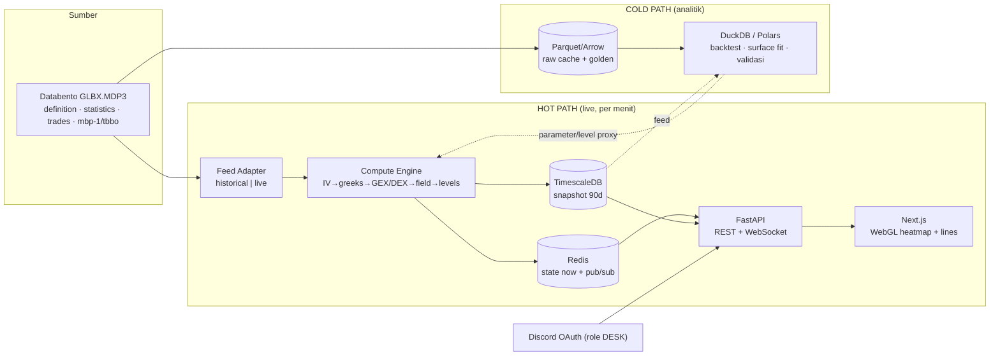

<aside>
🧭

**Apa dokumen ini.** Hasil eksekusi penuh dari mega-prompt riset FlowGreeks — bukan ringkasan, tapi riset + cetak biru replikasi end-to-end. Menggabungkan dua riset sebelumnya (**TRACE** = heatmap gamma/stok posisi, dan **HIRO** = hedging flow real-time) lalu menambah modul baru: **volatility surface, exposure greek lanjutan (GEX/DEX/vanna/charm), dinamika 0DTE, visualisasi 3D, dan modul sistem (alerting/backtesting/regime/arsitektur)** — semuanya diadaptasi ke **/ES & /NQ (CME, Databento GLBX.MDP3, Black-76)**.

Dokumen induk sebelumnya: SpotGamma TRACE — Riset Mendalam Replikasi Heatmap Gamma (vs OptionsDepth, GEXBOT, MenthorQ) dan SpotGamma HIRO — Riset Mendalam Replikasi Indikator Hedging Flow (+ adaptasi /ES /NQ Databento).

</aside>

<aside>
⚖️

**Legenda penanda klaim**

- **[FAKTA]** — dinyatakan eksplisit di sumber resmi/primer (link disertakan).
- **[INFERENSI]** — kesimpulan rekayasa dari prinsip kuantitatif standar; bukan klaim resmi vendor.
- **[PROPRIETARY]** — model/parameter internal vendor yang tidak dipublikasikan.
- **[TIDAK TERDOKUMENTASI]** — tidak ditemukan sumber; jangan dianggap fakta.
</aside>

<aside>
🧪

**Prinsip integritas:** tidak ada angka/parameter/rumus yang dikarang seolah resmi. Yang **DIPUBLIKASIKAN vendor** dipisahkan tegas dari yang harus **DI-REVERSE-ENGINEER**. Untuk replikasi 1:1 valid, semua field hasil rekonstruksi WAJIB divalidasi numerik terhadap screenshot/sesi nyata.

</aside>

## Ringkasan eksekutif

FlowGreeks bisa dibangun sebagai **satu mesin greek + satu state engine** yang melahirkan semua produk: TRACE (stok posisi → heatmap waktu×harga), HIRO (flow real-time → garis kumulatif), surface volatilitas, dan peta exposure (GEX/DEX/VEX/charm). Yang **terdokumentasi & bisa direplikasi**: rumus GEX/DEX, konvensi tanda dealer, definisi key levels, encoding warna diverging, metodologi VIX (CBOE), parameterisasi surface (SVI/SABR), estimator realized vol (Garman-Klass/Yang-Zhang), dan greek Black-76. Yang **proprietary/harus diestimasi**: model klasifikasi trade & inventory dealer (Options Inventory Model / DDOI / Synthetic OI), Volatility Trigger™/Risk Pivot, dan parameter normalisasi visual.

**Perbedaan paling fundamental vs SpotGamma:** mereka memakai SPX/OPRA (opsi indeks cash-settled, klasifikasi dari tape OPRA). Kamu memakai **/ES /NQ di CME (opsi atas futures)** — yang justru memberi keunggulan: field **aggressor side** dari matching engine CME (via Databento `trades`/`tbbo`) memberi arah buy/sell **langsung**, tanpa perlu menebak lewat Lee-Ready. Konsekuensinya: model greek wajib **Black-76** (underlying = harga futures F), dan label "customer vs dealer" tetap harus di-proxy.

---

# BAGIAN 1 — TRACE (HEATMAP GAMMA / STOK POSISI)

## 1.1 Konsep: apa yang divisualisasikan

TRACE memvisualkan **medan tekanan hedging dealer** pada ruang **(waktu × harga)** untuk opsi, dibangun di atas *Options Inventory Model* SpotGamma, update **tiap 1 menit** dengan **proyeksi forward 5 hari**, dengan tiga lensa: **Gamma, Delta Pressure, Charm Pressure**, plus panel **Strike Plot**. [[1]](https://support.spotgamma.com/hc/en-us/articles/33607907909011-What-is-SpotGamma-TRACE) **[FAKTA]** GEX-nya "measured in dollar notional terms based on the current price" dan tampil di TRACE Strike Plot. [[2]](https://support.spotgamma.com/hc/en-us/articles/33608294279955-What-is-GEX) **[FAKTA]**

**Besaran yang dipetakan:** net **$-gamma dealer** per (level harga, waktu) pada lensa Gamma; net perubahan delta-positioning pada lensa Delta Pressure; perubahan delta terhadap waktu pada Charm Pressure. [[1]](https://support.spotgamma.com/hc/en-us/articles/33607907909011-What-is-SpotGamma-TRACE) **[FAKTA konsep; transformasi persis = PROPRIETARY]**

**TRACE (stok) vs HIRO (flow):** TRACE = potret **inventory/posisi** (berbasis OI + estimasi intraday) — "di mana" tekanan terkonsentrasi. HIRO = **aliran real-time** dari tiap trade — "sedang ke mana" tekanan bergerak detik ini. [[1]](https://support.spotgamma.com/hc/en-us/articles/33607907909011-What-is-SpotGamma-TRACE)[[3]](https://spotgamma.com/gamma-exposure-gex/) **[FAKTA]**

## 1.2 Sumbu & struktur heatmap

- **Sumbu X = waktu intraday**, update tiap 1 menit + proyeksi forward 5 hari (calendar dropdown). [[1]](https://support.spotgamma.com/hc/en-us/articles/33607907909011-What-is-SpotGamma-TRACE)[[4]](https://support.spotgamma.com/hc/en-us/articles/33608037264787-What-is-the-Gamma-Heatmap) **[FAKTA]**
- **Sumbu Y = level harga / strike.** Chart SG dirancang "to match up price action on the right with levels on the left" di sumbu harga yang sama. [[5]](https://support.spotgamma.com/hc/en-us/articles/39946617292691-What-is-the-Synthetic-OI-Live-Price-SG-Levels-Chart) **[FAKTA untuk chart SG; INFERENSI untuk TRACE]**
- **Nilai sel/warna = net $-gamma (atau delta/charm) MM** di (harga, waktu). Biru = positif (vol rendah/pinning), merah = negatif (vol tinggi), netral = putih/hitam. [[4]](https://support.spotgamma.com/hc/en-us/articles/33608037264787-What-is-the-Gamma-Heatmap) **[FAKTA]**

**Kenapa (waktu×harga), bukan profil 1-D?** Karena gamma dealer berubah karena (a) **waktu** (charm/decay tiap menit, makin tajam mendekati close untuk 0DTE) dan (b) **harga** (gamma fungsi jarak spot→strike). [[6]](https://www.optionsdepth.com/resouce/market-makers-gamma-exposure-projection)[[3]](https://spotgamma.com/gamma-exposure-gex/) **[FAKTA]** OptionsDepth menyebut produk ini eksplisit "a projection across time and underlying price." [[6]](https://www.optionsdepth.com/resouce/market-makers-gamma-exposure-projection) **[FAKTA]**

## 1.3 Matematika GEX per strike

Rumus resmi SpotGamma (per kontrak), **put dikalikan −1** (asumsi dealer short put pada indeks):

$$
GEX_{i} = \Gamma_{i} \times OI_{i} \times \text{ContractSize} \times S^{2} \times 0.01
$$

dan net agregat $NetGEX = \sum_{call} GEX - \sum_{put} GEX$ dijumlahkan ke seluruh strike & ekspirasi. [[3]](https://spotgamma.com/gamma-exposure-gex/)[[7]](https://support.spotgamma.com/hc/en-us/articles/15214161607827-GEX-Gamma-Exposure-Explained-What-It-Is-and-How-SpotGamma-Uses-It) **[FAKTA]**

| Faktor | Arti | Catatan |
| --- | --- | --- |
| `Γ` | ∂²V/∂S² per 1 lembar (Black-Scholes) | Dihitung ulang saat S berubah [FAKTA] |
| `OI` | Open Interest | Basis posisi; resmi update overnight [FAKTA] |
| `ContractSize` | Multiplier kontrak (100 utk opsi ekuitas/indeks) | Untuk /ES /NQ berubah (Bagian 4) [FAKTA] |
| `S²·0.01` | Konversi ke $ per **1% move** | Penurunan: Γ·OI·mult·S = $/1$; ×0.01S = $/1% [INFERENSI didukung sumber] |

Varian SqueezeMetrics memakai `OI × Γ × 100 × spot` (denominasi share→$) tanpa S² eksplisit; selisih karena faktor "per 1%" diterapkan terpisah. [[8]](https://squeezemetrics.com/monitor/download/pdf/white_paper.pdf) **[FAKTA]**

**Konvensi tanda dealer (kritis & beda per produk):**

- **Indeks (SPX, /ES, /NQ):** dealer dimodelkan **long call / short put** — karena dominasi covered call & collar di sisi customer. [[9]](https://support.spotgamma.com/hc/en-us/articles/15246735925395-DDOI-Dealer-Directional-Positioning)[[10]](https://spotgamma.com/free-tools/spx-gamma-exposure/) **[FAKTA]**
- **Single-stock:** dealer dimodelkan **short call & short put**. [[9]](https://support.spotgamma.com/hc/en-us/articles/15246735925395-DDOI-Dealer-Directional-Positioning) **[FAKTA]**
- Greek apa? Default lensa = **gamma**; TRACE juga punya lensa **delta** & **charm**. Vanna **tidak** jadi lensa TRACE resmi (tapi dipakai SpotGamma di analisis terpisah, lihat Bagian 3B). [[1]](https://support.spotgamma.com/hc/en-us/articles/33607907909011-What-is-SpotGamma-TRACE) **[FAKTA]**

**OI vs Volume:** OI resmi hanya update overnight; SpotGamma memakai **Options Inventory Model / OI & Volume Adjustment** untuk estimasi perubahan posisi intraday dari volume live, dihitung pada 4 ekspirasi terdekat termasuk 0DTE. Cara klasifikasi volume (buy/sell, customer/dealer) = **[PROPRIETARY]** ("proprietary algorithms + multiple new data feeds"). [[3]](https://spotgamma.com/gamma-exposure-gex/)[[11]](https://support.spotgamma.com/hc/en-us/articles/39946919887891-What-is-the-Equity-Hub-Synthetic-OI-Open-Interest-Model)

## 1.4 Key levels (definisi & cara hitung)

| Level | Definisi | Cara hitung | Status |
| --- | --- | --- | --- |
| **Call Wall** | Strike dgn net call gamma tertinggi → resistance utama | argmax net call gamma per strike | [FAKTA] [[12]](https://support.spotgamma.com/hc/en-us/articles/15297391724179-Call-Wall-What-It-Is-and-How-SpotGamma-Uses-It) |
| **Put Wall** | Strike dgn net put gamma terbesar → support utama | argmin (paling negatif) net put gamma per strike | [FAKTA] [[3]](https://spotgamma.com/gamma-exposure-gex/) |
| **Zero Gamma / Gamma Flip** | Harga di mana net GEX agregat = 0 (inflection) | cari akar `Σ NetGEX(S)=0` dari profil GEX vs harga hipotetis | [FAKTA] [[3]](https://spotgamma.com/gamma-exposure-gex/)[[13]](https://support.spotgamma.com/hc/en-us/articles/15413261162387-Gamma-Flip) |
| **Volatility Trigger™** | Level di bawahnya bearish feedback loop mulai; "last major support above Put Wall"; di bawahnya realized vol mengembang (68.3% confidence) | Metode proprietary: "dealers last major level of positive gamma support" — BUKAN sekadar crossover OI | [PROPRIETARY] [[14]](https://support.spotgamma.com/hc/en-us/articles/15297954935699-Volatility-Trigger)[[15]](https://spotgamma.com/volatility-trigger-zero-gamma-trading/) |
| **Hedge Wall** | Analog Vol Trigger untuk single-stock; titik di mana realized vol diperkirakan mulai naik; predictive secara statistik. Di HIRO, kalkulasi serupa Vol Trigger dipakai sbg Hedge Wall | Proprietary (mirip Vol Trigger) | [PROPRIETARY] [[16]](https://support.spotgamma.com/hc/en-us/articles/15297582984723-Hedge-Wall)[[17]](https://support.bloomberg.spotgamma.com/hc/en-us/articles/20726435775379-Volatility-Trigger) |
| **Absolute Gamma** | Strike dgn total gamma terbesar → "sticky pin", sering dekat Zero Gamma | argmax total gamma (call+put) per strike | [FAKTA] [[18]](https://support.spotgamma.com/hc/en-us/articles/15297255426195-Absolute-Gamma) |
| **Risk Pivot** | Level kunci SpotGamma tambahan | tidak dipublikasi | [PROPRIETARY] [[3]](https://spotgamma.com/gamma-exposure-gex/) |

Catatan urutan rezim: Zero Gamma = titik infleksi, tapi bearish loop "tidak diharapkan menyala sampai menembus Volatility Trigger"; sebaliknya price harus cukup di atas Zero Gamma sebelum Call Wall menarik harga naik. [[13]](https://support.spotgamma.com/hc/en-us/articles/15413261162387-Gamma-Flip) **[FAKTA]**

## 1.5 Encoding warna

- **Diverging, berpusat nol:** biru = gamma +, merah = gamma −, netral = putih (light)/hitam (dark). [[4]](https://support.spotgamma.com/hc/en-us/articles/33608037264787-What-is-the-Gamma-Heatmap)[[6]](https://www.optionsdepth.com/resouce/market-makers-gamma-exposure-projection) **[FAKTA]**
- **Simetri:** titik tengah colormap = 0 ⇒ `vmin = −vmax`, `vmax = max|GEX|`. **[INFERENSI — standar diverging]**
- **Anti-skew outlier (krusial agar spike 0DTE tak membakar skala):** percentile clipping (98–99), signed-log/symlog `sign(x)·log(1+|x|/c)`, atau robust scaling per-frame. **[INFERENSI; parameter persis TIDAK TERDOKUMENTASI]**
- **Cara baca:** gamma + → dealer "buy dip/sell rip" → mean-reverting, range sempit (pinning di zona biru, paling kuat saat EOD). Gamma − → hedge searah → gerak membesar (zona merah). Topografi OptionsDepth: ridge (gamma peaks, garis hijau) = support/resistance; valley (troughs, garis kuning) = path of least resistance. [[3]](https://spotgamma.com/gamma-exposure-gex/)[[6]](https://www.optionsdepth.com/resouce/market-makers-gamma-exposure-projection) **[FAKTA]**

## 1.6 Pembanding (TRACE vs OptionsDepth vs GEXBOT vs MenthorQ)

| Dimensi | SpotGamma TRACE | OptionsDepth | GEXBOT | MenthorQ |
| --- | --- | --- | --- | --- |
| Model posisi | Options Inventory Model / Synthetic OI [FAKTA] | "Actual positioning" full-portfolio [FAKTA] | Orderflow berbasis volatilitas, presisi ms; sisi customer [FAKTA] | Net GEX dari OI real-time [FAKTA] |
| Visual utama | Heatmap waktu×harga 3 lensa + Strike Plot [FAKTA] | Heatmap 2D   **• 3D surface**; peaks/troughs [FAKTA] | Convexity ladder + profil GEX [FAKTA] | Gamma Levels 1–10 + TradingView [FAKTA] |
| Lensa greek | Gamma, Delta, Charm [FAKTA] | Gamma, Charm, Vanna [FAKTA] | GEX/convexity [FAKTA] | Net GEX, DEX [FAKTA] |
| Sisi konvensi | Dealer; index = long call/short put [FAKTA] | MM exposure [FAKTA] | **Customer** gex [FAKTA] | Net GEX (call−put) [FAKTA] |
| Update/forward | 1 menit + forward 5 hari [FAKTA] | Intraday & daily [FAKTA] | Milidetik [FAKTA] | ~10 menit (mitra) [FAKTA] |

> Sumber pembanding: OptionsDepth projection [[6]](https://www.optionsdepth.com/resouce/market-makers-gamma-exposure-projection); GEXBOT; MenthorQ guides. (detail lengkap di dokumen TRACE induk).
> 

## 1.7 Replikasi TRACE — DATA CONTRACT + algoritma

```python
# === INPUT (per snapshot waktu t, resolusi 1 menit) ===
OptionQuote = {
    "expiry": date, "strike": float, "type": "C"|"P",
    "bid": float, "ask": float,      # mid -> solve IV
    "open_interest": int,             # OI overnight (resmi)
    "volume": int,                    # volume kumulatif hari ini
    "iv": float | None,
}
MarketState = {
    "timestamp": datetime, "future_price": float,  # F (untuk /ES /NQ)
    "risk_free_curve": Callable[[float], float],   # r(T) SOFR/OIS [INFERENSI]
}
# Posisi dealer = OUTPUT Options Inventory Model (PROPRIETARY).
# Aproksimasi reverse-engineer: signed_qty per kontrak dari net signed flow.
DealerPosition = { "contract_id": str, "signed_qty": float }  # + long / - short
GammaField = {
    "time_axis": List[datetime], "price_axis": List[float],
    "values": "ndarray[n_price, n_time]",  # net $ gamma per 1%
    "price_overlay": List[(datetime, float)],
    "key_levels": {"call_wall":float,"put_wall":float,"gamma_flip":float},
}
```

```python
import numpy as np
from scipy.stats import norm

def build_gamma_field(snapshots, price_grid, contract_mult):
    field = np.zeros((len(price_grid), len(snapshots)))
    for j, snap in enumerate(snapshots):          # X: waktu (1 min)
        for c in snap.contracts:
            T  = year_frac(snap.timestamp, c.expiry)
            iv = c.iv or solve_iv_black76(c.mid, snap.future_price, c.strike, T,
                                          snap.r(T), c.is_call)
            sgn = dealer_sign(c)                   # +long/-short (Inventory Model)
            qty = c.signed_qty
            for i, Fy in enumerate(price_grid):    # Y: harga hipotetis
                g = black76_gamma(Fy, c.strike, T, iv, snap.r(T))
                field[i, j] += sgn*qty*g*contract_mult*Fy**2*0.01
    return field
```

**Field projection = re-evaluasi gamma di tiap harga hipotetis (BUKAN smear Gaussian).** SpotGamma Phase 3: "recalculate the unit gamma for every option across a wide range of hypothetical spot levels (±10%) … Run the GEX formula across all levels." Penghalusan muncul alami karena Γ(S) berbentuk lonceng. [[3]](https://spotgamma.com/gamma-exposure-gex/)[[6]](https://www.optionsdepth.com/resouce/market-makers-gamma-exposure-projection) **[FAKTA]** Render: `pcolormesh` diverging + `TwoSlopeNorm(0)` + clip persentil → overlay kontur (marching squares / `d3-contour`) → overlay harga → panel kiri Strike Plot (`sharey`).

---

# BAGIAN 2 — HIRO (HEDGING FLOW REAL-TIME)

## A. Konsep

**A1.** HIRO = **Hedging Impact of Real-time Options**; "measures and aggregates the delta notional value from every option trade, estimating the hedging requirement" — yaitu "what market makers will be forced to do." [[19]](https://support.spotgamma.com/hc/en-us/articles/4420646443539)[[20]](https://spotgamma.com/hiro-indicator/) **[FAKTA]** Beda dgn GEX/TRACE: HIRO = **flow** (perubahan dari tiap trade), GEX/TRACE = **stok** (posisi terakumulasi). **[FAKTA]**

**A2. Kenapa leading/real-time:** dihitung dari **tape trade live** (bukan OI overnight), jadi mendahului perubahan posisi. Trader membaca: (a) **slope/akumulasi** (flow beli vs jual), (b) **divergence vs harga** (harga naik tapi HIRO turun = rapuh), (c) **spike** (impuls hedging besar). [[20]](https://spotgamma.com/hiro-indicator/)[[21]](https://spotgamma.com/how-to-use-spotgamma-hiro-indicator/) **[FAKTA]**

## B. Matematika & data (inti)

**B3. Rumus inti (delta-notional bertanda, diakumulasi):**

$$
HIRO_t = \sum_{\text{trade } k \le t} s_k \cdot \delta_k \cdot q_k \cdot m \cdot F_k
$$

dengan $s_k$ = tanda sisi customer/dealer (±1), $\delta_k$ = delta opsi, $q_k$ = jumlah kontrak, $m$ = multiplier, $F_k$ = harga underlying. SpotGamma: agregasi delta-notional tiap trade. [[19]](https://support.spotgamma.com/hc/en-us/articles/4420646443539)[[22]](https://support.spotgamma.com/hc/en-us/articles/4421122374419) **[FAKTA konsep; bentuk eksak Σ = INFERENSI terstruktur]**

**B4. Klasifikasi sisi:** dari "Tape"; trade **above ask** = agresi beli berkonviksi, **below bid** = agresi jual. Logika persis (filter hedged-trade, deteksi retail, treatment multi-leg) = **[PROPRIETARY]**. [[22]](https://support.spotgamma.com/hc/en-us/articles/4421122374419)[[23]](https://spotgamma.com/hiro-updated-algo-logic-new-features/) Di OPRA, klasifikasi pakai eksekusi vs bid/ask (gaya Lee-Ready). **[INFERENSI]**

**B5. Arah hedging dealer (dealer = lawan customer):** customer **beli call / jual put** → dealer hedge **beli underlying** (flow +, hijau, dorongan naik); customer **jual call / beli put** → dealer **jual underlying** (flow −, merah). [[22]](https://support.spotgamma.com/hc/en-us/articles/4421122374419) **[FAKTA]**

**B6. Delta saja?** HIRO terutama **delta-notional**; bobot gamma/charm tidak dinyatakan eksplisit → asumsi model delta-based. Model greek/IV/recompute = **[TIDAK TERDOKUMENTASI]** (kemungkinan BS untuk SPX). **[INFERENSI]**

**B7. Resolusi & agregasi:** per **trade** → diakumulasi **kumulatif sepanjang hari** (reset harian), plus **rolling window** (mis. 5-menit) untuk membaca momentum; candle 5 detik–30 menit. [[23]](https://spotgamma.com/hiro-updated-algo-logic-new-features/)[[24]](https://spotgamma.com/wp-content/uploads/2025/10/SpotGamma-HIRO-User-Guide-2.pdf) **[FAKTA]**

**B8. Breakdown:** per index/ticker; garis terpisah untuk **Total, Calls, Puts, Next Expiry/0DTE, Retail**. [[24]](https://spotgamma.com/wp-content/uploads/2025/10/SpotGamma-HIRO-User-Guide-2.pdf) **[FAKTA]**

## C. Encoding visual

**C9.** Garis **kumulatif** di-overlay pada harga, **sumbu-Y ganda** (HIRO outer, price inner). Warna garis: **Putih = price, Ungu = Total HIRO, Biru = Puts, Oranye = Calls, Hijau = Next Expiry/0DTE, Merah = Retail**; overlay key levels (Call/Put/Hedge Wall, Key Gamma Strike). [[24]](https://spotgamma.com/wp-content/uploads/2025/10/SpotGamma-HIRO-User-Guide-2.pdf) **[FAKTA]**

**C10. Divergence:** harga naik + HIRO turun → rally rapuh (setup short); contoh terdokumentasi AMD 3/17/22 (price up, HIRO down) dan SPX 2/24/25 (HIRO reversal → rally stall). [[21]](https://spotgamma.com/how-to-use-spotgamma-hiro-indicator/)[[24]](https://spotgamma.com/wp-content/uploads/2025/10/SpotGamma-HIRO-User-Guide-2.pdf) **[FAKTA]**

## D. Replikasi HIRO

```python
Trade = { "ts": datetime, "strike": float, "expiry": date, "type":"C"|"P",
          "price": float, "size": int, "side": "A"|"B"|"N",   # CME aggressor
          "bid": float, "ask": float }

def hiro_stream(trades, F_now, mult, r_curve):
    cum, cum_call, cum_put, cum_0dte = 0,0,0,0
    for tr in trades:
        T  = year_frac(tr.ts, tr.expiry)
        iv = solve_iv_black76(mid(tr), F_now, tr.strike, T, r_curve(T), tr.is_call)
        d  = black76_delta(F_now, tr.strike, T, iv, r_curve(T), tr.is_call)
        s  = customer_sign(tr)        # dari aggressor side + proxy (lihat 4.2)
        dn = s * d * tr.size * mult * F_now
        cum += dn
        cum_call += dn if tr.is_call else 0
        cum_put  += dn if not tr.is_call else 0
        cum_0dte += dn if T < 1/365 else 0
        emit({"ts":tr.ts,"total":cum,"calls":cum_call,"puts":cum_put,"zdte":cum_0dte})
```

**D12. Teknologi:** ingest streaming (Databento live / WebSocket) → greek engine vektorisasi (numpy/Numba, cache IV per kontrak) → state akumulasi (in-memory ring buffer) → render time-series cepat (TradingView Lightweight Charts / uPlot). **[INFERENSI]**

**D13. HIRO vs pembanding flow:**

| Tool | Inti | Sisi |
| --- | --- | --- |
| **HIRO** | Delta-notional hedging flow kumulatif; greek-weighted [FAKTA] | Customer→dealer (delta hedge) |
| **Unusual Whales** | Net Premium / Market Tide; sisi via bid-ask, premium [FAKTA] | Premium-weighted, bukan delta |
| **Cheddar Flow** | Sweeps, block, dark pool [FAKTA] | Deteksi flow agresif |
| **GEXBOT** | Klasifikasi berbasis volatilitas, ms; delta/gamma/vanna/charm second-by-second [FAKTA] | Customer gex |

---

# BAGIAN 3 — MODUL EKSPANSI 0DTE (BARU)

## 3A. Volatility

### IV surface (strike × expiry × IV)

**Langkah:** (1) solve IV per kontrak dari **mid** via **Newton-Raphson** (fallback bisection saat vega kecil/near-expiry); (2) ubah ke koordinat **log-moneyness** $k=\log(K/F)$ dan **total implied variance** $w(k,T)=sigma_{BS}^2(k,T),T$; (3) fit per-slice. **[FAKTA notasi: Gatheral-Jacquier]** [[25]](https://arxiv.org/abs/1204.0646)

**Parameterisasi (standar industri):**

- **SVI** (raw): $w(k)=a+b\{\rho(k-m)+\sqrt{(k-m)^2+\sigma^2}\}$ — 5 parameter per slice; bisa dibuat **arbitrage-free** (Gatheral-Jacquier SSVI menjamin bebas calendar & butterfly arbitrage). [[25]](https://arxiv.org/abs/1204.0646)[[26]](https://mfe.baruch.cuny.edu/wp-content/uploads/2013/01/OsakaSVI2012.pdf) **[FAKTA]**
- **SABR** (stochastic α, β, ρ) — populer di rates, juga equity smile. [[27]](https://en.wikipedia.org/wiki/SABR_volatility_model) **[FAKTA]**
- **Cubic spline** — pilihan desain cepat, TIDAK menjamin bebas-arbitrage. **[INFERENSI]**

> **Standar industri vs pilihan desain:** SVI/SSVI & SABR = standar (arbitrage-free, sumber primer). Spline/interpolasi mentah = pilihan praktis tapi rawan arbitrage. **[FAKTA/INFERENSI]**
> 

### Skew, smile, term structure

- **Skew 25-delta:** $\sigma_{25\Delta P}-\sigma_{25\Delta C}$ (atau vs ATM) — ukuran kemiringan smile. **[INFERENSI — definisi industri standar]**
- **Term structure:** ATM IV vs T (contango/backwardation). **[INFERENSI]**

### Realized vol vs implied

- **Close-to-close:** $sigma=sqrt{tfrac{N}{n}sum (ln tfrac{C_i}{C_{i-1}})^2}$.
- **Garman-Klass (OHLC):** $\sigma_{GK}^2=\tfrac1n\sum[\tfrac12(\ln\tfrac{H_i}{L_i})^2-(2\ln2-1)(\ln\tfrac{C_i}{O_i})^2]$ — ~7–8× lebih efisien dari close-to-close. [[28]](https://ocw.mit.edu/courses/18-642-topics-in-mathematics-with-applications-in-finance-fall-2024/mit18_642_f24_lec17_2.pdf) **[FAKTA]**
- **Yang-Zhang:** $\sigma_{YZ}^2=\sigma_O^2+k\sigma_C^2+(1-k)\sigma_{RS}^2$ (gabungan overnight + close-open + Rogers-Satchell); paling efisien, handle drift & gap. [[29]](https://docs.quantreo.com/features-engineering/volatility/)[[30]](https://dynamiproject.files.wordpress.com/2016/01/measuring_historic_volatility.pdf) **[FAKTA]**
- **Volatility risk premium (VRP):** implied² − realized²; **vol cone:** distribusi realized vol per horizon (persentil). **[INFERENSI — konsep standar]**

### Indeks vol gaya VIX untuk /ES /NQ

Metodologi VIX CBOE = **model-free implied variance**: agregasi tertimbang harga put & call SPX lintas strike (mid bid/ask), mereplikasi variance swap, lalu interpolasi ke konstanta 30-hari. [[31]](https://cdn.cboe.com/resources/indices/Volatility_Index_Methodology_Cboe_Volatility_Index.pdf)[[32]](https://www.math.wustl.edu/~victor/classes/ma456/vixwhite.pdf) **[FAKTA]**

$$
\sigma^2=\frac{2}{T}\sum_i \frac{\Delta K_i}{K_i^2}e^{rT}Q(K_i)-\frac{1}{T}\left(\frac{F}{K_0}-1\right)^2
$$

**Opsi untuk /ES /NQ:** (a) pakai futures **VX/VXN** sebagai proxy; atau (b) **hitung sendiri** model-free IV pada chain /ES /NQ memakai formula di atas (F = harga futures, langsung cocok). VVIX = vol-of-vol (volatilitas dari VIX options) — analog bisa dibangun bila ada opsi pada VX. **[FAKTA metodologi; penerapan ke /ES = INFERENSI]**

### Dinamika IV intraday 0DTE & expected move

- **Vol crush & smile 0DTE ekstrem:** theta sangat besar, smile menukik tajam mendekati expiry. **[INFERENSI didukung literatur 0DTE]** [[33]](https://www.cboe.com/en/tradable-products/0dte/)
- **Expected move harian:** $EM \approx S\cdot\sigma_{ATM}\sqrt{T}$ atau ≈ harga **ATM straddle** (× ~0.85 untuk 1σ). **[INFERENSI — standar]**

## 3B. Exposure greek lanjutan

Kerangka kuantitatif dealer-positioning (gamma, vanna, charm sebagai second-order flows) dirangkum FlashAlpha & MenthorQ. [[34]](https://flashalpha.com/articles/dealer-positioning-gex-quantitative-approach-options-flow)[[35]](https://menthorq.com/guide/dealer-hedging-mechanics/) **[FAKTA kerangka]**

| Exposure | Greek | Rumus exposure (per strike, ber-tanda dealer) | Makna |
| --- | --- | --- | --- |
| **GEX** | Γ | `Σ Γ·OI·m·F²·0.01` | Stabilitas vs volatilitas [FAKTA] |
| **DEX** | δ | `Σ δ·OI·m·F` | Bias direksional hedging [FAKTA] [[36]](https://flashalpha.com/concepts/dex) |
| **VEX/Vanna** | ∂δ/∂σ | `Σ vanna·OI·m·F·(1vol)` | Sensitivitas delta dealer thd IV [FAKTA] [[37]](https://squeezemetrics.com/download/The_Implied_Order_Book.pdf) |
| **CHEX/Charm** | ∂δ/∂t | `Σ charm·OI·m·F·(1hari)` | Drift delta karena waktu [FAKTA] [[38]](https://flashalpha.com/articles/vanna-charm-second-order-greeks-guide) |

**SqueezeMetrics:** GEX = sensitivitas delta dealer thd harga; **VEX = sensitivitas delta dealer thd IV**; keduanya butuh **DDOI** (Dealer Directional Open Interest) — apakah dealer long/short tiap (expiry, strike, type), diturunkan dari **data transaksi** (klasifikasi buy/sell tiap trade) lalu **diverifikasi** dgn perubahan OI aktual. [[37]](https://squeezemetrics.com/download/The_Implied_Order_Book.pdf) **[FAKTA]**

**Charm 0DTE (afternoon drift):** menjelang close, delta opsi yang akan expiry meluruh cepat → dealer melepas hedge → flow direksional besar di sesi sore. Skenario pre-OPEX Friday: pagi pinned (GEX dominan), sore vol naik saat charm "unwinds" delta. [[38]](https://flashalpha.com/articles/vanna-charm-second-order-greeks-guide)[[39]](https://www.skylit.ai/learn/charm) **[FAKTA]** SpotGamma: vanna & charm = "hidden greeks" pendorong grinding rallies & EOD pins; **vanna rally** = dealer beli futures saat IV turun. [[40]](https://spotgamma.com/vanna-and-charm-explained/) **[FAKTA]**

**Vanna (vol feedback loop):** hedging dealer → gerak harga → ubah IV → reshape hedge — loop swa-perkuat; di lingkungan volume tinggi bisa jadi runaway move. [[35]](https://menthorq.com/guide/dealer-hedging-mechanics/) **[FAKTA]**

**Greek orde tinggi (speed=∂Γ/∂S, color=∂Γ/∂t):** berguna untuk akurasi re-hedge di near-expiry tapi umumnya **berlebihan** untuk dashboard; prioritaskan gamma/vanna/charm. **[INFERENSI]**

**Dealer-positioning (long/short gamma):** asumsi struktural (index: long call/short put) = prior publik; refinement dari klasifikasi flow = **[PROPRIETARY di SpotGamma]**, tapi **bisa di-reverse-engineer** dari OI + signed flow (lihat 4.2 — di CME kamu punya aggressor side langsung). Quant SE: asumsikan calls dimiliki dealer (GEX +), puts short dealer (GEX −), iterasi spot dgn smile konstan. [[41]](https://quant.stackexchange.com/questions/45921/calculating-dealer-gamma-imbalance-exposure-for-an-options-strip) **[FAKTA pendekatan]**

## 3C. Dinamika khusus 0DTE

- **Gamma pinning / pin risk:** dekat strike gamma besar (Absolute Gamma), dealer long gamma menahan harga → "sticky pin", terkuat saat EOD. [[18]](https://support.spotgamma.com/hc/en-us/articles/15297255426195-Absolute-Gamma) **[FAKTA]**
- **Charm/theta flow ke close:** afternoon drift (lihat 3B). **[FAKTA]**
- **Pangsa volume 0DTE:** ~1,5 juta kontrak/hari, ≈ separuh seluruh trade terkait SPX (Cboe 2025). [[42]](https://www.schwab.com/learn/story/zeroing-on-0dte-options-learn-basics) **[FAKTA]** Efek: hedging dealer terkonsentrasi di intraday & sangat sensitif waktu vs tenor panjang.
- **/ES vs /NQ:** korelasi tinggi tapi /NQ lebih bervol (beta tech); divergence flow (mis. HIRO /ES naik, /NQ turun) = sinyal rotasi/risiko. **[INFERENSI]**

## 3D. Visualisasi (termasuk 3D & lanjutan)

- **Heatmap gamma evolusi-waktu** (ala TRACE) + overlay key levels — Bagian 1.
- **Garis HIRO dual-axis** (total/call/put/0DTE/retail) — Bagian 2.
- **3D gamma/exposure surface:** x=strike, y=time-of-day atau time-to-expiry, z=GEX, warna=tanda. **Kapan 3D lebih baik:** saat ingin melihat **bentuk punggungan/lembah** dan evolusi konveksitas (0DTE menonjol mendekati expiry). **Risiko misleading 3D:** oklusi (data tertutup puncak), distorsi perspektif, sudut pandang menipu magnitudo → sediakan rotasi + proyeksi 2D pendamping. [[6]](https://www.optionsdepth.com/resouce/market-makers-gamma-exposure-projection) **[FAKTA: OptionsDepth punya 3D; INFERENSI: pitfalls]**
- **3D IV surface** (strike×expiry×IV) animasi real-time — `plotly go.Surface`. [[43]](https://plotly.com/python/3d-surface-plots/) **[FAKTA]**
- **Terrain/contour, ridgeline, time-scrubbing/replay sesi** untuk audit intraday.

**Teknologi render:**

| Kebutuhan | Rekomendasi | Catatan |
| --- | --- | --- |
| 3D surface interaktif (web) | **three.js / WebGL**, deck.gl, ECharts-GL | GPU; skala besar [INFERENSI] |
| 3D riset/prototipe | **plotly** `Surface` (Python/JS) | WebGL, jutaan titik [[44]](https://plotly.com/python/performance/) [FAKTA] |
| Heatmap besar | **datashader** / regl / PixiJS | Hindari SVG per-cell |
| Time-series cepat | **TradingView Lightweight Charts / uPlot** | HIRO/price overlay |
| Kontur | **d3-contour** (marching squares) | Ridge/valley |

**Color theory:** diverging colormap (RdBu) untuk tanda +/− berpusat 0; perceptual-uniform (viridis/magma) untuk magnitudo searah; hindari jet. **[INFERENSI — praktik viz standar]**

## 3E. Modul sistem lain

- **Alerting:** flow-impact threshold (|HIRO slope| > X), level-break (price cross Call/Put Wall/Vol Trigger), **gamma-flip cross**. **[INFERENSI]**
- **Backtesting/validasi sinyal:** uji prediktivitas HIRO/GEX terhadap return intraday — event study (sign HIRO → return t+Δ), IC/Sharpe per bucket regime, walk-forward. **[INFERENSI]**
- **Regime detection:** klasifikasi long-gamma vs short-gamma (price vs Zero Gamma/Vol Trigger), regime vol (HMM/threshold pada realized vol). Implikasi: long-gamma → mean-reversion; short-gamma → momentum. [[15]](https://spotgamma.com/volatility-trigger-zero-gamma-trading/) **[FAKTA arah; implementasi INFERENSI]**
- **Arsitektur pipeline:** ingest streaming (Databento live) → greek engine (Numba/Rust) → state/akumulasi (Redis/in-memory) → store kolumnar (**Parquet/Arrow**, time-series DB spt ClickHouse/Arctic) → render. Pertimbangan: latency (hot path greek), throughput (burst 0DTE), storage tick-level. **[INFERENSI]**

---

# BAGIAN 4 — ADAPTASI /ES & /NQ (CME, DATABENTO, BLACK-76)

## 4.1 Schema Databento — mana yang dibutuhkan

| Schema | Isi | Cukup utk klasifikasi buy/sell? |
| --- | --- | --- |
| `bbo-1m` | Snapshot BBO tiap interval 1 menit | **TIDAK** — snapshot, tak ada per-trade side [FAKTA] |
| `trades` | Tiap trade + field **`side`** (A/B/N) dari matching engine | **YA** — aggressor langsung [FAKTA] |
| `tbbo` | Trade + BBO tepat sebelum trade | **TERBAIK** — trade + konteks quote [FAKTA] |
| `mbp-1` | Top-of-book (L1) tiap update | Pendukung (rekonstruksi quote) [FAKTA] |

`side`: **A** = sell-aggressor, **B** = buy-aggressor, **N** = none/unknown. **Rekomendasi FlowGreeks:** `tbbo` (atau `trades` + `mbp-1`) untuk HIRO/flow; `definition` untuk master kontrak; opsional `statistics` untuk settlement/OI. [[45]](https://databento.com/docs/schemas-and-data-formats/tbbo)[[46]](https://databento.com/docs/standards-and-conventions/common-fields-enums-types) **[FAKTA]**

> Catatan migrasi (OPRA, Mei 2025): TBBO→TCBBO, MBP-1→CMBP-1. Untuk GLBX.MDP3 (CME) skema utama tetap `trades`/`tbbo`/`mbp-1`. [[47]](https://databento.com/docs/venues-and-datasets/opra-pillar) **[FAKTA]**
> 

## 4.2 Klasifikasi sisi di CME

CME matching engine memberi **aggressor side langsung** (field `side`) — keunggulan besar vs OPRA yang perlu **Lee-Ready** (bandingkan eksekusi vs mid/bid/ask + tick rule). **TAPI: aggressor ≠ otomatis "customer".** Yang agresif bisa dealer/HFT. Strategi proxy: (a) gunakan aggressor sebagai arah inisiasi; (b) proxy customer/dealer via ukuran, pola, dan filter (mis. block, multi-leg), seperti SpotGamma — tetap **[PROPRIETARY/heuristik]**. [[46]](https://databento.com/docs/standards-and-conventions/common-fields-enums-types) **[FAKTA aggressor; INFERENSI proxy]**

## 4.3 Black-76 (opsi atas futures)

Underlying = harga futures $F$; diskon $e^{-rT}$; $d_1=dfrac{ln(F/K)+tfrac12sigma^2T}{sigmasqrt T}$, $d_2=d_1-sigmasqrt T$.

| Greek | Rumus Black-76 |
| --- | --- |
| Delta (call/put) | $e^{-rT}N(d_1)$ / $-e^{-rT}N(-d_1)$ |
| Gamma | $e^{-rT}\dfrac{N'(d_1)}{F\sigma\sqrt T}$ |
| Vanna | $-e^{-rT}N'(d_1)\dfrac{d_2}{\sigma}$ |
| Charm (call) | $\approx e^{-rT}\!\left[rN(d_1)-N'(d_1)\dfrac{2rT\sqrt T-d_2\,(\,\cdot\,)}{2T\sigma\sqrt T}\right]$ (turunan ∂δ/∂t, hati-hati tanda) [INFERENSI — turunan standar] |
| Vega | $e^{-rT}F\,N'(d_1)\sqrt T$ |

IV solver: Newton-Raphson dari quote CME (mid). [[48]](https://databento.com/blog/option-greeks) **[FAKTA: Black-76 utk CME options-on-futures]**

```python
def black76_gamma(F,K,T,sigma,r):
    if T<=0 or sigma<=0: return 0.0
    d1=(np.log(F/K)+0.5*sigma**2*T)/(sigma*np.sqrt(T))
    return np.exp(-r*T)*norm.pdf(d1)/(F*sigma*np.sqrt(T))
def black76_delta(F,K,T,sigma,r,is_call):
    d1=(np.log(F/K)+0.5*sigma**2*T)/(sigma*np.sqrt(T))
    return np.exp(-r*T)*(norm.cdf(d1) if is_call else norm.cdf(d1)-1)
```

## 4.4 Multiplier & notional

/ES = **$50** per poin indeks, /NQ = **$20**. Delta-notional = $deltacdot qcdot mcdot F$; GEX = $Gammacdot OIcdot mcdot F^2cdot 0.01$. [[49]](https://www.cmegroup.com/markets/equities/sp/e-mini-sandp500.contractSpecs.html) **[FAKTA]**

## 4.5 Apa yang berubah vs SPX/OPRA SpotGamma

| Aspek | SpotGamma (SPX/OPRA) | FlowGreeks (/ES /NQ/CME) |
| --- | --- | --- |
| Feed | OPRA tape | Databento GLBX.MDP3 (`trades`/`tbbo`) [FAKTA] |
| Klasifikasi sisi | Lee-Ready (infer dari quote) [INFERENSI] | Aggressor side langsung dari matching engine [FAKTA] |
| Underlying | Spot SPX (cash) | Harga futures F (/ES /NQ) [FAKTA] |
| Model greek | Black-Scholes(-Merton), dividend q | **Black-76** (tanpa q; diskon futures) [FAKTA] |
| Multiplier | 100 (SPX options) | $50 (/ES), $20 (/NQ) [FAKTA] |
| Universe | 400+ ticker, fokus SPX | /ES, /NQ (extensible) [FAKTA] |
| Dealer/customer label | Proprietary inventory model | Proxy dari aggressor + heuristik [INFERENSI] |

## 4.6 Keterbatasan & workaround

- **Customer vs dealer tak pasti** (aggressor ≠ customer) → workaround: heuristik ukuran/pola + kalibrasi vs perubahan OI harian (a la DDOI). [[37]](https://squeezemetrics.com/download/The_Implied_Order_Book.pdf) **[INFERENSI]**
- **OI CME** update harian (settlement) → intraday pakai net signed volume sebagai ΔOI estimat. **[INFERENSI]**
- **Likuiditas chain /NQ** lebih tipis di strike jauh → smoothing surface (SVI) lebih penting. **[INFERENSI]**
- **Level proprietary (Vol Trigger/Risk Pivot)** tak bisa direplikasi 1:1 → bangun proxy (gamma centroid / last positive-gamma support) lalu validasi. **[INFERENSI]**

---

# BAGIAN 5 — SPESIFIKASI TEKNIS PEMBANGUNAN (Backend · Frontend · Database · Infra)

<aside>
🏗️

Bagian ini menjawab: **"sumber data cukup GLBX.MDP3 saja?"** (ya) dan **"tentukan spek teknis ideal end-to-end"**. Disusun dari hasil mega-riset di atas + dibandingkan dengan **PRD FlowDesk** milikmu. Tempat di mana rekomendasi ini **berbeda dari PRD** ditandai eksplisit (lihat 5.10). Sebagian besar pilihan teknologi adalah **[INFERENSI / keputusan desain]**, bukan klaim vendor.

</aside>

## 5.0 Keputusan sumber data: cukup GLBX.MDP3, OPRA tidak diperlukan

**Ya, betul — cukup Databento GLBX.MDP3, tanpa OPRA.Pillar.** Alasannya struktural, bukan sekadar preferensi:

- Opsi atas futures **/ES & /NQ** diperdagangkan **100% di CME Globex**, dan seluruh datanya ada di dataset **GLBX.MDP3**. **[FAKTA]** [[46]](https://databento.com/docs/standards-and-conventions/common-fields-enums-types)
- **OPRA** adlh consolidated feed untuk **opsi ekuitas & indeks AS (SPX, SPY, saham)** — semesta SpotGamma, bukan semestamu. Untuk trader futures, OPRA **tidak relevan** dan hanya menambah biaya + kompleksitas. **[FAKTA]** [[47]](https://databento.com/docs/venues-and-datasets/opra-pillar)
- Justru GLBX memberi **keunggulan**: field **aggressor `side` (A/B/N)** langsung dari matching engine CME → arah buy/sell tanpa Lee-Ready; satu venue (tanpa fragmentasi SIP) → tak perlu konsolidasi; underlying = harga futures F → **Black-76** native. **[FAKTA]** [[46]](https://databento.com/docs/standards-and-conventions/common-fields-enums-types)

| Pertanyaan | GLBX.MDP3 (/ES /NQ) | OPRA (tidak dipakai) |
| --- | --- | --- |
| Semesta instrumen | Opsi atas futures CME ✓ | Opsi ekuitas/indeks AS ✗ (di luar fokus) |
| Arah trade | Aggressor side native (A/B/N) ✓ | Harus infer Lee-Ready |
| Model greek | Black-76 (underlying F) ✓ | Black-Scholes + dividen |
| Konsolidasi feed | Single venue, tak perlu ✓ | Perlu (banyak exchange) |

> **Kesimpulan:** semua tujuan FlowGreeks (key levels, karakteristik market, "kompas"/arus angin flow 0DTE) tercapai penuh dengan GLBX.MDP3 saja. **[INFERENSI kuat]**
> 

## 5.1 Arsitektur makro (dua bidang: hot-path live + cold-path analitik)

Prinsip inti (selaras PRD #8 §14): **hitung sekali per menit di server → simpan turunan → semua klien baca hasil sama**. Saya pertahankan itu dan menambah **bidang analitik dingin** (golden dataset, backtest, surface) yang terpisah dari hot-path live agar tak mengganggu latensi RTH.



## 5.2 Lapisan data & pilihan schema Databento (final)

Untuk merekonstruksi chain 0DTE per menit (TRACE/GEX/DEX) **dan** mengklasifikasi flow per-trade (HIRO), dua kebutuhan berbeda → dua kelompok schema:

| Schema | Dipakai untuk | Kenapa |
| --- | --- | --- |
| `definition` | Master kontrak (strike, tipe, expiry) | Identitas + filter 0DTE (`expiry==session_date`) [FAKTA] |
| `statistics` | Open Interest + settlement | Basis Call/Put Wall (OI) [FAKTA] |
| `mbp-1` (atau `bbo-1m`) | **Quote per menit semua strike** → mid → solve IV | Snapshot top-of-book kontinu; perlu untuk IV seluruh chain tiap menit [FAKTA] [[46]](https://databento.com/docs/standards-and-conventions/common-fields-enums-types) |
| `trades` **atau** `tbbo` | **HIRO flow per-trade** (size + aggressor side) | `trades` punya `side`; `tbbo` = trade + BBO sebelum trade (konteks quote terbaik) [FAKTA] [[45]](https://databento.com/docs/schemas-and-data-formats/tbbo) |

<aside>
🔎

**Catatan vs PRD-mu (#8 §9):** PRD memakai `["definition","statistics","trades","mbp-1"]` — itu **sudah benar**. Refinemen: untuk HIRO, pertimbangkan **`tbbo`** menggantikan `trades`+lookup quote terpisah karena `tbbo` sudah membawa BBO pas sebelum tiap trade (klasifikasi above-ask/below-bid jadi lebih akurat tanpa join manual). Untuk TRACE per-menit, `mbp-1`/`bbo-1m` tetap wajib (quote kontinu semua strike). **[INFERENSI]**

</aside>

**Strategi ingest (pertahankan "aturan emas" PRD):** 1 schema = 1 request rentang penuh → cache ke disk (`.dbn`/Parquet) → `HistoricalFeedAdapter` baca lokal, tidak narik ulang. Hindari loop per-hari (pemicu rate-limit). **[FAKTA praktik]**

## 5.3 Backend — Compute Engine (jantung sistem)

| Aspek | Rekomendasi ideal | Alasan |
| --- | --- | --- |
| Bahasa | **Python 3.13** (numpy + scipy) | Ekosistem quant matang; cocok PRD [INFERENSI] |
| Hot-path greek | Vektorisasi numpy + **Numba** (`@njit`) untuk solver IV & field projection | Field projection = re-eval Black-76 di grid harga × semua strike tiap menit → CPU-berat; Numba beri ~10–50× tanpa pindah bahasa [INFERENSI] |
| Wrangling chain | **Polars** (atau pandas) untuk olah chain per menit | Lebih cepat & hemat memori dari pandas untuk join/agg per menit [INFERENSI] |
| Skala lanjut | Opsi port hot-loop ke **Rust** (pyo3) bila >ratusan user / multi-instrumen | Hanya bila profiling menuntut; jangan prematur [INFERENSI] |
| Struktur modul | `black76.py · iv.py · greeks.py · exposure.py · field.py · levels.py · regime.py` (+ v2: `surface.py` SVI, v3: `vanna_charm.py`) | Persis PRD #8 §2 + slot ekspansi mega-riset [selaras] |

Urutan pipeline per menit (selaras PRD #7 §16, diperluas): `chain → hygiene/filter 0DTE → solve IV (NR→bisection→interpolasi) → greeks Black-76 → NetGEX/NetDEX per strike (tanda dealer × VOL × M × F² × 1%) → field projection di price_grid → key levels (walls OI, flip/largest VOL) → regime → snapshot`. **[FAKTA dari PRD; algoritma di ALGORITMA FINAL atas]**

## 5.4 Backend — API / WebSocket service

| Aspek | Rekomendasi | Catatan |
| --- | --- | --- |
| Framework | **FastAPI** (Python) + Uvicorn | REST + WS satu proses; reuse model Pydantic = validasi snapshot [selaras PRD] |
| Kontrak snapshot | Pydantic v2 `Snapshot` (mirror ke TS `types.ts`) | Satu sumber kebenaran skema (PRD #8 §3) |
| Transport WS | JSON untuk metadata; **MessagePack/biner + gzip** untuk array `field`/`profile` besar | Array price_grid bisa ratusan titik/menit; biner memangkas payload & jitter [INFERENSI — beda dari PRD yang full-JSON] |
| Auth | Discord OAuth2 + gating role **DESK** (cookie HMAC, re-check harian + grace) | Pertahankan PRD #6 apa adanya [selaras] |
| Reliability | Reconnect backoff (1/2/4…max30s), heartbeat 30s, STALE bukan crash | Selaras PRD #9/#11 |

## 5.5 Database & state

| Lapisan | Teknologi | Isi & alasan |
| --- | --- | --- |
| State "now" | **Redis** | `state:{inst}:latest`  • pub/sub `live:{inst}`; heartbeat engine [selaras PRD] |
| Snapshot turunan | **TimescaleDB** (hypertable, retensi 90d, JSONB payload) | Replay + decoupling + hemat compute [selaras PRD #8 §4] |
| Raw cache | **Parquet/Arrow** di `DATA_DIR` | Cache `.dbn`→Parquet untuk historical-sim & golden; tak masuk DB produksi [selaras + dipertegas] |
| Analitik/backtest | **DuckDB** (query Parquet + Timescale) | Backtest prediktivitas HIRO/GEX, fit surface offline, validasi golden — tanpa bebani hot-path [INFERENSI — tambahan vs PRD] |
| Backup | Dump Timescale mingguan → object storage, simpan ≥4 minggu | Selaras PRD #11 §4 |

**Sizing kasar:** snapshot turunan ~beberapa KB–puluhan KB/menit/instrumen × ~390 menit RTH × 2 instrumen × 90 hari ≈ orde **ratusan MB–beberapa GB** → 1 VPS cukup. **[INFERENSI]**

## 5.6 Frontend

| Kebutuhan | Teknologi ideal | Alasan |
| --- | --- | --- |
| App shell | **Next.js + React + TypeScript** | Selaras PRD; SSR landing + SPA dashboard |
| Heatmap field (2D) | **WebGL** via `regl`/PixiJS (shader custom, colormap di GPU) | 60fps pan/zoom (NFR-2); colormap diverging perceptual (OKLab) di fragment shader [INFERENSI] |
| Profil garis + harga + HIRO lines | **uPlot** atau **TradingView Lightweight Charts** | Time-series ringan, dual-axis, hemat CPU [INFERENSI] |
| Kontur key-level (opsional) | **d3-contour** (marching squares) | Ridge/valley overlay heatmap |
| 3D surface (v3: gamma & IV) | **three.js / react-three-fiber** (atau plotly untuk prototipe) | x=strike, y=waktu/T, z=GEX/IV; sediakan rotasi + proyeksi 2D pendamping (anti-misleading) [INFERENSI] |
| State & data | **Zustand/Jotai**  • `ws-client.ts` (MessagePack) | State toggles (basis/metric/zoom/instrumen) + persist preferensi |
| Design system | Token PRD #2: **Space Grotesk + JetBrains Mono**, turquoise #40E0D0 / crimson #E0183C, interpolasi OKLab, anti-AI-look | Pertahankan penuh [selaras] |

## 5.7 Auth & entitlement

Pertahankan PRD #6 sepenuhnya: **Discord OAuth2** (scope `identify guilds.members.read`) → akses hanya bila `is_member(Flowjob.id) && has_role(DESK)`; cookie HMAC HttpOnly+Secure+SameSite; re-check saat login + harian + tombol manual; grace sampai akhir hari ET bila role dicabut; semua endpoint data 403 untuk non-DESK. **[selaras]**

## 5.8 Infra, deployment, CI/CD, monitoring

| Aspek | Rekomendasi | Catatan |
| --- | --- | --- |
| Hosting backend | **1 VPS Hetzner** (CPX31 prod / CPX21 dev) + Docker Compose | &lt;50 user → cukup; scale vertikal [selaras PRD #11] |
| Frontend | **Vercel** (Next.js), panggil API via HTTPS/WSS | Selaras PRD |
| Service | worker (engine) · api (FastAPI) · timescaledb · redis | `restart: unless-stopped`  • healthcheck + worker watchdog (>2 mnt → restart) [selaras] |
| CI/CD | lint/typecheck → unit (black76/iv/exposure) → **regression golden (blocker)** → build → staging(historical) → smoke → approval → prod(live) | Akurasi gagal = blokir deploy mutlak [selaras PRD #13] |
| Monitoring | Heartbeat Redis (>120s RTH → alert), `/api/health`, Sentry-like, alert **Discord webhook** | Selaras PRD #11/#13 |
| Scale-up path | Pisahkan worker compute ke node sendiri; managed Timescale; CDN aset; (jauh) NATS/Kafka ganti Redis pub/sub | Hanya bila metrik menuntut [INFERENSI] |

## 5.9 Peta modul → fase (jembatan PRD MVP ↔ mega-riset)

PRD MVP-mu sengaja membatasi lingkup (Charm/Vanna, alert, rolling-VOL = WON'T v1). Mega-riset menambah modul itu sebagai **ekspansi pasca-MVP**. Pemetaannya:

| Fase | Modul | Lapisan tersentuh | Status di PRD |
| --- | --- | --- | --- |
| **MVP (v1)** | Engine Black-76 + IV + GEX/DEX + field heatmap + walls/flip + regime + replay + auth | Engine, DB, API, FE | Inti PRD #1/#7/#8 |
| **v2** | IV surface (SVI) + VIX-proxy /ES /NQ + skew/term + expected move | +`surface.py`, panel vol baru | Ekspansi (mega-riset 3A) |
| **v3** | VEX/Vanna + CHEX/Charm + afternoon-drift 0DTE | +`vanna_charm.py`, lensa baru | WON'T v1 → v3 (3B/3C) |
| **v3** | Visualisasi 3D (gamma & IV surface) + time-scrubbing | FE three.js | Ekspansi (3D) |
| **v4** | Alerting + regime detection + backtesting + cross /ES↔/NQ | Cold-path DuckDB + alert svc | WON'T v1 → v4 (3E) |

## 5.10 Di mana spek ini BERBEDA dari PRD-mu (ringkas & jujur)

| Topik | PRD-mu | Rekomendasi di sini | Kenapa |
| --- | --- | --- | --- |
| Schema HIRO | `trades`  • `mbp-1` | Pertimbangkan **`tbbo`** untuk flow | BBO-pas-sebelum-trade → klasifikasi sisi lebih akurat tanpa join |
| Payload WS | JSON penuh | **MessagePack/biner + gzip** untuk array | Field array besar → kurangi latensi/jitter |
| Hot-path perf | numpy/scipy |   • **Numba** di IV & field projection | Field projection berat; aman tetap di Python |
| Analitik | (tak eksplisit) |   • **DuckDB/Polars cold-path** | Backtest & fit surface tanpa ganggu live |
| Lingkup greek | Gamma/Delta saja (v1) | Rancang slot **Vanna/Charm** sejak awal (aktif v3) | Hindari refactor; tetap MVP-lean |

<aside>
✅

**Yang TIDAK saya ubah (PRD-mu sudah tepat):** konvensi tanda dealer (long call/short put), satuan GEX (×M×F²×0.01), Black-76, IV solver NR→bisection→interpolasi, snapshot-per-menit, TimescaleDB+Redis, Discord-DESK gating, design token, aturan replay/retensi 90 hari, dan strategi ingest anti-blokir. Semua dipertahankan.

</aside>

## 5.11 Non-fungsional & anggaran performa

| Metrik | Target | Strategi |
| --- | --- | --- |
| Snapshot → layar (live) | ≤ 2 dtk (NFR-1) | Compute &lt;60s/menit, push Redis→WS instan |
| Compute 1 menit penuh | &lt; 60 dtk (AC-7) | Vektorisasi + Numba; cache IV antar-strike |
| Render heatmap | 60fps pan/zoom (NFR-2) | WebGL shader, colormap di GPU |
| Burst 0DTE (sore) | Tak drop trade | Ring buffer + agregasi per-menit; backpressure aman |
| Akurasi greek/IV | &lt;1e-6 (AC-1/2) | Uji vs py_vollib; golden dataset blocker CI |

---

# DATA CONTRACT FINAL (gabungan)

```python
# --- TRACE (stok): chain + OI ---
ChainSnapshot = { "ts":datetime, "future_price":float, "contracts":[OptionQuote], "r_curve":Callable }
# --- HIRO (flow): trade tape ---
TradeTape     = [ Trade ]   # dgn side A/B/N (Databento tbbo)
# --- VOL SURFACE input ---
IVSurfaceInput= { "ts":datetime, "F":float, "points":[(k=log(K/F), T, iv)], "params_svi":{...} }
# --- EXPOSURE output ---
ExposureGrid  = { "price_axis":[...], "time_axis":[...],
                  "GEX":ndarray, "DEX":ndarray, "VEX":ndarray, "CHEX":ndarray,
                  "levels":{"call_wall":..,"put_wall":..,"gamma_flip":..,"vol_trigger_proxy":..} }
```

# ALGORITMA FINAL (end-to-end)

```python
def flowgreeks_engine(chain_stream, trade_stream, mult):
    surface = {}                                   # SVI per expiry
    hiro    = HiroState()
    for ev in merge(chain_stream, trade_stream):
        if ev.kind == "chain":                      # tiap 1 menit
            ivs = {c.id: solve_iv_black76(c.mid, ev.F, c.strike, c.T, ev.r(c.T), c.is_call)
                   for c in ev.contracts}
            surface = fit_svi(ivs, ev.F)            # arbitrage-free per slice
            grid = build_exposure_grid(ev, ivs, mult)   # GEX/DEX/VEX/CHEX (re-eval Black-76)
            grid.levels = compute_levels(grid)          # walls, flip, vol-trigger proxy
            push_trace(grid)                            # heatmap waktu x harga
        elif ev.kind == "trade":                    # tiap trade
            s  = customer_sign(ev)                  # aggressor side + proxy
            iv = surface_lookup(surface, ev) or solve_iv_black76(mid(ev),...)
            d  = black76_delta(ev.F, ev.strike, ev.T, iv, ev.r, ev.is_call)
            hiro.add(s * d * ev.size * mult * ev.F, ev)
            push_hiro(hiro.snapshot())              # garis kumulatif
# build_exposure_grid: untuk tiap (price S_y, waktu t) re-evaluasi Black-76 greek
# lalu Σ signed_qty * greek * notional_factor (Bagian 1.7 & 3B).
```

# VISUALISASI — spesifikasi chart

| Chart | Sumbu/encoding | Tech |
| --- | --- | --- |
| TRACE heatmap (2D) | x=waktu, y=harga, warna=net$gamma diverging + kontur + overlay price | WebGL/datashader + d3-contour |
| HIRO lines | x=waktu, y-ganda (HIRO/price); garis total/call/put/0DTE/retail | Lightweight Charts/uPlot |
| 3D gamma surface | x=strike, y=time-to-expiry, z=GEX, warna=tanda | three.js / plotly Surface |
| 3D IV surface | x=log-moneyness, y=T, z=IV, animasi | plotly Surface / ECharts-GL |
| Exposure profile (1D) | bar per strike (call oranye/put biru), walls dilabeli | Strike Plot, sharey dgn heatmap |
| Vol dashboard | VIX-proxy, term structure, skew 25Δ, vol cone, RV vs IV | uPlot/plotly |

# PROPRIETARY / ASUMSI + REVERSE-ENGINEERING

<aside>
🔒

Daftar yang **tidak dipublikasi vendor** + cara estimasinya.

</aside>

1. **Options Inventory Model / DDOI / Synthetic OI** [PROPRIETARY]. Reverse: klasifikasi sisi tiap trade (di CME pakai aggressor langsung) → akumulasi net signed volume per kontrak → ΔOI intraday + OI overnight; verifikasi vs perubahan OI settlement (a la DDOI SqueezeMetrics). [[37]](https://squeezemetrics.com/download/The_Implied_Order_Book.pdf)
2. **Volatility Trigger™ / Risk Pivot / Hedge Wall** [PROPRIETARY]. Reverse: proxy = level di bawah spot di mana cumulative positive dealer-gamma terakhir terkonsentrasi (gamma centroid berbobot); kalibrasi statistik realized vol 68.3% di bawah level. [[14]](https://support.spotgamma.com/hc/en-us/articles/15297954935699-Volatility-Trigger)
3. **Klasifikasi customer/dealer & filter retail** [PROPRIETARY]. Reverse: heuristik ukuran/odd-lot/multi-leg + above-ask/below-bid. [[22]](https://support.spotgamma.com/hc/en-us/articles/4421122374419)
4. **Sumber IV, rate, treatment IV saat re-eval (sticky-strike vs sticky-delta)** [TIDAK TERDOKUMENTASI]. Reverse: IV dari mid (NR), SVI per slice, uji sticky-strike dulu.
5. **Normalisasi colormap & parameter kontur** [TIDAK TERDOKUMENTASI]. Reverse: TwoSlopeNorm(0)+clip persentil 98–99, 8–15 level kontur, eye-match screenshot.
6. **Transformasi persis Charm/Delta Pressure** [PROPRIETARY]. Reverse: hitung charm=∂δ/∂t Black-76, petakan seperti gamma field.

# ROADMAP (MVP → lanjutan)

| Fase | Modul | Alasan |
| --- | --- | --- |
| **MVP-1** | Greek engine Black-76 + IV solver + ingest `tbbo` /ES | Fondasi semua produk [INFERENSI] |
| **MVP-2** | GEX/DEX per strike + key levels (walls, flip) + Strike Plot | Output bernilai cepat, terdokumentasi penuh |
| **MVP-3** | HIRO flow (aggressor side, delta-notional kumulatif, dual-axis) | Keunggulan CME (side langsung) |
| **v2** | TRACE heatmap waktu×harga (re-eval grid) + kontur | Butuh inventory model proxy dulu |
| **v2** | Vol module: SVI surface, VIX-proxy, RV/IV, skew, expected move | Reuse IV solver |
| **v3** | Vanna/Charm exposure + dinamika 0DTE (afternoon drift) | Diferensiasi lanjutan |
| **v3** | 3D surface (gamma & IV), time-scrubbing | Visual premium, setelah data stabil |
| **v4** | Alerting, regime detection, backtesting, /NQ + cross-index | Produktisasi & validasi |

---

# Daftar sumber

**SpotGamma (primer):** [[1] TRACE](https://support.spotgamma.com/hc/en-us/articles/33607907909011-What-is-SpotGamma-TRACE) · [[2] What is GEX](https://support.spotgamma.com/hc/en-us/articles/33608294279955-What-is-GEX) · [[3] GEX page](https://spotgamma.com/gamma-exposure-gex/) · [[4] Gamma Heatmap](https://support.spotgamma.com/hc/en-us/articles/33608037264787-What-is-the-Gamma-Heatmap) · [[5] Synthetic OI Live Price](https://support.spotgamma.com/hc/en-us/articles/39946617292691-What-is-the-Synthetic-OI-Live-Price-SG-Levels-Chart) · [[7] GEX Explained](https://support.spotgamma.com/hc/en-us/articles/15214161607827-GEX-Gamma-Exposure-Explained-What-It-Is-and-How-SpotGamma-Uses-It) · [[9] DDOI](https://support.spotgamma.com/hc/en-us/articles/15246735925395-DDOI-Dealer-Directional-Positioning) · [[10] Free SPX GEX](https://spotgamma.com/free-tools/spx-gamma-exposure/) · [[11] Synthetic OI Model](https://support.spotgamma.com/hc/en-us/articles/39946919887891-What-is-the-Equity-Hub-Synthetic-OI-Open-Interest-Model) · [[12] Call Wall](https://support.spotgamma.com/hc/en-us/articles/15297391724179-Call-Wall-What-It-Is-and-How-SpotGamma-Uses-It) · [[13] Gamma Flip](https://support.spotgamma.com/hc/en-us/articles/15413261162387-Gamma-Flip) · [[14] Volatility Trigger](https://support.spotgamma.com/hc/en-us/articles/15297954935699-Volatility-Trigger) · [[15] Vol Trigger ES](https://spotgamma.com/volatility-trigger-zero-gamma-trading/) · [[16] Hedge Wall](https://support.spotgamma.com/hc/en-us/articles/15297582984723-Hedge-Wall) · [[17] Vol Trigger (Bloomberg)](https://support.bloomberg.spotgamma.com/hc/en-us/articles/20726435775379-Volatility-Trigger) · [[18] Absolute Gamma](https://support.spotgamma.com/hc/en-us/articles/15297255426195-Absolute-Gamma) · [[19] HIRO support](https://support.spotgamma.com/hc/en-us/articles/4420646443539) · [[20] HIRO indicator](https://spotgamma.com/hiro-indicator/) · [[21] How to use HIRO](https://spotgamma.com/how-to-use-spotgamma-hiro-indicator/) · [[22] HIRO tape/sign](https://support.spotgamma.com/hc/en-us/articles/4421122374419) · [[23] HIRO algo update](https://spotgamma.com/hiro-updated-algo-logic-new-features/) · [[24] HIRO User Guide PDF](https://spotgamma.com/wp-content/uploads/2025/10/SpotGamma-HIRO-User-Guide-2.pdf) · [[40] Vanna & Charm](https://spotgamma.com/vanna-and-charm-explained/)

**Volatilitas & kuantitatif:** [[8] SqueezeMetrics whitepaper](https://squeezemetrics.com/monitor/download/pdf/white_paper.pdf) · [[25] Arbitrage-free SVI (arXiv)](https://arxiv.org/abs/1204.0646) · [[26] SVI Baruch](https://mfe.baruch.cuny.edu/wp-content/uploads/2013/01/OsakaSVI2012.pdf) · [[27] SABR (Wikipedia)](https://en.wikipedia.org/wiki/SABR_volatility_model) · [[28] Garman-Klass (MIT)](https://ocw.mit.edu/courses/18-642-topics-in-mathematics-with-applications-in-finance-fall-2024/mit18_642_f24_lec17_2.pdf) · [[29] Yang-Zhang (Quantreo)](https://docs.quantreo.com/features-engineering/volatility/) · [[30] Measuring Historical Vol](https://dynamiproject.files.wordpress.com/2016/01/measuring_historic_volatility.pdf) · [[31] VIX Methodology (CBOE)](https://cdn.cboe.com/resources/indices/Volatility_Index_Methodology_Cboe_Volatility_Index.pdf) · [[32] VIX White Paper](https://www.math.wustl.edu/~victor/classes/ma456/vixwhite.pdf) · [[33] Cboe 0DTE](https://www.cboe.com/en/tradable-products/0dte/) · [[34] FlashAlpha dealer positioning](https://flashalpha.com/articles/dealer-positioning-gex-quantitative-approach-options-flow) · [[35] MenthorQ hedging mechanics](https://menthorq.com/guide/dealer-hedging-mechanics/) · [[36] FlashAlpha DEX](https://flashalpha.com/concepts/dex) · [[37] SqueezeMetrics Implied Order Book (VEX/DDOI)](https://squeezemetrics.com/download/The_Implied_Order_Book.pdf) · [[38] FlashAlpha vanna/charm](https://flashalpha.com/articles/vanna-charm-second-order-greeks-guide) · [[39] Skylit charm](https://www.skylit.ai/learn/charm) · [[41] Quant SE dealer gamma](https://quant.stackexchange.com/questions/45921/calculating-dealer-gamma-imbalance-exposure-for-an-options-strip) · [[42] Schwab 0DTE](https://www.schwab.com/learn/story/zeroing-on-0dte-options-learn-basics)

**Visualisasi:** [[6] OptionsDepth GEX projection](https://www.optionsdepth.com/resouce/market-makers-gamma-exposure-projection) · [[43] Plotly 3D surface](https://plotly.com/python/3d-surface-plots/) · [[44] Plotly performance/WebGL](https://plotly.com/python/performance/)

**CME / Databento:** [[45] tbbo schema](https://databento.com/docs/schemas-and-data-formats/tbbo) · [[46] common fields/enums (side)](https://databento.com/docs/standards-and-conventions/common-fields-enums-types) · [[47] OPRA pillar/migration](https://databento.com/docs/venues-and-datasets/opra-pillar) · [[48] Option greeks (Black-76)](https://databento.com/blog/option-greeks) · [[49] CME E-mini S&P contract specs](https://www.cmegroup.com/markets/equities/sp/e-mini-sandp500.contractSpecs.html)

<aside>
⚠️

**Disclaimer akurasi:** rumus GEX/DEX, konvensi tanda, key levels publik (Call/Put Wall, Zero Gamma, Absolute Gamma), encoding diverging, metodologi VIX, SVI/SABR, estimator realized vol, greek Black-76, dan schema Databento = **terdokumentasi**. Inventory/DDOI model, Volatility Trigger/Risk Pivot/Hedge Wall, label customer/dealer, IV source, dan parameter visual = **proprietary/inferensi**. Untuk replikasi valid, validasi numerik tiap field terhadap sesi nyata.

</aside>