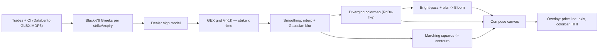

# Reverse Engineering: TRACE Gamma Heatmap Glow Panel

<aside>
🎯

**Tujuan:** Reverse-engineer panel kanan SpotGamma TRACE (gamma heatmap + efek "glow/senter") dan kasih resep teknis lengkap supaya bisa dibangun ulang di **FlowGreeks** (/ES & /NQ, 0DTE, Databento GLBX.MDP3, Black-76).

**Notasi bukti:** [FAKTA] = terverifikasi sumber publik · [INFERENSI] = dugaan teknis berbasis observasi · [PROPRIETARY] = milik SpotGamma, tidak dipublikasikan.

</aside>

## TL;DR — apa sebenarnya "efek senter" itu

Panel kanan itu **bukan** efek dekoratif. Itu adalah **2D scalar field heatmap** dari *Gamma Notional ($)* yang dipetakan ke sumbu **Strike (Y) × Waktu (X)**, lalu:

1. Di-**smooth** (interpolasi antar-strike + Gaussian blur) → muncul gradasi halus kayak cahaya.
2. Dipetakan ke **diverging colormap** (merah/pink = negative gamma, biru/ungu = positive gamma, gelap = netral ~0).
3. Dikasih **contour lines** (iso-line tipis) via marching squares.
4. Hotspot magnitudo tinggi dikasih **bloom/glow** (additive blending + bright-pass blur) → itulah "senter" yang nyala di tepi kanan.

Jadi formulanya: **field data → smoothing → colormap → contour → bloom**. Sisanya (price line, axis, colorbar, gauge HHI) cuma overlay.

---

## 1. Dekonstruksi visual (layer stack)

Gue bedah dari gambar lo, urut dari bawah ke atas:

| # | Layer | Isi | Teknik render |
| --- | --- | --- | --- |
| 0 | Background | Canvas gelap (near-black) | Clear color |
| 1 | Heatmap field | Gamma $ notional per (strike, waktu) | Texture / ImageData + colormap |
| 2 | Smoothing | Gradasi halus antar sel | Interpolasi bilinear/bicubic + Gaussian blur |
| 3 | Contour | Garis iso tipis abu-abu | Marching squares (d3-contour) |
| 4 | Bloom / glow | Hotspot nyala (tepi kanan magenta) | Bright-pass + blur + additive blend |
| 5 | Price path | Garis harga SPX intraday | Polyline (line2/stroke) |
| 6 | Overlay UI | Axis, colorbar, HHI gauge, time cutoff | DOM/SVG di atas canvas |

<aside>
🧭

**Acuan warna resmi [FAKTA]:** Blue zones = positive market-maker gamma (volatilitas rendah/stabil). Red zones = negative MM gamma (volatilitas tinggi). Black/white zones = transisi/netral. Kedalaman warna = kekuatan gamma di zona itu.

</aside>

---

## 2. Pipeline data (apa yang dipetakan)

Sebelum render, lo butuh **matriks nilai**. Ini bagian yang paling penting dan paling FlowGreeks banget.

### 2.1 Definisi field

- **Sumbu X** = waktu (time bin, mis. 1 menit dari open sampai close).
- **Sumbu Y** = strike price (mis. 6350–6550, step 5).
- **Nilai sel** `V(K, t)` = **dealer gamma exposure** dalam **$ notional** pada strike `K` dan waktu `t`.

### 2.2 Rumus GEX (options-on-futures, Black-76) [INFERENSI/standar industri]

Untuk tiap strike & expiry, hitung gamma per kontrak pakai **Black-76** (karena underlying-nya futures /ES /NQ), lalu agregasi:

$$
GEX(K,t) = \Gamma_{76}(F_t, K, \sigma, \tau) \times OI(K) \times M \times F_t^2 \times 0.01 \times \text{sign}_{dealer}
$$

- $\Gamma_{76}$ = gamma Black-76 terhadap harga futures `F`.
- $OI(K)$ = open interest (atau net OI intraday).
- $M$ = contract multiplier (mis. $50 untuk /ES).
- $F_t^2 \times 0.01$ = konversi ke notional per 1% move (konvensi GEX standar).
- $\text{sign}_{dealer}$ = +1/−1 dari model dealer-vs-customer positioning. **[PROPRIETARY]** — ini "saus rahasia" SpotGamma; mereka klaim model dealer/customer-nya yang bikin tanda GEX bermakna.

<aside>
⚠️

Bagian yang bikin TRACE susah ditiru bukan rendering-nya, tapi **klasifikasi dealer vs customer** + **intraday OI update** dari tiap trade. Visual-nya gampang; data sign-nya yang mahal. [INFERENSI]

</aside>

### 2.3 Diagram pipeline



---

## 3. Teknik rendering — 3 pendekatan

| Pendekatan | Stack | Plus | Minus | Cocok untuk |
| --- | --- | --- | --- | --- |
| A. Canvas2D + d3 | d3-contour, d3-scale-chromatic, ctx.filter blur | Cepat dibuat, simpel, no shader | Bloom terbatas, berat kalau grid besar + realtime | MVP / prototipe |
| B. WebGL shader | regl / three.js / PixiJS, fragment shader | Bloom & blur native GPU, realtime smooth, persis vibe TRACE | Kurva belajar GLSL | Produksi FlowGreeks |
| C. [deck.gl](http://deck.gl) | HeatmapLayer + ContourLayer | Aggregation + contour built-in, GPU | Kurang kontrol look spesifik, opinionated | Iterasi cepat berbasis layer |

<aside>
🧠

**[INFERENSI]** Smoothness + bloom realtime TRACE paling mungkin pakai **WebGL** (field di-upload sebagai texture float, colormap & bloom di fragment shader). Canvas2D murni susah nge-bloom semulus itu.

</aside>

---

## 4. Komponen kunci (detail teknis)

### 4.1 Diverging colormap

Gamma punya tanda (+/−) → wajib **diverging scale** yang center-nya di 0 (netral = gelap), bukan sequential.

- Pakai `d3.scaleDiverging` + interpolator custom, atau bikin LUT (lookup table) sendiri.
- Domain: `[-max, 0, +max]`. Clamp magnitudo ekstrem (mis. ±34B di gambar lo) biar outlier gak nge-burn.
- Untuk dark mode: titik tengah = warna gelap/transparan, makin jauh dari 0 makin pekat (pink→magenta untuk negatif, biru→ungu untuk positif).

```jsx
import * as d3 from "d3-scale";
// stops: negatif (pink/merah) -> 0 (gelap) -> positif (biru/ungu)
const color = d3.scaleDiverging()
  .domain([-MAX, 0, +MAX])
  .interpolator(t => {
    // t in [0,1]; bikin ramp custom dark-center
    // 0 -> #ff1e6e (pink), 0.5 -> #0a0a12 (dark), 1 -> #7b5cff (ungu)
    return rampDarkCenter(t);
  })
  .clamp(true);
```

### 4.2 Smoothing (sumber "glow" halus)

Strike itu diskrit (step 5), tapi heatmap-nya mulus. Caranya:

1. **Interpolasi antar-strike** (cubic/Catmull-Rom) supaya kolom mulus secara vertikal.
2. **Gaussian blur 2D** pada field (atau pada hasil colormap) — ini yang bikin tepi "melar" kayak cahaya.
3. Opsional: **KDE** (kernel density estimation) kalau lo mau treat tiap konsentrasi gamma sebagai sumber Gaussian. Tapi untuk grid teratur, blur 2D udah cukup. [INFERENSI]

### 4.3 Contour lines (marching squares)

- Pakai **d3-contour** (`d3.contours().size([w,h]).thresholds([...])`) untuk dapat MultiPolygon dari field.
- Render stroke tipis, opacity rendah, warna abu terang.
- Threshold = beberapa level iso (mis. tiap N miliar $). Ini yang bikin "garis topografi" di gambar.

```jsx
import { contours } from "d3-contour";
const cs = contours().size([cols, rows]).thresholds(8)(field);
// gambar tiap polygon: ctx.stroke pakai geoPath / path2D
```

### 4.4 Bloom / glow (efek "senter" sebenarnya)

Ini intinya. Teknik klasik post-processing 3 pass:

1. **Bright-pass:** ambil hanya pixel dengan magnitudo di atas threshold (hotspot gamma tinggi).
2. **Blur:** Gaussian blur (biasanya separable: horizontal lalu vertikal, beberapa iterasi / mipmap downsample).
3. **Additive composite:** tambahkan hasil blur ke gambar asli (`blend = add`), bisa dikali intensitas.

Di WebGL ini standar "Unreal Bloom" (three.js `UnrealBloomPass`). Itulah kenapa hotspot di tepi kanan keliatan nyala mekar.

```glsl
// fragment (bright-pass)
vec3 c = texture2D(uScene, vUv).rgb;
float b = max(c.r, max(c.g, c.b));
gl_FragColor = b > uThreshold ? vec4(c, 1.0) : vec4(0.0);
// lalu blur pass (separable gaussian), lalu:
// final = sceneColor + bloomColor * uIntensity;
```

### 4.5 Overlay

- **Price line:** polyline harga vs waktu, putih/abu, di atas heatmap.
- **Colorbar kanan:** legend diverging (label HHI / Gamma $ Notional).
- **HHI / Stability gauge:** angka + arc kecil (mis. 27% Stability) — komponen DOM terpisah.
- **Time cutoff & timeline scrubber:** kontrol UI biasa.

---

## 5. Resep implementasi (step-by-step)

### Jalur cepat (MVP, Canvas2D) — bisa jadi dalam 1 hari

1. Bangun `field: Float32Array(cols*rows)` dari GEX grid lo.
2. Hitung `MAX = quantile(|field|, 0.98)` untuk clamp.
3. Buat `ImageData`: tiap pixel = `color(field[i])`.
4. `putImageData` ke offscreen canvas kecil → `drawImage` di-upscale ke canvas besar (dapet interpolasi gratis).
5. `ctx.filter = "blur(6px)"` saat drawImage → smoothing/glow murah.
6. Overlay contour via d3-contour.
7. Gambar price line + axis.

### Jalur produksi (WebGL, persis vibe TRACE)

1. Upload `field` sebagai **texture float** (`R32F`/`LUMINANCE`), ukuran cols×rows.
2. Fragment shader: sample field (GPU bilinear), map via **colormap LUT texture** → scene color.
3. **Bloom pass** (bright-pass → separable blur → additive).
4. Render **contour** sebagai overlay (precompute di CPU pakai marching squares, atau threshold di shader).
5. Price line pakai geometry terpisah (mis. regl-line / three Line2).
6. Update field tiap tick (streaming) → re-upload texture (cepat, cuma cols×rows float).

<aside>
⚡

**Tips performa:** field-nya kecil (mis. 40 strikes × 390 menit ≈ 15.6k nilai). Render di texture kecil lalu upscale + blur di GPU. Jangan render per-strike-bar sebagai DOM. Pisahkan "static history" (cache) dari "kolom terbaru" yang update.

</aside>

---

## 6. Rekomendasi library

| Kebutuhan | Library |
| --- | --- |
| Colormap / scale | d3-scale, d3-scale-chromatic (RdBu, custom diverging) |
| Contour | d3-contour, MarchingSquares.js |
| WebGL low-level | regl, PixiJS (filter bloom bawaan), three.js (UnrealBloomPass) |
| Aggregation + contour cepat | [deck.gl](http://deck.gl) (HeatmapLayer, ContourLayer) |
| No-code WebGL effect | Unicorn Studio (buat eksperimen look) |

---

## 7. Pemetaan ke stack FlowGreeks

- **Data layer:** Databento GLBX.MDP3 → parse trades/quotes → OI & volume per strike/expiry → Black-76 gamma → grid `V(K,t)`.
- **Sign model:** ini PR terbesar lo. Mulai dari heuristik sederhana (asumsi dealer short puts / long calls) seperti free GEX chart standar, lalu iterasi ke trade-classification (aggressor side dari tick rule / Lee-Ready). [INFERENSI]
- **Render layer:** mulai Canvas2D MVP buat validasi data, baru naik ke WebGL bloom buat look final.
- **Reuse:** colormap & bloom yang sama bisa dipakai buat Delta Pressure / Charm Pressure heatmap (cuma ganti field-nya).

---

## 8. Catatan kejujuran

- Yang **bisa** lo replikasi 1:1: seluruh sisi visual (heatmap, smoothing, contour, bloom, colorbar). [FAKTA/INFERENSI]
- Yang **tidak** dipublikasikan: model dealer/customer positioning & intraday OI estimation SpotGamma. [PROPRIETARY] — lo harus bikin versi sendiri.
- Acuan warna & arti zona diambil dari dokumentasi resmi SpotGamma. [FAKTA]